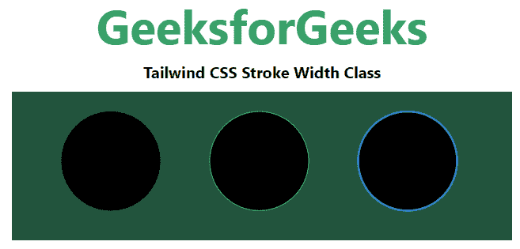

# 顺风 CSS 笔画宽度

> 原文:[https://www.geeksforgeeks.org/tailwind-css-stroke-width/](https://www.geeksforgeeks.org/tailwind-css-stroke-width/)

这个类在[顺风 CSS](https://www.geeksforgeeks.org/css-tailwind-introduction/) 中接受很多值，其中所有属性都以形式覆盖。此类用于设置 SVG 形状中边框的宽度。此属性只能应用于具有形状或文本内容元素的元素。在 CSS 中，我们通过使用 [CSS 笔画宽度属性做到了这一点。](https://www.geeksforgeeks.org/css-stroke-width-property/)

**笔画宽度等级:**

*   **笔画-0:** 该类将笔画宽度设置为零。
*   **笔画-1:** 该类将笔画宽度设置为 1。
*   **笔画-2:** 该类将笔画宽度设置为 2。

**语法:**

```
<svg class="stroke-{width}">...</svg>
```

**示例:**

## 超文本标记语言

```
<!DOCTYPE html> 
<html> 
<head> 
    <link href= 
"https://unpkg.com/tailwindcss@^1.0/dist/tailwind.min.css"
        rel="stylesheet"> 
</head> 

<body class="text-center mx-4 space-y-2"> 
    <h1 class="text-green-600 text-5xl font-bold"> 
        GeeksforGeeks 
    </h1> 
    <b>Tailwind CSS Stroke Width Class</b> 
    <div class="bg-green-900 m-24 grid grid-flow-col"> 
        <svg height="150px" width="500px"
      xmlns="http://www.w3.org/2000/svg"
      version="1.1"> 
         <circle class="stroke-current text-red-600 stroke-0" 
              cx="100" cy="70" r="50" /> 
         <circle class="stroke-current text-green-600 stroke-1" 
              cx="250" cy="70" r="50" /> 
         <circle class="stroke-current text-blue-600 stroke-2" 
              cx="400" cy="70" r="50" /> 
        </svg> 
    </div> 
</body> 

</html> 
```

**输出:**

