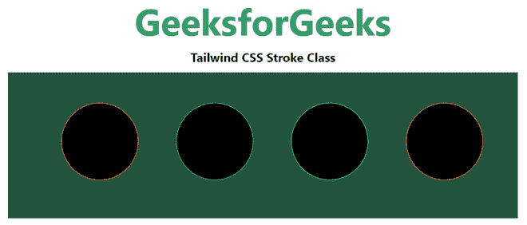

# 顺风 CSS 笔划

> 原文:[https://www.geeksforgeeks.org/tailwind-css-stroke/](https://www.geeksforgeeks.org/tailwind-css-stroke/)

这个类在[顺风 CSS](https://www.geeksforgeeks.org/css-tailwind-introduction/) 中接受很多值，其中所有的属性都以类的形式被覆盖。它是要应用于 SVG 元素的笔画类。在 CSS 中，我们使用了[笔画属性](https://www.geeksforgeeks.org/svg-stroke-properties/)。

**中风等级:**

*   **笔画-当前:**该类用于将一个 SVG 的笔画颜色设置为当前文本颜色。通过将此类与现有的文本颜色实用程序相结合，可以轻松设置元素的笔画颜色。

**语法**:

```html
<svg class="stroke-current">...</svg>
```

**示例:**

## 超文本标记语言

```html
<!DOCTYPE html> 
<html> 
<head> 
    <link href= 
"https://unpkg.com/tailwindcss@^1.0/dist/tailwind.min.css"
        rel="stylesheet"> 
</head> 

<body class="text-center mx-4 space-y-2"> 
    <h1 class="text-green-600 text-5xl font-bold"> 
        GeeksforGeeks 
    </h1> 
    <b>Tailwind CSS Stroke Class</b> 
    <div class="bg-green-900 m-4 grid grid-flow-col gap-4 p-5"> 
        <svg height="150px" width="600px"
      xmlns="http://www.w3.org/2000/svg"
      version="1.1"> 
      <circle class="stroke-current text-red-600" cx="100"
        cy="70" r="50" /> 
      <circle class="stroke-current text-green-600" cx="250"
        cy="70" r="50" /> 
      <circle class="stroke-current text-blue-600" cx="400"
        cy="70" r="50" /> 
      <circle class="stroke-current text-yellow-600" cx="550"
        cy="70" r="50" /> 
    </svg> 
    </div> 
</body> 

</html> 
```

**输出:**



笔画类别