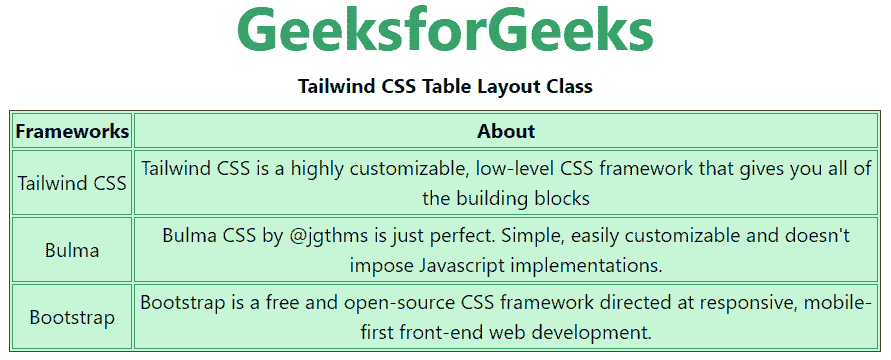
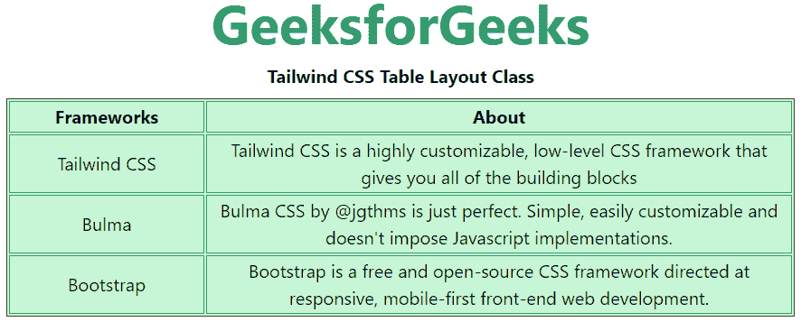

# 顺风 CSS 表格布局

> 原文:[https://www.geeksforgeeks.org/tailwind-css-table-layout/](https://www.geeksforgeeks.org/tailwind-css-table-layout/)

这个类在[顺风 CSS](https://www.geeksforgeeks.org/css-tailwind-introduction/) 中接受很多值，其中所有的属性都以类的形式被覆盖。通过使用这个类，我们可以设置表格布局的显示。在 CSS 中，我们通过使用 [CSS 表格布局属性](https://www.geeksforgeeks.org/css-table-layout-property/)来实现。

**表格布局类:**

*   **表-自动**
*   **表-固定**

**表格-自动:**该类用于允许表格自动调整列的大小以适应单元格的内容。

**语法:**

```html
<element class="table-auto">...</element>
```

**示例:**

## 超文本标记语言

```html
<!DOCTYPE html> 
<html>
<head> 
    <link href= 
"https://unpkg.com/tailwindcss@^1.0/dist/tailwind.min.css"
        rel="stylesheet"> 
</head> 

<body class="text-center mx-4 space-y-2"> 
    <h1 class="text-green-600 text-5xl font-bold"> 
        GeeksforGeeks 
    </h1> 
    <b>Tailwind CSS Table Layout Class</b> 
    <div class="bg-green-200"> 
        <table class="table-auto border-separate border border-green-900">
        <thead>
          <tr>
            <th class="border border-green-600">Frameworks</th>
            <th class="border border-green-600">About</th>
          </tr>
        </thead>
        <tbody>
          <tr>
            <td class="border border-green-600">Tailwind CSS</td>
            <td class="border border-green-600">
                Tailwind CSS is a highly customizable, 
                low-level CSS framework that gives you all 
                of the building blocks
            </td>
          </tr>
          <tr>
            <td class="border border-green-600">Bulma</td>
            <td class="border border-green-600">
                Bulma CSS by @jgthms is just perfect. 
                Simple, easily customizable and doesn't 
                impose Javascript implementations.
            </td>
          </tr>
          <tr>
            <td class="border border-green-600">Bootstrap</td>
            <td class="border border-green-600">
                Bootstrap is a free and open-source CSS 
                framework directed at responsive, mobile-first
                front-end web development.
            </td>
          </tr>
        </tbody>
        </table>
    </div> 
</body> 

</html> 
```

**输出:**



顺风 CSS 表格布局

**表格-固定:**这个类用于允许表格忽略内容，对列使用固定宽度。第一行的宽度将设置整个表格的列宽。

**语法:**

```html
<element class="table-fixed">...</element>
```

**示例:**

## 超文本标记语言

```html
<!DOCTYPE html> 
<html>
<head> 
    <link href= 
"https://unpkg.com/tailwindcss@^1.0/dist/tailwind.min.css"
        rel="stylesheet"> 
</head> 

<body class="text-center mx-4 space-y-2"> 
    <h1 class="text-green-600 text-5xl font-bold"> 
        GeeksforGeeks 
    </h1> 
    <b>Tailwind CSS Table Layout Class</b> 
    <div class="bg-green-200"> 
        <table class="table-fixed border-separate border border-green-900">
        <thead>
          <tr>
            <th class="border border-green-600 w-1/4">Frameworks</th>
            <th class="border border-green-600 w-3/4">About</th>
          </tr>
        </thead>
        <tbody>
          <tr>
            <td class="border border-green-600">Tailwind CSS</td>
            <td class="border border-green-600">
                Tailwind CSS is a highly customizable, 
                low-level CSS framework that gives you all 
                of the building blocks
            </td>
          </tr>
          <tr>
            <td class="border border-green-600">Bulma</td>
            <td class="border border-green-600">
                Bulma CSS by @jgthms is just perfect. 
                Simple, easily customizable and doesn't 
                impose Javascript implementations.
            </td>
          </tr>
          <tr>
            <td class="border border-green-600">Bootstrap</td>
            <td class="border border-green-600">
                Bootstrap is a free and open-source CSS 
                framework directed at responsive, mobile-first
                front-end web development.
            </td>
          </tr>
        </tbody>
        </table>
    </div> 
</body> 

</html> 
```

**输出:**



顺风 CSS 布局