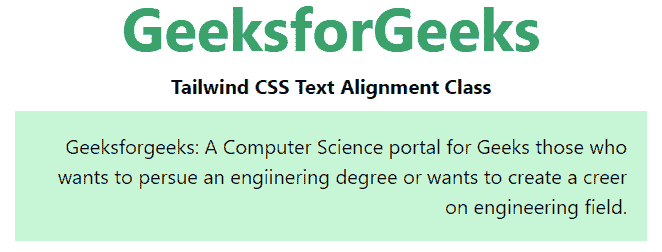

# 顺风 CSS 文本对齐

> 原文:[https://www.geeksforgeeks.org/tailwind-css-text-alignment/](https://www.geeksforgeeks.org/tailwind-css-text-alignment/)

这个类在[顺风 CSS](https://www.geeksforgeeks.org/css-tailwind-introduction/) 中接受很多值，其中所有的属性都以类的形式被覆盖。它是 [CSS 文本对齐属性](https://www.geeksforgeeks.org/css-text-align-property/)的替代。此类用于指定元素中文本的水平对齐方式。

**文本对齐类:**

*   **文本-左侧**
*   **文本中心**
*   **文本-右侧**
*   **文本对齐**

**文本向左:**用于设置文本向左对齐。

**语法:**

```html
<element class="text-left">...</element>
```

**示例:**

## 超文本标记语言

```html
<!DOCTYPE html>
<head>
    <link href=
"https://unpkg.com/tailwindcss@^1.0/dist/tailwind.min.css"
          rel="stylesheet">
</head>

<body class="text-center mx-4 space-y-2">
    <h1 class="text-green-600 text-5xl font-bold">
        GeeksforGeeks
    </h1>
    <b>Tailwind CSS Text Alignment Class</b>
    <div class="mx-24 bg-green-200">
        <p class="p-4 text-left">
            Geeksforgeeks: A Computer Science portal for Geeks
            those who wants to persue an engiinering degree or
            wants to create a career on engineering field.
        </p>

    </div>
</body>

</html>
```

**输出:**


**文本居中:**用于设置文本居中对齐。

**语法:**

```html
<element class="text-center">...</element>
```

**示例:**

## 超文本标记语言

```html
<!DOCTYPE html>
<head>
    <link href=
"https://unpkg.com/tailwindcss@^1.0/dist/tailwind.min.css"
          rel="stylesheet">
</head>

<body class="text-center mx-4 space-y-2">
    <h1 class="text-green-600 text-5xl font-bold">
        GeeksforGeeks
    </h1>
    <b>Tailwind CSS Text Alignment Class</b>
    <div class="mx-24 bg-green-200">
        <p class="p-4 text-center">
            Geeksforgeeks: A Computer Science portal for Geeks
            those who wants to persue an engiinering degree or
            wants to create a career on engineering field.
        </p>

    </div>
</body>

</html>
```

**输出:**


**文本右对齐:**用于设置文本右对齐。

**语法:**

```html
<element class="text-right">...</element>
```

**示例:**

## 超文本标记语言

```html
<!DOCTYPE html>
<head>
    <link href=
"https://unpkg.com/tailwindcss@^1.0/dist/tailwind.min.css"
          rel="stylesheet">
</head>

<body class="text-center mx-4 space-y-2">
    <h1 class="text-green-600 text-5xl font-bold">
        GeeksforGeeks
    </h1>
    <b>Tailwind CSS Text Alignment Class</b>
    <div class="mx-24 bg-green-200">
        <p class="p-4 text-right">
            Geeksforgeeks: A Computer Science portal for Geeks
            those who wants to persue an engiinering degree or
            wants to create a career on engineering field.
        </p>

    </div>
</body>

</html>
```

**输出:**



**文本对齐:**用于拉伸元素内容，以显示每行相同的宽度。

**语法:**

```html
<element class="text-left">...</element>
```

**示例:**

## 超文本标记语言

```html
<!DOCTYPE html>
<head>
    <link href=
"https://unpkg.com/tailwindcss@^1.0/dist/tailwind.min.css"
          rel="stylesheet">
</head>

<body class="text-center mx-4 space-y-2">
    <h2 class="text-green-600 text-5xl font-bold">
        GeeksforGeeks
    </h2>
    <b>Tailwind CSS Text Alignment Class</b>
    <div class="mx-24 bg-green-200">
        <p class="p-4 text-justify">
            Geeksforgeeks: A Computer Science portal for Geeks
            those who wants to persue an engineering degree or
            wants to create a career on engineering field.
        </p>

    </div>
</body>

</html>
```

**输出:**


文本对齐