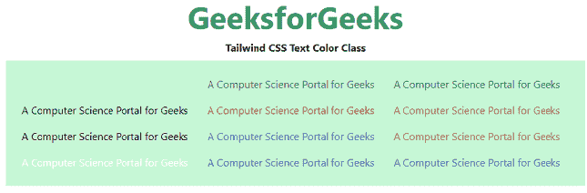

# 顺风 CSS 文字颜色

> 原文:[https://www.geeksforgeeks.org/tailwind-css-text-color/](https://www.geeksforgeeks.org/tailwind-css-text-color/)

这个类在 [<u>顺风 CSS</u>](https://www.geeksforgeeks.org/css-tailwind-introduction/) 中接受大量的值，其中所有的属性都包含在类形式中。通过使用这个类，我们可以给任何文本着色。在 CSS 中，我们通过使用[<u>CSS 颜色属性</u>来实现。](https://www.geeksforgeeks.org/css-color-property/)

**文本颜色类别:**

*   文本透明:文本颜色将是透明的。
*   文本-当前:文本颜色将取决于父元素颜色。
*   文本-黑色:文本颜色将为黑色。
*   文本-白色:文本颜色将为白色。
*   文本-灰色-50:文本颜色将为灰色。
*   文本-红色-50:文本颜色将为红色。
*   文本-蓝色-50:文本颜色将为蓝色。
*   文本-靛蓝-50:文本颜色将是靛蓝。
*   文本-紫色-50:文本颜色将为紫色。
*   文本-绿色-50:文本颜色将为绿色。
*   文本-黄色-50:文本颜色将为黄色。
*   文本-粉色-50:文本颜色将为粉色。

**注意:**颜色的值可以根据你的需要在 50-900 之间变化，跨度应该是 100，在 100 之后。

**语法:**

```html
<element class="text-{color}">...</element>
```

**示例:**这个示例涵盖了所有可能的类，可以更改颜色值使其更有对比度、更饱满，或者使其更褪色。

## 超文本标记语言

```html
<!DOCTYPE html> 
<head> 
    <link href=
"https://unpkg.com/tailwindcss@^1.0/dist/tailwind.min.css" 
          rel="stylesheet"> 
</head> 

<body class="text-center mx-4 space-y-2"> 
    <h2 class="text-green-600 text-5xl font-bold">
        GeeksforGeeks
    </h2> 
    <b>Tailwind CSS Text Color Class</b> 
    <div class="mx-14 bg-green-200 grid grid-rows-4
                grid-flow-col text-justify p-4">

       <p class="text-transparent p-2">
         A Computer Science Portal for Geeks
       </p>

       <p class="text-current p-2">
           A Computer Science Portal for Geeks
       </p>

       <p class="text-black p-2">
           A Computer Science Portal for Geeks
       </p>

       <p class="text-white p-2">
           A Computer Science Portal for Geeks
       </p>

       <p class="text-gray-700 p-2">
           A Computer Science Portal for Geeks
       </p>

       <p class="text-red-700 p-2">
           A Computer Science Portal for Geeks
       </p>

       <p class="text-indigo-700 p-2">
           A Computer Science Portal for Geeks
       </p>

       <p class="text-blue-700 p-2">
           A Computer Science Portal for Geeks
       </p>

       <p class="text-green-700 p-2">
          A Computer Science Portal for Geeks
       </p>

       <p class="text-yellow-700 p-2">
          A Computer Science Portal for Geeks
       </p>

       <p class="text-pink-700 p-2">
          A Computer Science Portal for Geeks
       </p>

       <p class="text-purple-700 p-2">
          A Computer Science Portal for Geeks
       </p>

    </div>
</body> 

</html> 
```

**输出:**



CSS 文本颜色