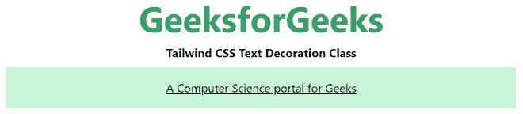
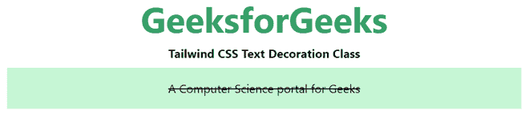
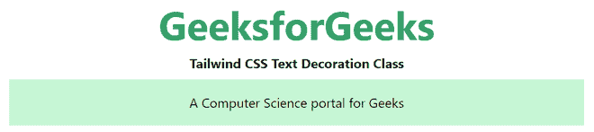

# 顺风 CSS 文字装饰

> 原文:[https://www.geeksforgeeks.org/tailwind-css-text-decoration/](https://www.geeksforgeeks.org/tailwind-css-text-decoration/)

该类在[顺风 CSS](https://www.geeksforgeeks.org/css-tailwind-introduction/) 中接受多个值。所有的属性都包含在类的形式中。它是 [CSS 文本装饰属性](https://www.geeksforgeeks.org/css-text-decoration-property/)的替代物。这个类用来“装饰”文本的内容。它本质上是用不同种类的线条装饰文本。

**文字装饰类:**

*   **下划线**
*   **线通**
*   **无下划线**

**下划线:**这个类用来用下划线修饰文字。

**语法:**

```
<element class="underline ">...</element>
```

**示例:**

## 超文本标记语言

```
<!DOCTYPE html> 
<head> 
    <link href=
"https://unpkg.com/tailwindcss@^1.0/dist/tailwind.min.css" 
          rel="stylesheet"> 
</head> 

<body class="text-center mx-4 space-y-2"> 
    <h1 class="text-green-600 text-5xl font-bold">
        GeeksforGeeks
    </h1> 
    <b>Tailwind CSS Text Decoration Class</b> 
    <div class="mx-14 bg-green-200 p-4">
    <p class="underline"> 
        A Computer Science portal for Geeks
    </p>

    </div>
</body> 

</html> 
```

**输出:**



**划线:**这个类是用来描边文字的。

**语法:**

```
<element class="line-through">...</element>
```

**示例:**

## 超文本标记语言

```
<!DOCTYPE html> 
<head> 
    <link href=
"https://unpkg.com/tailwindcss@^1.0/dist/tailwind.min.css" 
          rel="stylesheet"> 
</head> 

<body class="text-center mx-4 space-y-2"> 
    <h1 class="text-green-600 text-5xl font-bold">
        GeeksforGeeks
    </h1> 
    <b>Tailwind CSS Text Decoration Class</b> 
    <div class="mx-14 bg-green-200 p-4">
    <p class="line-through"> 
        A Computer Science portal for Geeks
    </p>

    </div>
</body> 

</html> 
```

**输出:**



**无下划线:**此类用于移除下划线或贯穿线条的样式。

**语法:**

```
<element class="no-underline">...</element>
```

**示例:**

## 超文本标记语言

```
<!DOCTYPE html> 
<head> 
    <link href=
"https://unpkg.com/tailwindcss@^1.0/dist/tailwind.min.css" 
          rel="stylesheet"> 
</head> 

<body class="text-center mx-4 space-y-2"> 
    <h1 class="text-green-600 text-5xl font-bold">
        GeeksforGeeks
    </h1> 
    <b>Tailwind CSS Text Decoration Class</b> 
    <div class="mx-14 bg-green-200 p-4">
    <p class="underline no-underline"> 
        A Computer Science portal for Geeks
    </p>

    </div>
</body> 

</html> 
```

**输出:**



无下划线