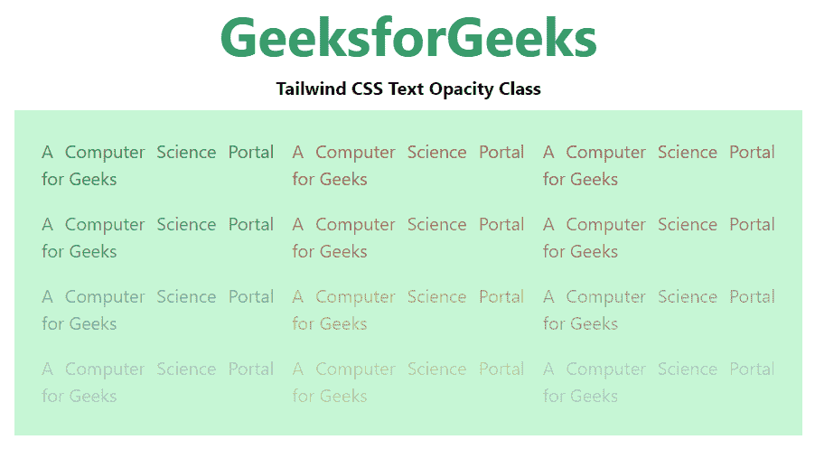

# 泰风 CSS 文本不透明

> 原文:[https://www.geeksforgeeks.org/tailwind-css-text-opacity/](https://www.geeksforgeeks.org/tailwind-css-text-opacity/)

这个类在 [<u>顺风 CSS</u>](https://www.geeksforgeeks.org/css-tailwind-introduction/) 中接受大量的值，其中所有的属性都以类的形式被覆盖。通过使用这个类，我们可以设置任何文本的不透明度。在 CSS 中，我们通过使用 [<u>CSS 不透明度属性</u>](https://www.geeksforgeeks.org/css-opacity-transparency/) 来做到这一点。

**文本不透明度:**

*   **文本-不透明度-0:** 使用*文本-不透明度-{amount}* 工具控制元素占位符颜色的不透明度。

**注意:**不透明度的数量可以在 0 到 100 之间变化，跨度为 5。

**语法:**

```css
<element class="text-{opacity}">...</element>
```

**示例:**

## 超文本标记语言

```css
<!DOCTYPE html>
<html>
  <head>
    <link href=
"https://unpkg.com/tailwindcss@^1.0/dist/tailwind.min.css"
      rel="stylesheet"/>
  </head>

  <body class="text-center mx-4 space-y-2">
    <h1 class="text-green-600 text-5xl font-bold">
      GeeksforGeeks
    </h1>
    <b>Tailwind CSS Text Opacity Class</b>
    <div class="mx-14 bg-green-200 grid grid-rows-4
                grid-flow-col text-justify p-4">
      <p class="text-green-800 text-opacity-100 p-2">
        A Computer Science Portal for Geeks
      </p>

      <p class="text-green-800 text-opacity-75 p-2">
        A Computer Science Portal for Geeks
      </p>

      <p class="text-green-800 text-opacity-50 p-2">
        A Computer Science Portal for Geeks
      </p>

      <p class="text-green-800 text-opacity-25 p-2">
        A Computer Science Portal for Geeks
      </p>

      <p class="text-yellow-800 text-opacity-100 p-2">
        A Computer Science Portal for Geeks
      </p>

      <p class="text-yellow-800 text-opacity-75 p-2">
        A Computer Science Portal for Geeks
      </p>

      <p class="text-yellow-800 text-opacity-50 p-2">
        A Computer Science Portal for Geeks
      </p>

      <p class="text-yellow-800 text-opacity-25 p-2">
        A Computer Science Portal for Geeks
      </p>

      <p class="text-pink-800 text-opacity-100 p-2">
        A Computer Science Portal for Geeks
      </p>

      <p class="text-pink-800 text-opacity-75 p-2">
        A Computer Science Portal for Geeks
      </p>

      <p class="text-pink-800 text-opacity-50 p-2">
        A Computer Science Portal for Geeks
      </p>

      <p class="text-pink-800 text-opacity-25 p-2">
        A Computer Science Portal for Geeks
      </p>
    </div>
  </body>
</html>
```

**输出:**



不透明