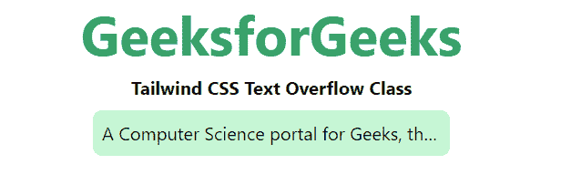
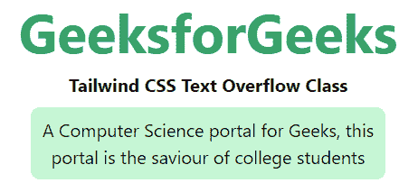

# 顺风 CSS 文本溢出

> 原文:[https://www.geeksforgeeks.org/tailwind-css-text-overflow/](https://www.geeksforgeeks.org/tailwind-css-text-overflow/)

该类在[顺风 CSS](https://www.geeksforgeeks.org/css-tailwind-introduction/) 中接受多个值。所有的属性都包含在类的形式中。它是 [CSS 文本溢出属性](https://www.geeksforgeeks.org/css-text-overflow-property/)的替代品。该类用于指定某些文本已经溢出并隐藏在视图之外。*空白*类必须设置为 *nowrap* 并且*溢出*类必须隐藏。

**文本溢出类:**

*   **截断**
*   **溢出-省略号**
*   **溢流夹**

**截断:**它截断文本。

**语法:**

```css
<element class="truncate">...</element>
```

**示例:**

## 超文本标记语言

```css
<!DOCTYPE html> 
<html>
<head> 
    <link href=
"https://unpkg.com/tailwindcss@^1.0/dist/tailwind.min.css" 
          rel="stylesheet"> 
</head> 

<body class="text-center mx-4 space-y-2"> 
    <h1 class="text-green-600 text-5xl font-bold">
        GeeksforGeeks
    </h1> 
    <b>Tailwind CSS Text Overflow Class</b> 
    <div class="mx-48 bg-green-200 p-2 rounded-lg">
    <p class="truncate whitespace-nowrap overflow-hidden"> 
        A Computer Science portal for Geeks, 
        this portal is the saviour of college 
        students
    </p>

    </div>
</body> 

</html> 
```

**输出:**



**溢出-省略号:**文本被剪裁，剪裁后的文本表示为“…”

**语法:**

```css
<element class="overflow-ellipsis">...</element>
```

**示例:**

## 超文本标记语言

```css
<!DOCTYPE html> 
<html>
<head> 
    <link href=
"https://unpkg.com/tailwindcss@^1.0/dist/tailwind.min.css" 
          rel="stylesheet"> 
</head> 

<body class="text-center mx-4 space-y-2"> 
    <h1 class="text-green-600 text-5xl font-bold">
        GeeksforGeeks
    </h1> 
    <b>Tailwind CSS Text Overflow Class</b> 
    <div class="mx-48 bg-green-200 p-2 rounded-lg">
    <p class="overflow-ellipsis whitespace-nowrap overflow-hidden"> 
        A Computer Science portal for Geeks, 
        this portal is the saviour of college 
        students
    </p>

    </div>
</body> 

</html> 
```

**输出:**



**溢出剪辑:**文本被剪辑，看不到。这是默认值。

**语法:**

```css
<element class="overflow-clip">...</element>
```

**示例:**

## 超文本标记语言

```css
<!DOCTYPE html> 
<html>
<head> 
    <link href=
"https://unpkg.com/tailwindcss@^1.0/dist/tailwind.min.css" 
          rel="stylesheet"> 
</head> 

<body class="text-center mx-4 space-y-2"> 
    <h1 class="text-green-600 text-5xl font-bold">
        GeeksforGeeks
    </h1> 
    <b>Tailwind CSS Text Overflow Class</b> 
    <div class="mx-48 bg-green-200 p-2 rounded-lg">
    <p class="overflow-clip whitespace-nowrap overflow-hidden"> 
        A Computer Science portal for Geeks, 
        this portal is the saviour of college 
        students
    </p>

    </div>
</body> 

</html> 
```

**输出:**


文本溢出类