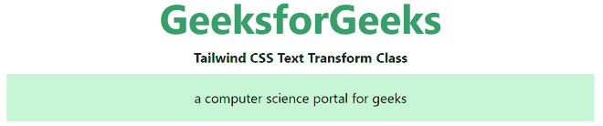
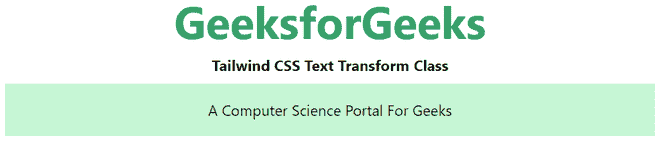
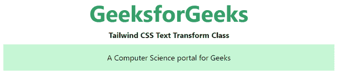

# 顺风 CSS 文本转换

> 原文:[https://www.geeksforgeeks.org/tailwind-css-text-transform/](https://www.geeksforgeeks.org/tailwind-css-text-transform/)

该类在[顺风 CSS](https://www.geeksforgeeks.org/css-tailwind-introduction/) 中接受多个值。所有的属性都包含在类的形式中。它是 [CSS 文本转换属性](https://www.geeksforgeeks.org/css-text-transform-property/)的替代品。此类用于控制文本的大写。

**文本转换类:**

*   **大写**
*   **小写**
*   **大写**
*   **正常情况**

**大写:**用于将每个单词中的所有字符转换或变换为大写。

**语法:**

```css
<element class="uppercase">...</element>
```

**示例:**

## 超文本标记语言

```css
<!DOCTYPE html> 
<html>
<head> 
    <link href=
"https://unpkg.com/tailwindcss@^1.0/dist/tailwind.min.css" 
          rel="stylesheet"> 
</head> 

<body class="text-center mx-4 space-y-2"> 
    <h1 class="text-green-600 text-5xl font-bold">
        GeeksforGeeks
    </h1> 
    <b>Tailwind CSS Text Transform Class</b> 
    <div class="mx-14 bg-green-200 p-4">
    <p class="uppercase"> 
        A Computer Science portal for Geeks
    </p>

    </div>
</body> 

</html> 
```

**输出:**


**小写:**用于将每个单词中的所有字符转换或变换为小写。

**语法:**

```css
<element class="lowercase">...</element>
```

**示例:**

## 超文本标记语言

```css
<!DOCTYPE html> 
<html>
<head> 
    <link href=
"https://unpkg.com/tailwindcss@^1.0/dist/tailwind.min.css" 
          rel="stylesheet"> 
</head> 

<body class="text-center mx-4 space-y-2"> 
    <h1 class="text-green-600 text-5xl font-bold">
        GeeksforGeeks
    </h1> 
    <b>Tailwind CSS Text Transform Class</b> 
    <div class="mx-14 bg-green-200 p-4">
    <p class="lowercase"> 
        A Computer Science portal for Geeks
    </p>

    </div>
</body> 

</html> 
```

**输出:**



**大写:**用于将每个单词的第一个字符转换为大写。

**语法:**

```css
<element class="capitalize">...</element>
```

**示例:**

## 超文本标记语言

```css
<!DOCTYPE html> 
<html>
<head> 
    <link href=
"https://unpkg.com/tailwindcss@^1.0/dist/tailwind.min.css" 
          rel="stylesheet"> 
</head> 

<body class="text-center mx-4 space-y-2"> 
    <h1 class="text-green-600 text-5xl font-bold">
        GeeksforGeeks
    </h1> 
    <b>Tailwind CSS Text Transform Class</b> 
    <div class="mx-14 bg-green-200 p-4">
    <p class="capitalize"> 
        A Computer Science portal for Geeks
    </p>

    </div>
</body> 

</html> 
```

**输出:**



利用

**正常情况:**有默认值。它没有大写。

**语法:**

```css
<element class="normal-case">...</element>
```

**示例:**

## 超文本标记语言

```css
<!DOCTYPE html> 
<html>
<head> 
    <link href=
"https://unpkg.com/tailwindcss@^1.0/dist/tailwind.min.css" 
          rel="stylesheet"> 
</head> 

<body class="text-center mx-4 space-y-2"> 
    <h1 class="text-green-600 text-5xl font-bold">
        GeeksforGeeks
    </h1> 
    <b>Tailwind CSS Text Transform Class</b> 
    <div class="mx-14 bg-green-200 p-4">
    <p class="normal-case"> 
        A Computer Science portal for Geeks
    </p>

    </div>
</body> 

</html> 
```

**输出:**



正常情况