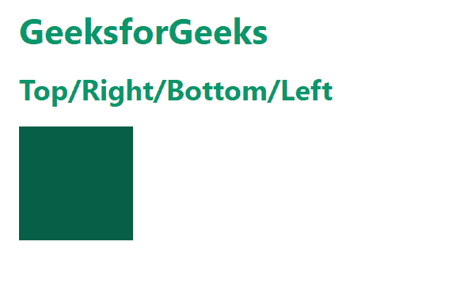
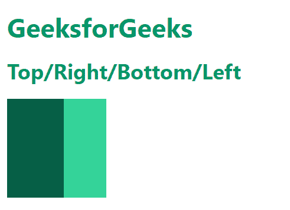
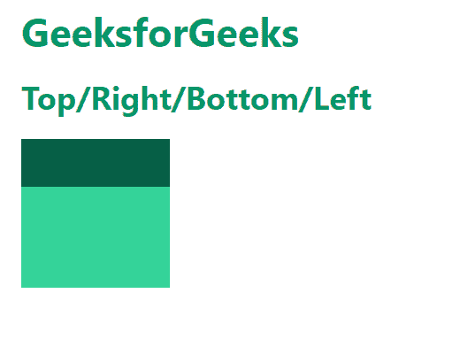
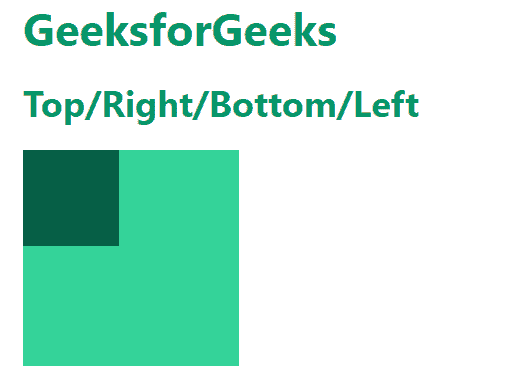
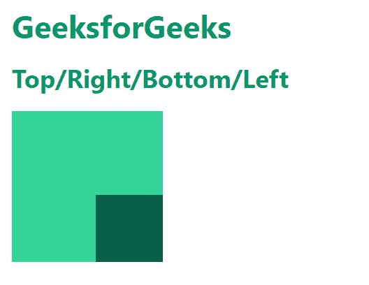

# 顺风 CSS 上/右/下/左

> 原文:[https://www . geesforgeks . org/tail wind-CSS-右上角-左下角/](https://www.geeksforgeeks.org/tailwind-css-top-right-bottom-left/)

这些类在[顺风 CSS](https://www.geeksforgeeks.org/css-tailwind-introduction/) 中接受许多值，其中所有属性都以类的形式覆盖。这些是 CSS 上/右/下/左属性的替代。这些类用于控制定位元素的对齐方式。记住我们只能对定位元素使用这些属性。

**上/右/下/左类:**

*   。插图-0
*   。插图-y-0
*   。插图-x-0
*   。top-0
*   。右-0
*   。底部-0
*   。左-0

顺风中上/右/下/左/插入工具的默认值为0 和自动**。**

**注意:**可以用有效的“rem”值更改数字“0”。

**插图-0:** 用于为元素的上/右/下/左属性提供 **0px** 值。

**语法:**

```html
<element class="inset-0">...</element>
```

**示例:**

## 超文本标记语言

```html
<!DOCTYPE html>
<html>
<head>
    <link href=
"https://unpkg.com/tailwindcss@^2/dist/tailwind.min.css" 
          rel="stylesheet">
</head>
<body>
    <div class="text-green-600 font-bold m-4">
    <h1 class="text-3xl my-4" >GeeksforGeeks</h1>
    <p class=" text-2xl">Top/Right/Bottom/Left</p>

    </div>
    <div class="relative h-24 w-24 bg-green-400 m-4">
        <div class="absolute inset-0 bg-green-800"></div>
      </div>
</body>
</html>
```

**输出:**



插图-0

**插图-y-0:** 用于为元素的*顶部*和*底部*属性提供值 **0px** 。

**语法:**

```html
<element class="inset-y-0">...</element>
```

**示例:**

## 超文本标记语言

```html
<!DOCTYPE html>
<html>
<head>
    <link href=
"https://unpkg.com/tailwindcss@^2/dist/tailwind.min.css" 
          rel="stylesheet">
</head>
<body>
    <div class="text-green-600 font-bold m-4">
    <h1 class="text-3xl my-4" >GeeksforGeeks</h1>
    <p class=" text-2xl">Top/Right/Bottom/Left</p>

    </div>
    <div class="relative h-28 w-28 bg-green-400 m-4">
        <div class="absolute inset-y-0 
                    w-16 bg-green-800">
        </div>
      </div>
</body>
</html>
```

**输出:**



插图-y-0

**插图-x-0:** 用于向元素的*右侧*和*左侧*属性提供值 0px。

**语法:**

```html
<element class="inset-x-0">...</element>
```

**示例:**

## 超文本标记语言

```html
<!DOCTYPE html>
<html>
<head>
    <link href=
"https://unpkg.com/tailwindcss@^2/dist/tailwind.min.css" 
          rel="stylesheet">
</head>
<body>
    <div class="text-green-600 font-bold m-4">
    <h1 class="text-3xl my-4" >GeeksforGeeks</h1>
    <p class=" text-2xl">Top/Right/Bottom/Left</p>

    </div>
    <div class="relative h-28 w-28 bg-green-400 m-4">
        <div class="absolute inset-x-0 
                    h-9 bg-green-800">
        </div>
      </div>
</body>
</html>
```

**输出:**



插图-x-0

**top-0** :用于给元素的 top 属性提供值 0px。

**语法:**

```html
<element class="top-0">...</element>
```

**left-0:** 用于给元素的 left 属性提供值 0px。

**语法:**

```html
<element class="left-0">...</element>
```

**示例:**在本例中，我们使用的是*左-0* 和*顶-0* 类。

## 超文本标记语言

```html
<!DOCTYPE html>
<html>
<head>
    <link href=
"https://unpkg.com/tailwindcss@^2/dist/tailwind.min.css" 
          rel="stylesheet">
</head>
<body>
    <div class="text-green-600 font-bold m-4">
    <h1 class="text-3xl my-4" >GeeksforGeeks</h1>
    <p class=" text-2xl">Top/Right/Bottom/Left</p>

    </div>
    <div class="relative h-36 w-36 bg-green-400 m-4">
        <div class="absolute left-0 top-0 
                    w-16 h-16 bg-green-800">
        </div>
      </div>
</body>
</html>
```

**输出:**



左 0 顶 0

**right-0** :用于给元素的 right 属性提供值 0px。

**语法:**

```html
<element class="right-0">...</element>
```

**bottom-0:** 用于为元素的 bottom 属性提供值 0px。

**语法:**

```html
<element class="bottom-0">...</element>
```

**示例:**在本例中，我们使用的是*右-0* 和*底-0* 类。

## 超文本标记语言

```html
<!DOCTYPE html>
<html>
<head>
    <link href=
"https://unpkg.com/tailwindcss@^2/dist/tailwind.min.css" 
          rel="stylesheet">
</head>
<body>
    <div class="text-green-600 font-bold m-4">
    <h1 class="text-3xl my-4" >GeeksforGeeks</h1>
    <p class=" text-2xl">Top/Right/Bottom/Left</p>

    </div>
    <div class="relative h-36 w-36 bg-green-400 m-4">
        <div class="absolute right-0 bottom-0 
                    w-16 h-16 bg-green-800">
        </div>
      </div>
</body>
</html>
```

**输出:**



右 0 下 0