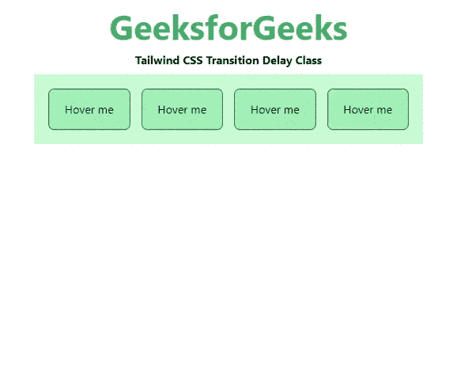

# 顺风 CSS 过渡延迟

> 原文:[https://www . geesforgeks . org/tail wind-CSS-transition-delay/](https://www.geeksforgeeks.org/tailwind-css-transition-delay/)

这个类在[顺风 CSS](https://www.geeksforgeeks.org/css-tailwind-introduction/) 中接受很多值，其中所有的属性都以类的形式被覆盖。过渡延迟类用于指定开始过渡效果的时间长度(秒或毫秒)。在 CSS 中，我们已经通过使用 [CSS 转换延迟](https://www.geeksforgeeks.org/css-transition-delay-property/)做到了这一点。

**过渡延迟等级:**

*   **延时-75:** 此类用于启动 75ms 的过渡时间。
*   **延时-100:** 此类用于启动 100 毫秒的过渡时间。
*   **延时-150:** 此类用于启动 150ms 的过渡时间。
*   **延时-200:** 此类用于启动 200 毫秒的过渡时间。
*   **延时-300:** 此类用于启动 300 毫秒的过渡时间。
*   **延时-500:** 此类用于启动 500ms 的过渡时间。
*   **延时-700:** 此类用于启动 700 毫秒的过渡时间。
*   **延时-1000:** 此类用于启动 1000 毫秒的过渡时间。

**语法:**

```html
<element class="delay-{amount}">...</element>
```

**示例:**

## 超文本标记语言

```html
<!DOCTYPE html> 
<html>
<head> 
    <link href= 
"https://unpkg.com/tailwindcss@^1.0/dist/tailwind.min.css"
        rel="stylesheet"> 
</head> 

<body class="text-center mx-4 space-y-2"> 
    <h1 class="text-green-600 text-5xl font-bold"> 
        GeeksforGeeks 
    </h1> 
    <b>Tailwind CSS Transition Delay Class</b> 
    <div class="bg-green-200 m-8 grid grid-flow-col gap-4 p-5"> 
        <button class="transition delay-75 ease-in-out 
                       bg-green-300 hover:bg-green-600 transform 
                       hover:-translate-y-1 hover:scale-110 
                       rounded-lg p-4 border border-green-900">
            Hover me
        </button>
        <button class="transition delay-100 ease-in-out 
                       bg-green-300 hover:bg-green-600 transform 
                       hover:-translate-y-1 hover:scale-110 
                       rounded-lg p-4 border border-green-900">
            Hover me
        </button>
        <button class="transition delay-500 ease-in-out 
                       bg-green-300 hover:bg-green-600 transform 
                       hover:-translate-y-1 hover:scale-110 
                       rounded-lg p-4 border border-green-900">
            Hover me
        </button>
        <button class="transition delay-1000 ease-in-out 
                       bg-green-300 hover:bg-green-600 transform 
                       hover:-translate-y-1 hover:scale-110 
                       rounded-lg p-4 border border-green-900">
            Hover me
        </button>
    </div> 
</body> 

</html>
```

**输出:**



转变延迟