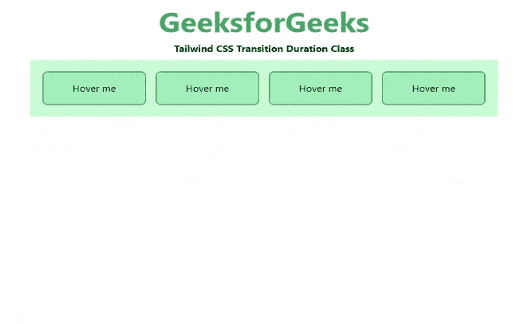

# 顺风 CSS 过渡持续时间

> 原文:[https://www . geesforgeks . org/tail wind-CSS-transition-duration/](https://www.geeksforgeeks.org/tailwind-css-transition-duration/)

这个类在 [<u>顺风 CSS</u>](https://www.geeksforgeeks.org/css-tailwind-introduction/) 中接受大量的值，其中所有的属性都包含在类形式中。过渡持续时间类用于指定完成过渡效果的时间长度(以秒或毫秒为单位)。在 CSS 中，我们已经通过使用 [CSS 过渡-持续时间](https://www.geeksforgeeks.org/css-transition-duration-property/)做到了这一点。

**过渡持续时间等级:**

*   **持续时间-75:** 这个类用来取 75ms 的过渡时间。
*   **持续时间-100:** 这个类用来取 100ms 的过渡时间。
*   **持续时间-150:** 这个类用来取 150ms 的过渡时间。
*   **持续时间-200:** 这个类用来取 200 毫秒的过渡时间。
*   **持续时间-300:** 这个类用来取 300ms 的过渡时间。
*   **持续时间-500:** 这个类用来取 500ms 的过渡时间。
*   **持续时间-700:** 这个类用来取 700ms 的过渡时间。
*   **持续时间-1000:** 这个类用来取 1000 毫秒的过渡时间。

**语法:**

```
<element class="duration-{amount}">...</element>
```

**示例:**

## 超文本标记语言

```
<!DOCTYPE html> 
<html>
<head> 
    <link href= 
"https://unpkg.com/tailwindcss@^1.0/dist/tailwind.min.css"
        rel="stylesheet"> 
</head> 

<body class="text-center mx-4 space-y-2"> 
    <h1 class="text-green-600 text-5xl font-bold"> 
        GeeksforGeeks 
    </h1> 
    <b>Tailwind CSS Transition Duration Class</b> 
    <div class="bg-green-200 m-8 grid grid-flow-col gap-4 p-5"> 
        <button class="transition duration-75 ease-in-out 
                       bg-green-300 hover:bg-green-600 transform 
                       hover:-translate-y-1 hover:scale-110 
                       rounded-lg p-4 border border-green-900">
            Hover me
        </button>
        <button class="transition duration-100 ease-in-out 
                       bg-green-300 hover:bg-green-600 transform 
                       hover:-translate-y-1 hover:scale-110 
                       rounded-lg p-4 border border-green-900">
            Hover me
        </button>
        <button class="transition duration-500 ease-in-out 
                       bg-green-300 hover:bg-green-600 transform 
                       hover:-translate-y-1 hover:scale-110 
                       rounded-lg p-4 border border-green-900">
            Hover me
        </button>
        <button class="transition duration-1000 ease-in-out 
                       bg-green-300 hover:bg-green-600 transform 
                       hover:-translate-y-1 hover:scale-110 
                       rounded-lg p-4 border border-green-900">
            Hover me
        </button>
    </div> 
</body> 

</html> 
```

**输出:**



过渡持续时间类别