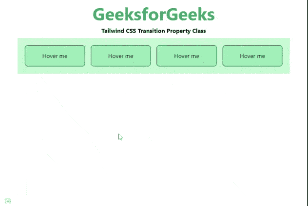

# 顺风 CSS 过渡属性

> 原文:[https://www . geesforgeks . org/tail wind-CSS-transition-property/](https://www.geeksforgeeks.org/tailwind-css-transition-property/)

这个类在[顺风 CSS](https://www.geeksforgeeks.org/css-tailwind-introduction/) 中接受很多值，其中所有的属性都以类的形式被覆盖。转换属性类用于指定将对其产生转换效果的 CSS 属性的名称。在 CSS 中，我们已经通过使用 [CSS 转换属性](https://www.geeksforgeeks.org/css-transition-property-property/)做到了这一点。

**过渡属性类:**

*   **过渡-无:**该值用于指定没有类会获得过渡效果。
*   **过渡-全部:**所有的职业都会获得一个过渡效果。这也是该类的默认值。
*   **过渡:**我们可以指定将要应用过渡效果的 CSS 属性的名称。我们还可以通过用逗号分隔来指定多个属性。
*   **过渡-颜色:**该值用于指定颜色类将获得过渡效果。
*   **过渡-不透明度:**该值用于指定不透明度类将获得过渡效果。
*   **过渡-阴影:**此值用于指定阴影类将获得过渡效果。
*   **过渡-变换:**该值用于指定变换成已定义的形状。

**语法:**

```
<element class="transition-{properties}">...</element>
```

**示例:**

## 超文本标记语言

```
<!DOCTYPE html> 
<html>
<head> 
    <link href= 
"https://unpkg.com/tailwindcss@^1.0/dist/tailwind.min.css"
        rel="stylesheet"> 
</head> 

<body class="text-center mx-4 space-y-2"> 
    <h1 class="text-green-600 text-5xl font-bold"> 
        GeeksforGeeks 
    </h1> 
    <b>Tailwind CSS Transition Property Class</b> 
    <div class="bg-green-200 m-8 grid grid-flow-col gap-4 p-5"> 
        <button class="transition duration-500 ease-in-out 
                       bg-green-300 hover:bg-green-600 transform 
                       hover:-translate-y-1 hover:scale-110 
                       rounded-lg p-4 border border-green-900">
            Hover me
        </button>
        <button class="transition-opacity duration-500 ease-in-out 
                       bg-green-300 hover:opacity-75 transform 
                       hover:-translate-y-1 hover:scale-110 
                       rounded-lg p-4 border border-green-900">
            Hover me
        </button>
        <button class="transition-none duration-500 ease-in-out 
                       bg-green-300 hover:bg-green-600 transform 
                       hover:-translate-y-1 hover:scale-110 
                       rounded-lg p-4 border border-green-900">
            Hover me
        </button>
        <button class="transition-colors duration-500 ease-in-out 
                       bg-green-300 hover:bg-yellow-600 transform 
                       hover:scale-110 rounded-lg p-4 border 
                       border-green-900 hover:border-black">
            Hover me
        </button>
    </div> 
</body> 

</html> 
```

**输出:**



不同的属性类别