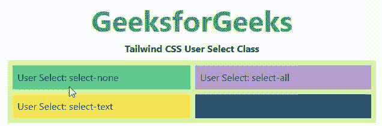

# 顺风 CSS 用户选择

> 原文:[https://www.geeksforgeeks.org/tailwind-css-user-select/](https://www.geeksforgeeks.org/tailwind-css-user-select/)

这个类在[顺风 CSS](https://www.geeksforgeeks.org/css-tailwind-introduction/) 中接受很多值，其中所有的属性都作为一个类形式被覆盖。此类用于指定用户是否可以选择文本。在 CSS 中，我们通过使用 [CSS 用户选择属性](https://www.geeksforgeeks.org/css-user-select-property/)来实现。

**用户选择类别**

*   **选择-无:**此类用于拒绝选择任何文本。
*   **选择-文本:**该类用于选择单个文本。
*   **全选:**此类用于选择整个语句。
*   **选择-自动:**该类用于设置默认行为。

**语法:**

```html
<element class="select-{effect}">...</element>
```

**示例:**

## 超文本标记语言

```html
<!DOCTYPE html> 
<html> 
<head> 
    <link href= 
"https://unpkg.com/tailwindcss@^1.0/dist/tailwind.min.css"
    rel="stylesheet"/> 
</head> 

<body class="text-center mx-4 space-y-2"> 
    <h1 class="text-green-600 text-5xl font-bold"> 
    GeeksforGeeks 
    </h1> 
    <b>Tailwind CSS User Select Class</b> 
    <div class="mx-14 bg-green-200 grid grid-rows-2
                grid-flow-col text-justify p-2 gap-2"> 
    <p class="bg-green-400 p-2 select-none"> 
        User Select: select-none
    </p>

    <p class="bg-yellow-400 p-2 select-text"> 
        User Select: select-text     
    </p>

    <p class="bg-purple-400 p-2 select-all"> 
        User Select: select-all
    </p>

    <p class="bg-blue-800 p-2 select-auto"> 
        User Select: select-auto 
    </p>

    </div> 
</body> 
</html> 
```

**输出:**

