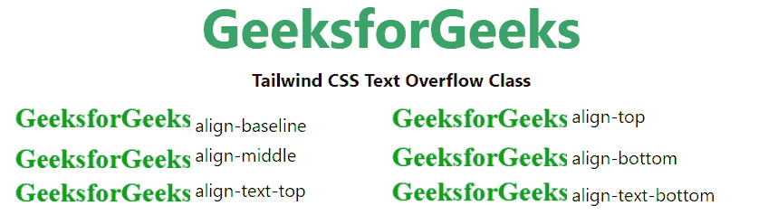

# 顺风 CSS 垂直对齐

> 原文:[https://www . geesforgeks . org/tail wind-CSS-垂直-对齐/](https://www.geeksforgeeks.org/tailwind-css-vertical-alignment/)

该类在[顺风 CSS](https://www.geeksforgeeks.org/css-tailwind-introduction/) 中接受多个值。所有的属性都包含在类的形式中。它是 [CSS 垂直对齐属性](https://www.geeksforgeeks.org/css-vertical-align-property/)的替代品。此类用于指定表格框或内联元素的垂直对齐方式。

**垂直校准等级:**

*   **对齐-基线:**它将元素基线与父元素的基线相对应对齐。这可能因浏览器而异。这是默认值。
*   **对齐顶部:**将元素的顶部与其线上最高元素的顶部对齐。
*   **对齐-中间:**将元素的中间与父元素的中间对齐。
*   **对齐-底部:**将元素的底部与其线上最短元素的顶部对齐。
*   **对齐-文本-顶部:**它将元素顶部与父字体的顶部相对应对齐。
*   **对齐-文本-底部:**将元素的底部与父字体的底部对齐。

**语法:**

```
<element class="align-{Vertical Alignment}">...</element>
```

**示例:**

## 超文本标记语言

```
<!DOCTYPE html> 
<html>
<head> 
    <link href=
"https://unpkg.com/tailwindcss@^1.0/dist/tailwind.min.css" 
          rel="stylesheet"> 
</head> 

<body class="text-center mx-4 space-y-2"> 
    <h1 class="text-green-600 text-5xl font-bold">
        GeeksforGeeks
    </h1> 
    <b>Tailwind CSS Text Overflow Class</b> 
    <div class="mx-4 h-24 rounded-lg grid grid-cols-2 text-left ">

      <p>
        
             align-baseline
      </p>

      <p>
        
             align-top
      </p>

      <p>
        
             align-middle
      </p>

      <p>
        
             align-bottom
      </p>

      <p>
        
             align-text-top
      </p>

      <p>
        
             align-text-bottom
      </p>

    </div>
</body> 

</html> 
```

**输出:**

