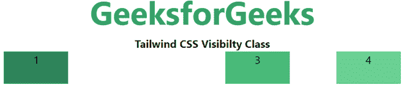
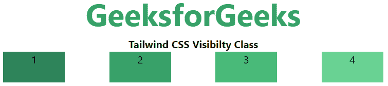

# 顺风 CSS 能见度

> 原文:[https://www.geeksforgeeks.org/tailwind-css-visibility/](https://www.geeksforgeeks.org/tailwind-css-visibility/)

这个类在 tailwind CSS 中接受两个值。它是 [**CSS 可见性属性**](https://www.geeksforgeeks.org/css-visibility-property/#:~:t) 的替代品。此类用于指定一个元素在 web 文档中是否可见，但隐藏的元素会占用 web 文档中的空间。使用*显示*属性从浏览器中移除或隐藏并删除元素。

**能见度:**

*   看不见的
*   看得见的

**不可见:**这个类用于隐藏页面中的元素，但是会占用文档中的空间

**语法:**

```
<element class="invisible">...</element>
```

**示例:**

## 超文本标记语言

```
<!DOCTYPE html>
<html> 
<head> 
    <link href=
"https://unpkg.com/tailwindcss@^1.0/dist/tailwind.min.css" 
          rel="stylesheet"> 
</head> 

<body class="text-center"> 
    <h1 class="text-green-600 text-5xl font-bold">
        GeeksforGeeks
    </h1> 
    <b>Tailwind CSS Visibility Class</b> 
    <div id="main" class="flex flex-row justify-evenly"> 
        <div class="bg-green-700 w-24 h-12">1</div> 
        <div class="invisible bg-green-600 w-24 h-12">2</div> 
        <div class="bg-green-500 w-24 h-12">3</div> 
        <div class="bg-green-400 w-24 h-12">4</div> 
    </div> 
</body> 

</html>
```

**输出:**



**可见:**为默认值。该元素通常在 web 文档中显示或可见。

**语法:**

```
<element class="invisible">...</element>
```

**示例:**

## 超文本标记语言

```
<!DOCTYPE html> 
<html> 
<head> 
    <link href=
"https://unpkg.com/tailwindcss@^1.0/dist/tailwind.min.css" 
          rel="stylesheet"> 
</head> 

<body class="text-center"> 
    <h1 class="text-green-600 text-5xl font-bold">
        GeeksforGeeks
    </h1> 
    <b>Tailwind CSS Visibility Class</b> 
    <div id="main" class="flex flex-row justify-evenly"> 
        <div class="bg-green-700 w-24 h-12">1</div> 
        <div class="visible bg-green-600 w-24 h-12">2</div> 
        <div class="bg-green-500 w-24 h-12">3</div> 
        <div class="bg-green-400 w-24 h-12">4</div> 
    </div> 
</body> 

</html>
```

**输出:**

