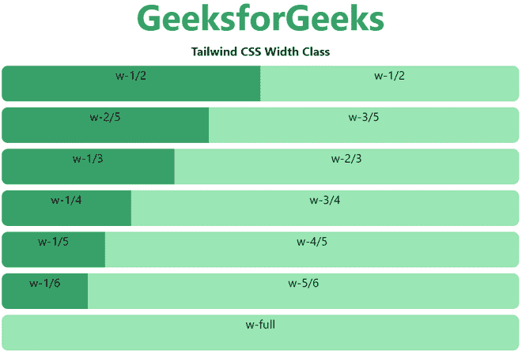

# 顺风 CSS 宽度

> 原文:[https://www.geeksforgeeks.org/tailwind-css-width/](https://www.geeksforgeeks.org/tailwind-css-width/)

这个类在[顺风 CSS](https://www.geeksforgeeks.org/css-tailwind-introduction/) 中接受很多值，其中所有的属性都以类的形式被覆盖。它是 [CSS 宽度属性的替代。](https://www.geeksforgeeks.org/css-width-property/)此类用于设置文字、图像的宽度。宽度可以像素(px)、百分比(%)、厘米(cm)等形式分配给文本和图像。

**宽度等级:**

*   **w-0:** 此类表示宽度设置为零。
*   **w-auto:** 此类表示根据内容设置宽度
*   **w-1/2:** 此类表示宽度设置为窗口的一半。
*   **w-1/3:** 此类表示宽度设置为窗口的三分之一。
*   **w-1/4:** 此类表示宽度设置为窗口的四分之一。
*   **w-1/5:** 此类表示宽度设置为窗口的五分之一。
*   **w-1/6:** 此类表示宽度设置为窗口的六分之一。
*   **w-1/12:** 此类表示宽度设置为窗口的十二分之一。
*   **w-full:** 此类表示宽度设置为 full。
*   **w-screen:** 此类表示宽度设置为屏幕尺寸。
*   **w-min:** 该类用于定义*最小宽度*。
*   **最大宽度:**该类用于定义*最大宽度*。

**注意:**您可以用有效的“rem”值更改数字或设置百分比值。

**语法:**

```css
<element class="w-0">...</element>
```

**示例:**

## 超文本标记语言

```css
<!DOCTYPE html> 
<head> 
    <link href=
"https://unpkg.com/tailwindcss@^1.0/dist/tailwind.min.css" 
          rel="stylesheet"> 
</head> 

<body class="text-center mx-4 space-y-2"> 
    <h1 class="text-green-600 text-5xl font-bold">
        GeeksforGeeks
    </h1> 
    <b>Tailwind CSS Width Class</b> 
    <div class="flex">
        <div class="w-1/2 bg-green-600 h-12 rounded-l-lg">
          w-1/2
        </div>
        <div class="w-1/2 bg-green-300 h-12 rounded-r-lg">
          w-1/2
        </div>
    </div>
    <div class="flex ...">
      <div class="w-2/5 bg-green-600 h-12 rounded-l-lg">
          w-2/5
      </div>
      <div class="w-3/5 bg-green-300 h-12 rounded-r-lg">
          w-3/5
      </div>
    </div>
    <div class="flex ...">
      <div class="w-1/3 bg-green-600 h-12 rounded-l-lg">
          w-1/3
      </div>
      <div class="w-2/3 bg-green-300 h-12 rounded-r-lg">
          w-2/3
      </div>
    </div>
    <div class="flex ...">
      <div class="w-1/4 bg-green-600 h-12 rounded-l-lg">
          w-1/4
      </div>
      <div class="w-3/4 bg-green-300 h-12 rounded-r-lg">
          w-3/4
      </div>
    </div>
    <div class="flex ...">
      <div class="w-1/5 bg-green-600 h-12 rounded-l-lg">
          w-1/5
      </div>
      <div class="w-4/5 bg-green-300 h-12 rounded-r-lg">
          w-4/5
      </div>
    </div>
    <div class="flex ...">
      <div class="w-1/6 bg-green-600 h-12 rounded-l-lg">
          w-1/6
      </div>
      <div class="w-5/6 bg-green-300 h-12 rounded-r-lg">
          w-5/6
      </div>
    </div>
    <div class="w-full bg-green-300 h-12 rounded-lg">
          w-full
    </div>
</body> 

</html>
```

**输出:**

