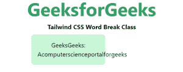
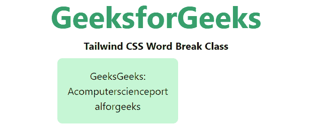
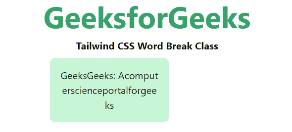

# 顺风 CSS 断字

> 原文:[https://www.geeksforgeeks.org/tailwind-css-word-break/](https://www.geeksforgeeks.org/tailwind-css-word-break/)

该类在[顺风 CSS](https://www.geeksforgeeks.org/css-tailwind-introduction/) 中接受多个值。所有的属性都包含在类的形式中。它是 [CSS 断字属性](https://www.geeksforgeeks.org/css-word-break-property/)的替代品。此类用于指定当单词到达行尾时如何换行。文本中的换行符可能出现在某些空格中，比如有空格或连字符时。

**断字类:**

*   **中断-正常**
*   **断字**
*   **全断**

**断线-正常:**此类用于默认断线规则。

**语法:**

```css
<element class="break-normal">...</element>
```

**示例:**

## 超文本标记语言

```css
<!DOCTYPE html> 
<head> 
    <link href=
"https://unpkg.com/tailwindcss@^1.0/dist/tailwind.min.css" 
          rel="stylesheet"> 
</head> 

<body class="text-center mx-4 space-y-2"> 
    <h1 class="text-green-600 text-5xl font-bold">
        GeeksforGeeks
    </h1> 
    <b>Tailwind CSS Word Break Class</b> 
    <div class="mx-48 w-48 bg-green-200 rounded-lg">
        <p class="p-4 break-normal">
            GeeksGeeks: Acomputerscienceportalforgeeks
        </p>

    </div>
</body> 

</html> 
```

**输出:**



**断字:**用于任意点断字，防止溢出。

**语法:**

```css
<element class="break-words">...</element>
```

**示例:**

## 超文本标记语言

```css
<!DOCTYPE html> 
<head> 
    <link href=
"https://unpkg.com/tailwindcss@^1.0/dist/tailwind.min.css" 
          rel="stylesheet"> 
</head> 

<body class="text-center mx-4 space-y-2"> 
    <h1 class="text-green-600 text-5xl font-bold">
        GeeksforGeeks
    </h1> 
    <b>Tailwind CSS Word Break Class</b> 
    <div class="mx-48 w-48 bg-green-200 rounded-lg">
        <p class="p-4 break-words">
            GeeksGeeks: Acomputerscienceportalforgeeks
        </p>

    </div>
</body> 

</html> 
```

**输出:**



**断字:**用于任意字符处断字，防止溢出。

**语法:**

```css
<element class="break-all">...</element>
```

**示例:**

## 超文本标记语言

```css
<!DOCTYPE html> 
<head> 
    <link href=
"https://unpkg.com/tailwindcss@^1.0/dist/tailwind.min.css" 
          rel="stylesheet"> 
</head> 

<body class="text-center mx-4 space-y-2"> 
    <h1 class="text-green-600 text-5xl font-bold">
        GeeksforGeeks
    </h1> 
    <b>Tailwind CSS Word Break Class</b> 
    <div class="mx-48 w-48 bg-green-200 rounded-lg">
        <p class="p-4 break-all">
            GeeksGeeks: Acomputerscienceportalforgeeks
        </p>

    </div>
</body> 

</html> 
```

**输出:**



中断所有课程