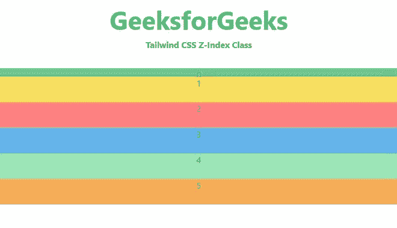
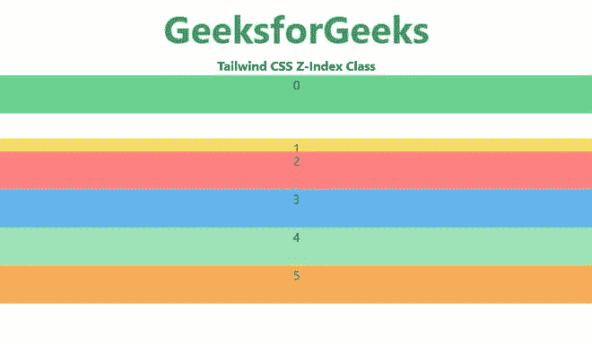
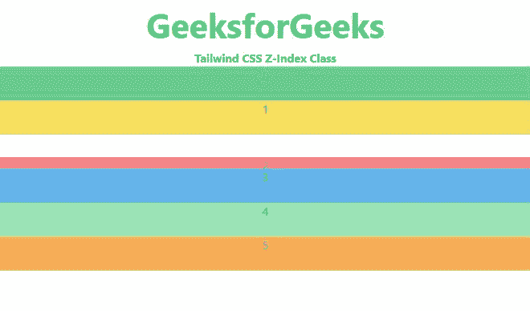
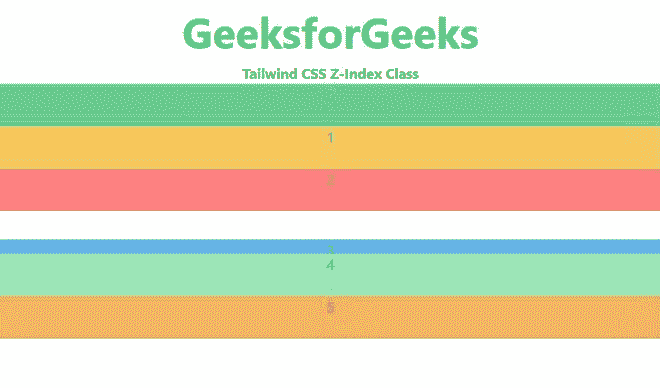
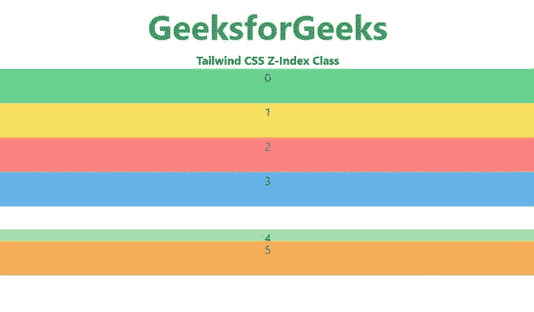
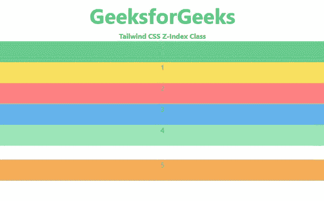

# 顺风 CSS Z 指数

> 原文:[https://www.geeksforgeeks.org/tailwind-css-z-index/](https://www.geeksforgeeks.org/tailwind-css-z-index/)

[顺风 CSS](https://www.geeksforgeeks.org/css-tailwind-introduction/) 是一个实用的 CSS 框架，它提供了在使用 CSS 时管理我们的 HTML 内容的类。**顺风 CSS** 使我们的设计部分更容易，并对多个平台做出响应。z-Index 实用程序用于控制元素的堆栈顺序。它是 [**CSS z-index**](https://www.geeksforgeeks.org/css-z-index-property/) 属性的替代品。该类用于描述三维平面上的 z 指数，如下例所示。

**顺风 CSS z-index 类:**

*   **z-0**
*   **z-10**
*   **z-20**
*   **z-30**
*   **z-40**
*   **z-50**
*   **z-auto**

**注:**在上述类中， *z-0* 相当于 *z-index:0* CSS 属性等等。

**z-0:** 用于给元素赋予 *z-index* 0。

**语法:**

```html
<element class="z-0">....</element>
```

**示例:**

## 超文本标记语言

```html
<!DOCTYPE html>
<head>
    <link 
    rel="stylesheet"
    href="https://unpkg.com/tailwindcss@^1.0/dist/tailwind.min.css">
</head>

<body class="text-center">
    <h1 class="text-green-600 text-5xl font-bold">
        GeeksforGeeks
    </h1>
    <b>Tailwind CSS Z-Index Class</b>
    <div class="flex-column">
        <div class="relative z-0 w-full 
                    h-12 bg-green-400" 
              style="top: 32px;">0</div>
        <div class="relative z-10 w-full 
                    h-12 bg-yellow-400">1</div>
        <div class="relative z-20 w-full 
                    h-12 bg-red-400">2</div>
        <div class="relative z-30 w-full 
                    h-12 bg-blue-400">3</div>
        <div class="relative z-40 w-full 
                    h-12 bg-green-300">4</div>
        <div class="relative z-50 w-full 
                    h-12 bg-orange-400">5</div>
    </div>
</body>

</html>
```

**输出:**



**z-10:** 用于给元素赋予 *z-index* 10。元素沿 z 轴向上显示 10px。

**语法:**

```html
<element class="z-10">....</element>
```

**示例:**

## 超文本标记语言

```html
<!DOCTYPE html>
<head>
    <link 
    rel="stylesheet"
    href="https://unpkg.com/tailwindcss@^1.0/dist/tailwind.min.css">
</head>

<body class="text-center">
    <h1 class="text-green-600 text-5xl font-bold">
        GeeksforGeeks
    </h1>
    <b>Tailwind CSS Z-Index Class</b>
    <div class="flex-column">
        <div class="relative z-0 w-full h-12 bg-green-400">0</div>
        <div class="relative z-10 w-full 
                    h-12 bg-yellow-400" style="top: 32px;">1</div>
        <div class="relative z-20 w-full h-12 bg-red-400">2</div>
        <div class="relative z-30 w-full h-12 bg-blue-400">3</div>
        <div class="relative z-40 w-full h-12 bg-green-300">4</div>
        <div class="relative z-50 w-full h-12 bg-orange-400">5</div>
    </div>
</body>

</html>
```

**输出:**



**z-20:** 用于给元素赋予 *z-index* 20。元素沿 z 轴向上显示 20px。

**语法:**

```html
<element class="z-20">....</element>
```

**示例:**

## 超文本标记语言

```html
<!DOCTYPE html>
<head>
    <link 
    rel="stylesheet"
    href="https://unpkg.com/tailwindcss@^1.0/dist/tailwind.min.css">
</head>

<body class="text-center">
    <h1 class="text-green-600 text-5xl font-bold">
        GeeksforGeeks
    </h1>
    <b>Tailwind CSS Z-Index Class</b>
    <div class="flex-column">
        <div class="relative z-0 w-full h-12 bg-green-400">0</div>
        <div class="relative z-10 w-full h-12 bg-yellow-400">1</div>
        <div class="relative z-20 w-full h-12 bg-red-400"
                                           style="top: 32px;">2</div>
        <div class="relative z-30 w-full h-12 bg-blue-400">3</div>
        <div class="relative z-40 w-full h-12 bg-green-300">4</div>
        <div class="relative z-50 w-full h-12 bg-orange-400">5</div>
    </div>
</body>

</html>
```

**输出:**



**z-30:** 用于给元素赋予 *z-index* 30。元素沿 z 轴向上显示 30px。

**语法:**

```html
<element class="z-30">....</element>
```

**示例:**

## 超文本标记语言

```html
<!DOCTYPE html>
<head>
    <link 
    rel="stylesheet"
    href="https://unpkg.com/tailwindcss@^1.0/dist/tailwind.min.css">
</head>

<body class="text-center">
    <h1 class="text-green-600 text-5xl font-bold">
        GeeksforGeeks
    </h1>
    <b>Tailwind CSS Z-Index Class</b>
    <div class="flex-column">
        <div class="relative z-0 w-full h-12 bg-green-400">0</div>
        <div class="relative z-10 w-full h-12 bg-yellow-400">1</div>
        <div class="relative z-20 w-full h-12 bg-red-400">2</div>
        <div class="relative z-30 w-full h-12 
                           bg-blue-400" style="top: 32px;">3</div>
        <div class="relative z-40 w-full h-12 bg-green-300">4</div>
        <div class="relative z-50 w-full h-12 bg-orange-400">5</div>
    </div>
</body>

</html>
```

**输出:**



**z-40:** 用于给元素赋予 *z-index* 40。元素沿 z 轴向上显示 40px。

**语法:**

```html
<element class="z-40">....</element>
```

**示例:**

## 超文本标记语言

```html
<!DOCTYPE html>
<head>
    <link 
    rel="stylesheet"
    href="https://unpkg.com/tailwindcss@^1.0/dist/tailwind.min.css">
</head>

<body class="text-center">
    <h1 class="text-green-600 text-5xl font-bold">
        GeeksforGeeks
    </h1>
    <b>Tailwind CSS Z-Index Class</b>
    <div class="flex-column">
        <div class="relative z-0 w-full h-12 bg-green-400">0</div>
        <div class="relative z-10 w-full h-12 bg-yellow-400">1</div>
        <div class="relative z-20 w-full h-12 bg-red-400">2</div>
        <div class="relative z-30 w-full h-12 bg-blue-400">3</div>
        <div class="relative z-40 w-full h-12 bg-green-300" 
                                         style="top: 32px;">4</div>
        <div class="relative z-50 w-full h-12 bg-orange-400">5</div>
    </div>
</body>

</html>
```

**输出:**



**z-50:** 它**T3】用来给元素赋予 *z-index* 50。元素沿 z 轴向上显示 50px。**

**语法:**

```html
<element class="z-50">....</element>
```

**示例:**

## 超文本标记语言

```html
<!DOCTYPE html>
<head>
    <link 
    rel="stylesheet"
    href="https://unpkg.com/tailwindcss@^1.0/dist/tailwind.min.css">
</head>

<body class="text-center">
    <h1 class="text-green-600 text-5xl font-bold">
        GeeksforGeeks
    </h1>
    <b>Tailwind CSS Z-Index Class</b>
    <div class="flex-column">
        <div class="relative z-0 w-full h-12 bg-green-400">0</div>
        <div class="relative z-10 w-full h-12 bg-yellow-400">1</div>
        <div class="relative z-20 w-full h-12 bg-red-400">2</div>
        <div class="relative z-30 w-full h-12 bg-blue-400">3</div>
        <div class="relative z-40 w-full h-12 bg-green-300">4</div>
        <div class="relative z-50 w-full h-12 bg-orange-400" 
                                          style="top: 32px;">5</div>
    </div>
</body>

</html>
```

**输出:**

