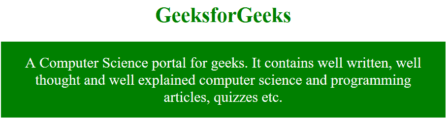

# 只针对有 CSS 的火狐

> 原文:[https://www . geesforgeks . org/targeting-only-Firefox-with-CSS/](https://www.geeksforgeeks.org/targeting-only-firefox-with-css/)

有时内容需要集中在特定的浏览器上。本文的目标是火狐浏览器显示 CSS 属性。目标 CSS 仅适用于目标浏览器。用 CSS 在很多方面瞄准火狐浏览器。其中一些将在下面讨论:

**方法 1:** 该方法使用 Mozilla 特定扩展添加 CSS 属性。这个扩展只在火狐浏览器中提供 CSS 属性。
**语法:**

```html
@-moz-document url-prefix() {
    element {
        // CSS Property
    }
}

```

**示例:**

```html
<!DOCTYPE html>
<html>
    <head>
        <title>Targetting firefox with CSS</title>
        <style type="text/css">
            @-moz-document url-prefix() {
                h1 {
                    color: green; 
                    font-size: 34px;
                    text-align: center;
                }
                p {
                    font-size: 24px;
                    text-align: center;
                }
            }
        </style>
    </head>
    <body>
        <h1>GeeksforGeeks</h1> 
        <p>A Computer Science portal for geeks. It contains
        well written, well thought and well explained computer
        science and programming articles, quizzes etc. </p>
    </body>
</html>                    
```

**输出**


**方法 2:**Gecko(火狐)中使用-moz 外观 CSS 属性，根据操作系统的主题，使用平台原生样式显示元素。
**语法:**

```html
@supports (-moz-appearance:none) {
    element {
        // CSS Property
    }
}

```

**示例:**

```html
<!DOCTYPE html>
<html>
    <head>
        <title>Targetting firefox with CSS</title>
        <style type="text/css">
            @supports (-moz-appearance:none) {
                h1 {
                    color: green; 
                    font-size: 34px;
                    text-align: center;
                }
                p {
                    font-size: 24px;
                    text-align: center;
                    display:block;
                    padding: 20px;
                    background: green;
                    color: white;
                }
            }
        </style>
    </head>
    <body>
        <h1>GeeksforGeeks</h1>
        <p>A Computer Science portal for geeks. It contains
        well written, well thought and well explained computer
        science and programming articles, quizzes etc. </p>
    </body>
</html>                    
```

**输出:**


**注意:**以上示例的 CSS 样式只会在火狐浏览器中工作。