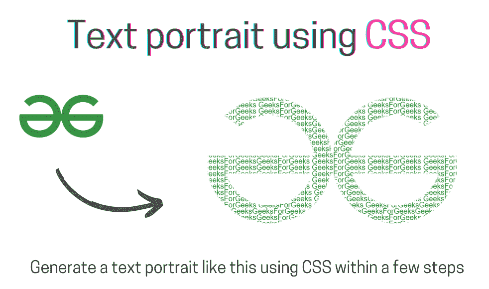
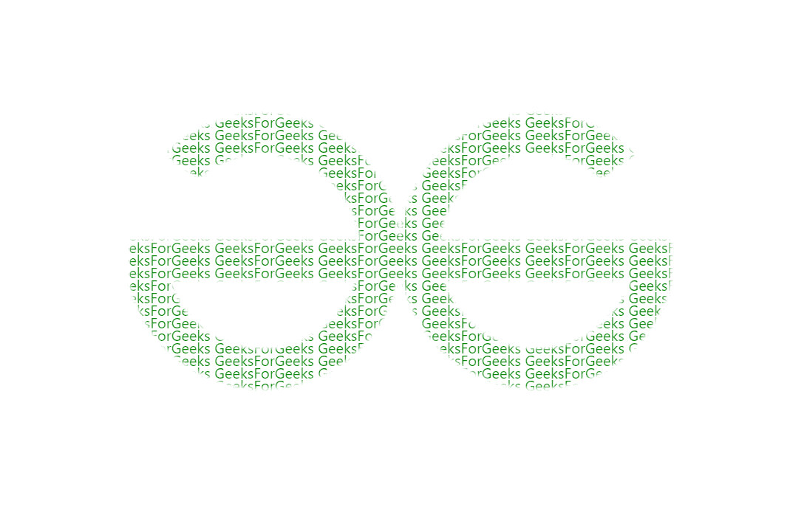

# 使用 CSS 的文字人像

> 原文:[https://www.geeksforgeeks.org/text-portrait-using-css/](https://www.geeksforgeeks.org/text-portrait-using-css/)

在本文中，我们将学习通过几个简单的步骤使用 CSS 创建一个文本肖像。如果你想知道，那就继续读这篇文章。我们已经规定了你需要采取的所有步骤。让我们开始设计文字肖像。



使用 CSS 的文本纵向

**方法:**以下是获取所需文本人像所需的步骤。

1.  创建一个带有一堆“GeeksforGeeks”文本的 HTML 文档，为了重复特定的单词，我们使用了如下所示的 [JavaScript repeat()](https://www.geeksforgeeks.org/javascript-string-repeat/) 函数。
2.  要使背景变暗以使人像具有吸引力，请使用背景属性，并使用 CSS 中的 url()函数设置[背景图像](https://www.geeksforgeeks.org/css-background-image-property/)。为了避免图像重复，请将背景-重复设置为不重复，方法是将图像放在中心。为了更好的可视化，减少线之间的空间。
3.  为了打印带有前景文本的背景，我们需要剪辑文本&添加一些样式属性，如[背景尺寸](https://www.geeksforgeeks.org/css-background-size-property/)，字体等。

**示例:**

## 超文本标记语言

```html
<!DOCTYPE html>
<html lang="en">

<head>
    <title>Text Portrait using CSS</title>
    <style>
        body {
            background: rgb(236, 236, 236);
            overflow: hidden;
            font-family: "Segoe UI", sans-serif;
        }

        p {
            line-height: 14px;
            background: url(
"https://media.geeksforgeeks.org/wp-content/uploads/20210628182253/gfglogo.png");

            -webkit-background-clip: text;
            background-attachment: fixed;
            background-repeat: no-repeat;
            -webkit-text-fill-color: rgba(255, 255, 255, 0);
            background-size: 80vh;
            background-position: center;
        }
    </style>
</head>

<body>
    <p id="text"></p>

    <script>
        let str = "GeeksForGeeks ";
        document.getElementById("text").innerHTML = str.repeat(500);
    </script>
</body>

</html>
```

**输出:**



最终输出