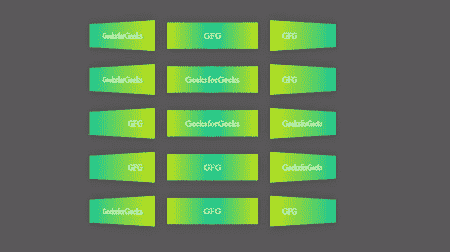

# 使用 CSS 平铺透视列表网格悬停动画

> 原文:[https://www . geesforgeks . org/tiling-透视图-列表-网格-悬停-动画-使用-css/](https://www.geeksforgeeks.org/tiling-perspective-list-grid-hover-animation-using-css/)

平铺透视列表网格悬停动画可以通过使用[第 n 个子 CSS 属性](https://www.geeksforgeeks.org/css-nth-child-selector/)和显示网格来创建。每个列元素的样式和悬停效果都不同，这种效果给人一种很好的透视效果。

**进场:**

*   创建一个名为*index.html*的 HTML 文件。
*   在 HTML 中创建一个 *ul* 列表元素。
*   在上一步创建的 *ul* 中创建一些 *li* 列表元素。
*   在 CSS 中添加样式。
*   在 CSS 中使用*第 n 个子元素* 获取列表中需要的子元素，并相应地设置样式。
*   对于 3D 透视外观，在 CSS 中使用 [*变换*](https://www.geeksforgeeks.org/css-transform-property/) 属性，并使用 [*透视()*](https://www.geeksforgeeks.org/css-perspective-function/) 方法来实现外观。
*   CSS *透视()*函数定义了一个设置用户和 z=0 平面之间距离的变换。
*   要获取第一列的元素，可以使用*第 n 个子元素(3n+1)* ，这意味着从列表的第一个元素开始每隔三个元素。类似地，*第 n 个子列(3n+2)* **第 T5】和*第 n 个子列(3n+3)* 可以分别用于设置第 2 列和第 3 列的样式。**
*   要获得网格外观，可以使用显示网格来重复 3 列，中间有一些网格间隙。

**HTML 代码:**下面的代码演示了如上所述的*index.html*文件。

## 超文本标记语言

```css
<!DOCTYPE html>
<html lang="en">
<head>
    <meta charset="UTF-8">
    <meta http-equiv="X-UA-Compatible" content="IE=edge">
    <meta name="viewport" 
          content="width=device-width, initial-scale=1.0">

    <style>
        * {
            padding: 0;
            margin: 0;
            box-sizing: border-box;
            background-color: #5b5b5b;
        }
        ul {
            /* to get it in center */
            position:fixed;
            top:50vh;
            left:50vw;
            transform: translate(-50%,-50%);
            list-style-type:none;
            display:grid;
            /* Create 3 columns */
            grid-template-columns: repeat(3,16vw);
            /* Give gap between the rows and columns */
            gap:40px 10px;
        }
        li {
            height: 60px;
            font-size: 20px;
            box-shadow: 0 0 1em rgba(0, 0, 0, 0.2);
            color: white;
            line-height: 60px;
            transition: 0.25s;
            cursor: pointer;
        }
        /*  if it is the 1st column, set the styles accordingly */
        li:nth-child(3n+1) {
            background:linear-gradient(to left, #c0e218, #16c79a);
            left:20vw;
            text-align: right;
            padding-right:30px;
            transform: perspective(25em) rotateY(-45deg);
        }
        /*  if it is the 2nd column, set the styles accordingly */
        li:nth-child(3n+2) {
            background:linear-gradient(to left, #c0e218, #16c79a,#c0e218);
            left:20vw;
            text-align: center;
        }
        /*  if it is the 3rd column, set the styles accordingly */
        li:nth-child(3n+3) {
            padding-left:30px;
            background:linear-gradient(to right, #c0e218, #16c79a);
            left:40vw;
            transform:perspective(25em) rotateY(45deg);
        }
        /* hover effect on column 1 */
        li:nth-child(3n+1):hover {
            transform:skew(15deg, 10deg) scaleY(1.4);
        }
        /* hover effect on column 2 */
        li:nth-child(3n+2):hover {
            transform:scale(1.1,1.4);
        }
        /* hover effect on column 3 */
        li:nth-child(3n+3):hover {
            transform:skew(-15deg, -10deg) scaleY(1.4);
        }
    </style>
</head>

<body>
    <!-- sample list -->
    <ul>
        <li>GeeksforGeeks</li>
        <li>GFG</li>
        <li>GFG</li>
        <li>GeeksforGeeks</li>
        <li>GeeksforGeeks</li>
        <li>GFG</li>
        <li>GFG</li>
        <li>GeeksforGeeks</li>
        <li>GeeksforGeeks</li>
        <li>GFG</li>
        <li>GFG</li>
        <li>GeeksforGeeks</li>
        <li>GeeksforGeeks</li>
        <li>GFG</li>
        <li>GFG</li>
    </ul>
</body>

</html>
```

**输出:**



平铺透视列表网格