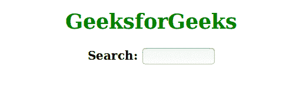

# CSS 中多属性的过渡速记？

> 原文:[https://www . geesforgeks . org/transition-速记-带有多个属性-in-css/](https://www.geeksforgeeks.org/transition-shorthand-with-multiple-properties-in-css/)

CSS 中的 transition 属性用于在元素中创建一些转换。此属性平滑地更改值。本文在 div 元素上包含悬停效果，以在转换后更改元素的宽度和高度。
过渡属性列表如下:

*   过渡性质
*   过渡持续时间
*   过渡定时功能
*   过渡延迟

**语法:**

```html
div {
    transition: <property> <duration> <timing-function> <delay>;
}

```

**例 1:**

```html
<!DOCTYPE html>
<html>
    <head>
        <style>
            h1 {
                color:Green;
                text-align:center;
            }
            h3 {
                text-align:center;
            }
            input[type=text] {
                width: 100px;
                -webkit-transition: width .35s ease-in-out;
                transition: width .35s ease-in-out;
            }
            input[type=text]:focus {
                width: 250px;
            }
        </style>
    </head>
    <body>
        <h1>GeeksforGeeks</h1>
        <h3>Search: <input type="text" name="searchbox"></h3>
    </body>
</html>                    
```

**输出:**

**注意:**如果没有指定持续时间部分，过渡将没有效果，因为它的默认值是 0。transition 属性主要指定两件事。第一个是添加效果的 CSS 属性，第二个是持续时间，除非过渡效果会更小。

**例 2:**

```html
<!DOCTYPE html>
<html>
    <head>
        <style> 
            h1 {
                color:Green;
            }
            div {
                width: 1px;
                height: 0px;
                text-align:center;
                background: Green;
                -webkit-transition: width 2s, height 2s; 
                transition: width 2s, height 2s;
            }
            div:hover {
                width: 300px;
                height: 240px;
            }
        </style>
    </head>
    <body>
        <h1>GeeksforGeeks</h1>
        <div>
        </div>
    </body>
</html>                    
```

**输出:**
