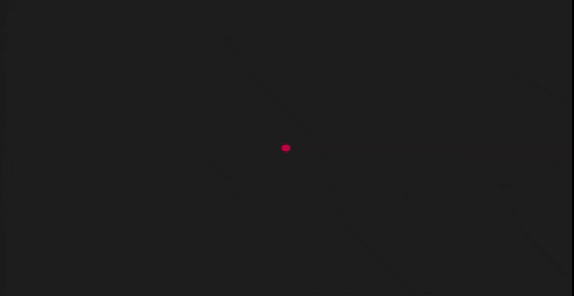

# 将剪辑路径 CSS 关键帧动画转置为 anime.js 动画

> 原文:[https://www . geesforgeks . org/转置-clip path-CSS-关键帧-动画-转化为动画-js-动画/](https://www.geeksforgeeks.org/transpose-clippath-css-keyframe-animations-into-anime-js-animation/)

[**Anime.js**](https://www.geeksforgeeks.org/introduction-to-anime-js/) 是一个小型、轻量级的 JavaScript 库，拥有一个简单而小巧的强大 API。它与 DOM 元素、CSS 和 JavaScript 对象一起工作。

我们利用图书馆使我们的工作变得简单易行。库是一个包含许多函数的 JavaScript 文档，这些函数为您的网页完成一些有用的任务。

**CDN 链接:**

**示例:**在简单的 CSS 中，如果我们想要动画化任何对象，我们必须向该 HTML 标记或类或 id 添加动画属性。我们可以用简单的 CSS 实现动画。

## 超文本标记语言

```html
<!DOCTYPE html>
<html>
  <head>
    <!-- Below is the cdn for anime.js -->
    <script
      src=
"https://cdnjs.cloudflare.com/ajax/libs/animejs/3.2.1/anime.min.js"
      integrity=
"sha512-z4OUqw38qNLpn1libAN9BsoDx6nbNFio5lA6CuTp9NlK83b89hgyCVq+N5FdBJptINztxn1Z3SaKSKUS5UP60Q=="
      crossorigin="anonymous">
    </script>
    <style>
        /* Adding basic CSS */
      * {
        box-sizing: border-box;
        margin: 0;
        padding: 0;
      }

      body {
        display: flex;
        justify-content: center;
        align-items: center;
        min-height: 100vh;
        background: rgb(29, 29, 29);
        flex-wrap: wrap;
      }

      .container {
        flex-direction: row;
        display: flex;
        align-content: center;
        justify-content: center;
      }
      .circle {
        width: 60px;
        height: 60px;
        background: crimson;
        border-radius: 50%;
        margin: 1rem;
        clip-path: circle(100%);
        animation: animation 1.5s forwards infinite;
      }

      @keyframes animation {
        100% {
          clip-path: circle(0);
        }
      }
    </style>
  </head>
  <body>
    <div class="container">
      <div class="circle"></div>
    </div>
  </body>
</html>

</html>
```

**输出:**



为了将剪辑路径 CSS *关键帧*动画转换为**动画，我们将遵循下面的方法**。****

**方法:**首先，我们将从 CSS 文件中移除关键帧和动画。现在我们将编写我们的 JavaScript。

在 anime.js 中，我们必须指定什么是开始帧和结束帧，因为如果我们只添加一帧，它将保持静止，动画不会发生。

我们的起点是

```html
clip-path: circle(100%);
```

我们的结尾框架是

```html
clip-path:circle(0);
```

所以使用 **anime.js** 实现上述动画非常简单，只需要几行代码。

**JavaScript:** 下面演示代码的 JavaScript 部分。

## java 描述语言

```html
  anime({
  targets: ".circle",
  easing: "easeInOutExpo",
  keyframes: [
    { clipPath: "circle(100%)" },
    { clipPath: "circle(0%)" },
  ],
  direction: "alternate",
  duration: 1500,
  loop: true
});

```

**完整解决方案:**我们选择我们的目标，因此我们选择我们的*圆形 div* 标签。在第二行，我们宣布我们的动议。我们将使用*画架输出*移动它，它将使我们的动画流畅。然后，我们声明我们的*关键帧*，其中第一行将是开始帧，第二行将包含结束帧。

我们将宣布其动画的方向，如*反转、前进*或*交替*。然后我们将给出动画发生的持续时间。最后一行包括我们是想通过给 *true* 值来循环制作动画无限次，还是只给一次值 *false* 。

## 超文本标记语言

```html
<!DOCTYPE html>
<html>
  <head>
    <script src=
"https://cdnjs.cloudflare.com/ajax/libs/animejs/3.2.1/anime.min.js"
            integrity=
"sha512-z4OUqw38qNLpn1libAN9BsoDx6nbNFio5lA6CuTp9NlK83b89hgyCVq+N5FdBJptINztxn1Z3SaKSKUS5UP60Q=="
      crossorigin="anonymous">
    </script>
    <style>

        /* Adding basic CSS */
      * {
        box-sizing: border-box;
        margin: 0;
        padding: 0;
      }

      body {
        display: flex;
        justify-content: center;
        align-items: center;
        min-height: 100vh;
        background: rgb(29, 29, 29);
        flex-wrap: wrap;
      }

      .container {
        flex-direction: row;
        display: flex;
        align-content: center;
        justify-content: center;
      }
      .circle {
        width: 60px;
        height: 60px;
        background: crimson;
        border-radius: 50%;
        margin: 1rem;
      }
    </style>
  </head>
  <body>
    <div class="container">
      <div class="circle"></div>
    </div>
    <script>
      anime({

        // Selecting our target
        targets: ".circle",

        // Adding easing attribute for smooth animation
        easing: "easeInOutExpo",
        keyframes: [ //Frame start and End
          { clipPath: "circle(100%)" },
          { clipPath: "circle(0%)" },
        ],
        direction: "alternate",
        duration: 1500,
        loop: true,
      });
    </script>
  </body>
</html>
```

**输出:**这样我们就可以将 Clippath CSS 关键帧动画转置为 anime.js 动画。

