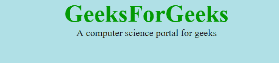

# CSS 类型(层叠样式表)

> 原文:[https://www . geesforgeks . org/type-of-CSS-层叠样式表/](https://www.geeksforgeeks.org/types-of-css-cascading-style-sheet/)

级联样式表用于设置包含 HTML 元素的网页的样式。它设置网页上元素的背景颜色、字体大小、字体系列、颜色等属性。
CSS 有三种类型，如下所示:

*   内嵌 CSS
*   内部或嵌入式 CSS
*   外部 CSS

**内联 CSS:** 内联 CSS 包含的 CSS 属性在主体部分附加了元素被称为内联 CSS。这种样式是使用样式属性在 HTML 标记中指定的。
T3】例:

## 超文本标记语言

```html
<!DOCTYPE html>
<html>
    <head>
        <title>Inline CSS</title>
    </head>

    <body>
        <p style = "color:#009900; font-size:50px;
                font-style:italic; text-align:center;">
            GeeksForGeeks
        </p>

    </body>
</html>         
```

**输出:**


**内部或嵌入式 CSS:** 当单个 HTML 文档必须具有唯一样式时，可以使用该选项。CSS 规则集应该在标题部分的 HTML 文件中，即 CSS 嵌入在 HTML 文件中。
T3】例:

## 超文本标记语言

```html
<!DOCTYPE html>
<html>
    <head>
        <title>Internal CSS</title>
        <style>
            .main {
                text-align:center; 
            }
            .GFG {
                color:#009900;
                font-size:50px;
                font-weight:bold;
            }
            .geeks {
                font-style:bold;
                font-size:20px;
            }
        </style>
    </head>
    <body>
        <div class = "main">
            <div class ="GFG">GeeksForGeeks</div>

            <div class ="geeks">
                A computer science portal for geeks
            </div>
        </div>
    </body>
</html>              
```

**输出:**


**外部 CSS:** 外部 CSS 包含单独的 CSS 文件，借助标签属性(如类、id、标题、…等)只包含样式属性。属性编写在一个单独的文件中。css 扩展，应该使用**链接**标签链接到 HTML 文档。这意味着对于每个元素，样式只能设置一次，并且将跨网页应用。
**示例:**下面给出的文件包含 CSS 属性。此文件与一起保存。css 扩展。例如:**极客. css**

```html
body {
    background-color:powderblue;
}
.main {
    text-align:center;   
}
.GFG {
    color:#009900;
    font-size:50px;
    font-weight:bold;
}
#geeks {
    font-style:bold;
    font-size:20px;
}
```

下面是利用创建的外部样式表的 HTML 文件

*   **链接**标签用于链接外部样式表和 html 网页。
*   **href** 属性用于指定外部样式表文件的位置。

## 超文本标记语言

```html
<!DOCTYPE html>
<html>
    <head>
        <link rel="stylesheet" href="geeks.css"/>
    </head>

    <body>
        <div class = "main">
            <div class ="GFG">GeeksForGeeks</div>
            <div id ="geeks">
                A computer science portal for geeks
            </div>
        </div>
    </body>
</html>
```

**输出:**



**CSS 属性:**内联 CSS 优先级最高，其次是内部/嵌入式，其次是外部 CSS 优先级最低。一页上可以定义多个样式表。如果对于一个 HTML 标记，样式是在多个样式表中定义的，那么将遵循下面的顺序。

*   由于内联具有最高的优先级，所以在内部和外部样式表中定义的任何样式都会被内联样式覆盖。
*   “内部”或“嵌入”位于优先级列表的第二位，并覆盖外部样式表中的样式。
*   外部样式表的优先级最低。如果没有在内联或内部样式表中定义样式，则外部样式表规则将应用于 HTML 标记。

**支持的浏览器:**

*   谷歌 Chrome
*   微软公司出品的 web 浏览器
*   火狐浏览器
*   歌剧
*   旅行队

HTML 是网页的基础，通过构建网站和网络应用程序用于网页开发。您可以通过以下 [HTML 教程](https://www.geeksforgeeks.org/html-tutorials/)和 [HTML 示例](https://www.geeksforgeeks.org/html-examples/)从头开始学习 HTML。

CSS 是网页的基础，通过设计网站和网络应用程序用于网页开发。你可以通过以下 [CSS 教程](https://www.geeksforgeeks.org/css-tutorials/)和 [CSS 示例](https://www.geeksforgeeks.org/css-examples/)从头开始学习 CSS。