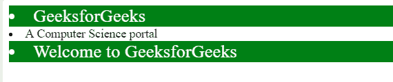
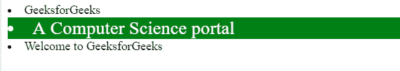
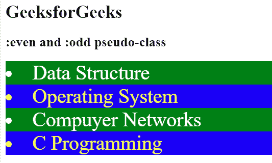

# CSS 中带列表项的:偶数和:奇数伪类的使用

> 原文:[https://www . geesforgeks . org/使用带列表项的奇偶伪类 css/](https://www.geeksforgeeks.org/use-of-even-and-odd-pseudo-classes-with-list-items-in-css/)

CSS 中的:n-child()选择器用于根据元素在一组同级元素中的位置来匹配元素。它匹配第 n 个子元素的每个元素。:偶数和:奇数伪类用于项目列表，如段落、文章项目，基本上是列表内容。

*   **奇数:**在任何只会影响奇数索引号列表的列表项中使用奇数伪类。
    **语法:**

```css
li:nth-child( odd ) {
    // CSS Property   
}
```

*   **示例:**

## 超文本标记语言

```css
<!DOCTYPE html>
<html>

<head>
    <title>
        CSS :nth-child(odd) Selector
    </title>

    <!-- Style to uses :nth-child(odd)
            Selector -->
    <style>
        li:nth-child(odd) {
            background: green;
            font-size: 24px;
            color:white;
        }
    </style>
</head>

<body>
    <li>GeeksforGeeks</li>
    <li>A Computer Science portal</li>
    <li>Welcome to GeeksforGeeks</li>
</body>

</html>                               
```

*   **输出:**



*   **偶数:**在任何列表项中使用偶数伪类，只会影响偶数索引号列表。
    **语法:**

```css
li:nth-child( even ) {
    // CSS Property
}
```

*   **示例:**

## 超文本标记语言

```css
<!DOCTYPE html>
<html>

<head>
    <title>
        CSS :nth-child(even) Selector
    </title>

    <!-- Style to uses :nth-child(odd)
            Selector -->
    <style>
        li:nth-child(even) {
            background: green;
            font-size: 24px;
            color:white;
        }
    </style>
</head>

<body>
    <li>GeeksforGeeks</li>
    <li>A Computer Science portal</li>
    <li>Welcome to GeeksforGeeks</li>
</body>

</html>                                  
```

*   **输出:**



*   **示例:**这个示例同时使用了:偶数和:奇数伪类选择器。

## 超文本标记语言

```css
<!DOCTYPE html>
<html>

<head>

    <style>
        li:nth-child(odd) {
            background: green;
            font-size: 36px;
            color:white;
        }
        li:nth-child(even) {
            background: Blue;
            font-size: 36px;
            color:yellow;
        }
    </style>
</head>

<body>
    <h1>GeeksforGeeks</h1>

    <h2>:even and :odd pseudo-class</h2>

    <li>Data Structure</li>
    <li>Operating System</li>
    <li>Compuyer Networks</li>
    <li>C Programming</li>
</body>

</html>                   
```

*   **输出:**



**支持的浏览器:**

*   谷歌 Chrome 4.0
*   Internet Explorer 9.0
*   Firefox 3.5
*   歌剧 9.6
*   Safari 3.2