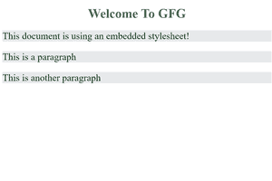
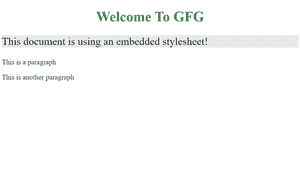

# 在 CSS 中使用嵌入式样式表

> 原文:[https://www . geesforgeks . org/use-of-an-embedded-style-sheet-in-CSS/](https://www.geeksforgeeks.org/uses-of-an-embedded-style-sheet-in-css/)

CSS 样式表用于描述用 HTML 编写的文档的表示。它提供了颜色、布局、背景、字体和边框属性，同时还允许更好的内容可访问性、增强的灵活性和控制，以及演示特性的规范。CSS 样式表可以通过三种方式应用于 HTML 文档——内嵌样式、嵌入式样式表和外部样式表。

**嵌入式样式表:**它允许您在一个地方定义特定 HTML 文档的样式。这是通过在文档的头部嵌入包含 CSS 属性的 **<样式></样式>** 标签来实现的。嵌入样式表对于 HTML 文档特别有用，这些文档与项目中的其他文档有独特的样式要求。但是，如果样式需要跨多个文档应用，您应该链接到外部样式表，而不是使用单独的嵌入式样式表。使用嵌入式样式表比内联样式有明显的优势，内联样式只允许您一次处理一个 HTML 元素。

**语法:**嵌入样式表的 CSS 语法与其他 CSS 代码完全相同，除了它现在被包装在<样式></样式>标签中。<样式>标签采用“类型”属性来定义所使用的样式表的类型(即。文本/CSS)。

**示例 1:** 下面是一个 HTML 文档，整个网页的 CSS 样式包含在<样式></样式>标签中。这些属性将应用于 HTML 文档中所有相应的元素。

## 超文本标记语言

```html
<!DOCTYPE html>
<html>

<head>
    <title>Page Title</title>

    <!-- Embedded stylesheet -->
    <style>
        h2 {
            font-size: 1.5rem;
            color: #2f8d46;
            text-align: center;
        }

        p {
            font-variant: italic;
        }
    </style>
</head>

<body>
    <h2>Welcome To GFG</h2>
    <p>This document is using an embedded stylesheet!</p>
    <p>This is a paragraph</p>
    <p>This is another paragraph</p>
</body>

</html>
```

**输出:**



所有的

元素都已经使用嵌入的 CSS 中提供的样式进行了样式化。

**示例 2:** 当 CSS 规则集列表插入样式元素时，它会将关联的属性应用于网页上的所有元素。如果你想对一个元素或一组元素进行更有选择性和清晰的样式化，使用类和标识，如下所示。

## 超文本标记语言

```html
<!DOCTYPE html>
<html>

<head>
    <title>Page Title</title>

    <!-- Embedded stylesheet -->
    <style>
        h2 {
            font-size: 1.5rem;
            color: #2f8d46;
            text-align: center;
        }

        .p-content {
            font-variant: italic;
        }
    </style>
</head>

<body>
    <h2>Welcome To Geeks for Geeks</h2>
    <p class="p-content">
        This document is using an 
        embedded stylesheet!
    </p>

    <p>This is a paragraph</p>
    <p>This is another paragraph</p>
</body>

</html>
```

**输出:**



特定的

元素已经使用类属性进行了样式化。