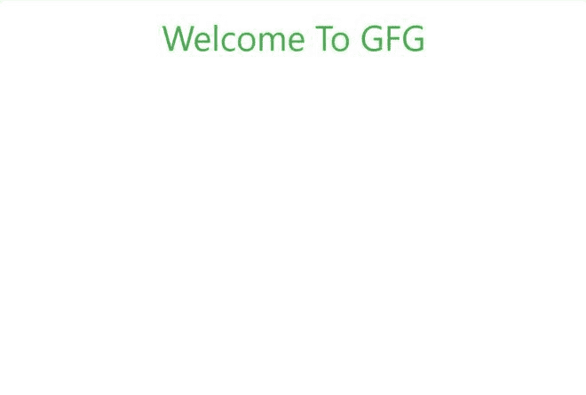
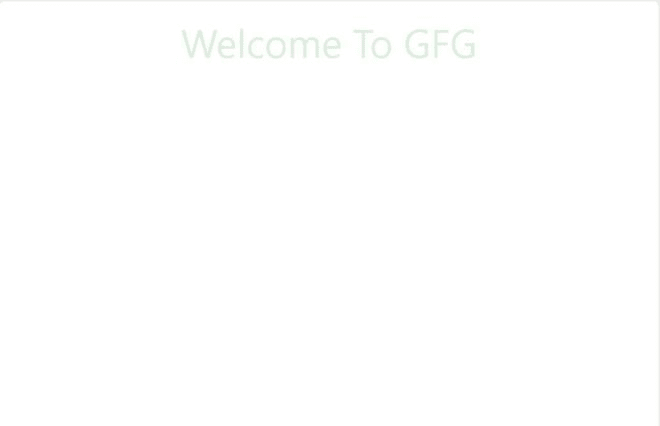
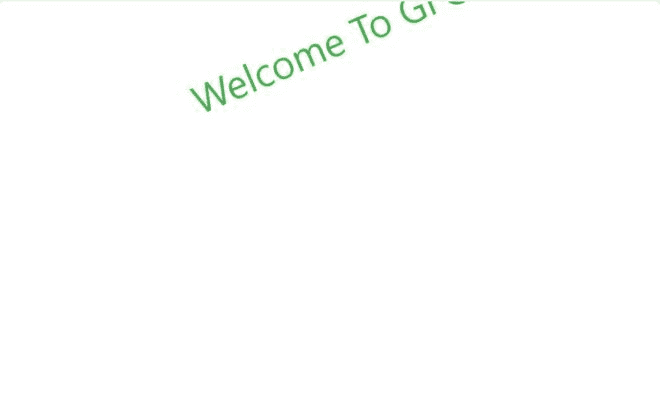

# W3。CSS 动画〔t1〕

> 哎哎哎:# t0]https://www . geeksforgeeks . org/w3-CSS 动画/

CSS 动画是一种改变网页中各种元素的外观和行为的技术。它用于通过改变元素的运动或显示来控制元素。W3。CSS 为开发人员提供了一些很好的内置动画类。班级名单如下:

<figure class="table">

| 

Sr 编号

 | 

班级名称

 | 

描述

 |
| --- | --- | --- |
| 1。

 | w3-animate-top | 目标元素似乎从顶部滑动。 |
| 2。 | w3-animate-bottom | 目标元素似乎从底部滑动。 |
| 3。 | w3-animate-left | 目标元素似乎从左侧滑动。

 |
| 4。 | w3-animate-right | 目标元素似乎从右侧滑动。 |
| 5。 | w3-动画-不透明度 | 目标元素的不透明度在 1.5 秒内从 0 变为 1。 |
| 6。 | w3-animate-zoom | 目标元素的大小在 0.6 秒内从 0 变为 100%。 |
| 7。 | w3-动画-淡入淡出 | 目标元素的不透明度不断从 0 变为 1，再变回 0。 |
| 8。 | w3-spin | 目标元素与轴的角度从 0 度持续变化到 360 度。 |

</figure>

**示例 1:** 在 HTML 页面中使用 w3-animate-top 动画。

## 超文本标记语言

```html
<!DOCTYPE html>
<html>

<head>

    <!-- Adding W3.CSS file through external link -->
    <link rel="stylesheet" href=
        "https://www.w3schools.com/w3css/4/w3.css">
</head>

<body>
    <!-- w3-container is used to add 
         16px padding to any HTML element.  -->
    <!-- w3-center is used to set the 
         content of the element to the center. -->
    <!-- w3-animate-top added animation to 
        this division. -->
    <div class="w3-container w3-center 
        w3-animate-top">

        <!-- w3-text-green sets the text colour 
            to green. -->
        <!-- w3-xxlarge sets font size to 32px. -->
        <h2 class="w3-text-green w3-xxlarge">
            Welcome To GFG
        </h2>
    </div>
</body>

</html>
```

**输出:**



**示例 2:** 在 HTML 页面中使用 w3-animate-bottom 动画。

## 超文本标记语言

```html
<!DOCTYPE html>
<html>

<head>

    <!-- Adding W3.CSS file through external link -->
    <link rel="stylesheet" href=
        "https://www.w3schools.com/w3css/4/w3.css">
</head>

<body>
    <!-- w3-container is used to add 
         16px padding to any HTML element.  -->
    <!-- w3-center is used to set the 
         content of the element to the center. -->
    <!-- w3-animate-bottom added animation to 
        this division. -->
    <div class="w3-container w3-center 
        w3-animate-bottom">

        <!-- w3-text-green sets the text 
            colour to green. -->
        <!-- w3-xxlarge sets font size to 32px. -->
        <h2 class="w3-text-green w3-xxlarge">
            Welcome To GFG
        </h2>
    </div>
</body>

</html>
```

**输出:**


**示例 3:** 在 HTML 页面中使用 w3-animate-left 动画。

## 超文本标记语言

```html
<!DOCTYPE html>
<html>

<head>

    <!-- Adding W3.CSS file through external link -->
    <link rel="stylesheet" 
          href="https://www.w3schools.com/w3css/4/w3.css">
</head>

<body>
    <!-- w3-container is used to add 
         16px padding to any HTML element.  -->
    <!-- w3-center is used to set the 
         content of the element to the center. -->
    <!-- w3-animate-left added animation to this division. -->
    <div class="w3-container w3-center w3-animate-left">
        <!-- w3-text-green sets the text color to green. -->
        <!-- w3-xxlarge sets font size to 32px. -->
        <h2 class="w3-text-green w3-xxlarge">
            Welcome To GFG
        </h2>
    </div>
</body>

</html>
```

**输出:**


**示例 4:** 在 HTML 页面中使用 w3-animate-right 动画。

## 超文本标记语言

```html
<!DOCTYPE html>
<html>

<head>

    <!-- Adding W3.CSS file through external link -->
    <link rel="stylesheet" 
      href="https://www.w3schools.com/w3css/4/w3.css">

</head>

<body>
    <!-- w3-container is used to add 
         16px padding to any HTML element.  -->
    <!-- w3-center is used to set the 
         content of the element to the center. -->
    <!-- w3-animate-right added animation to 
         this division. -->
    <div class="w3-container w3-center w3-animate-right">
        <!-- w3-text-green sets the text color to green. -->
        <!-- w3-xxlarge sets font size to 32px. -->
        <h2 class="w3-text-green w3-xxlarge">
            Welcome To GFG
        </h2>
    </div>
</body>

</html>
```

**输出:**


**示例 5:** 在 HTML 页面中使用 w3-动画-不透明度动画。

## 超文本标记语言

```html
<!DOCTYPE html>
<html>

<head>

    <!-- Adding W3.CSS file through external link -->
    <link rel="stylesheet" href=
        "https://www.w3schools.com/w3css/4/w3.css">
</head>

<body>
    <!-- w3-container is used to add 
         16px padding to any HTML element.  -->
    <!-- w3-center is used to set the content 
         of the element to the center. -->
    <!-- w3-animate-opacity added animation 
         to this division. -->
    <div class="w3-container w3-center 
        w3-animate-opacity">

        <!-- w3-text-green sets the text 
             color to green. -->
        <!-- w3-xxlarge sets font size to 32px. -->
        <h2 class="w3-text-green w3-xxlarge">
            Welcome To GFG
        </h2>
    </div>
</body>

</html>
```

**输出:**


**示例 6:** 在 HTML 页面中使用 w3-animate-zoom 动画。

## 超文本标记语言

```html
<!DOCTYPE html>
<html>

<head>

    <!-- Adding W3.CSS file through external link -->
    <link rel="stylesheet" href=
       "https://www.w3schools.com/w3css/4/w3.css">
</head>

<body>
    <!-- w3-container is used to add 16px
         padding to any HTML element.  -->
    <!-- w3-center is used to set the content 
         of the element to the center. -->
    <!-- w3-animate-zoom added animation to 
         this division. -->
    <div class="w3-container w3-center 
        w3-animate-zoom">

        <!-- w3-text-green sets the text color
             to green. -->
        <!-- w3-xxlarge sets font size to 32px. -->
        <h2 class="w3-text-green w3-xxlarge">
            Welcome To GFG
        </h2>
    </div>
</body>

</html>
```

**输出:**


**示例 7:** 在 HTML 页面中使用 w3-animate-渐隐动画。

## 超文本标记语言

```html
<!DOCTYPE html>
<html>

<head>

    <!-- Adding W3.CSS file through external link -->
    <link rel="stylesheet" href=
        "https://www.w3schools.com/w3css/4/w3.css">
</head>

<body>
    <!-- w3-container is used to add 16px
         padding to any HTML element.  -->
    <!-- w3-center is used to set the content
         of the element to the center. -->
    <!-- w3-animate-fading added animation 
         to this division. -->
    <div class="w3-container w3-center 
        w3-animate-fading">
        <!-- w3-text-green sets the text 
             color to green. -->
        <!-- w3-xxlarge sets font size to 32px. -->
        <h2 class="w3-text-green w3-xxlarge">
            Welcome To GFG
        </h2>
    </div>
</body>

</html>
```

**输出:**



**示例 8:** 在 HTML 页面中使用 w3 旋转动画。

## 超文本标记语言

```html
<!DOCTYPE html>
<html>

<head>

    <!-- Adding W3.CSS file through external link -->
    <link rel="stylesheet" href=
        "https://www.w3schools.com/w3css/4/w3.css">
</head>

<body>
    <!-- w3-container is used to add 16px 
         padding to any HTML element.  -->
    <!-- w3-center is used to set the content
          of the element to the center. -->
    <!-- w3-spin added animation to this division. -->
    <div class="w3-container w3-center w3-spin">

        <!-- w3-text-green sets the text 
             color to green. -->
        <!-- w3-xxlarge sets font size to 32px. -->
        <h2 class="w3-text-green w3-xxlarge">
            Welcome To GFG
        </h2>
    </div>
</body>

</html>
```

**输出:**

