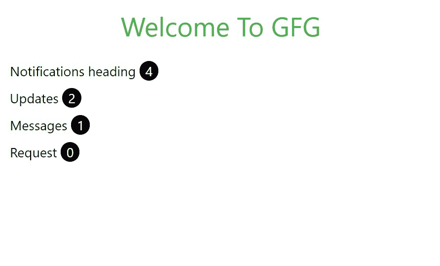
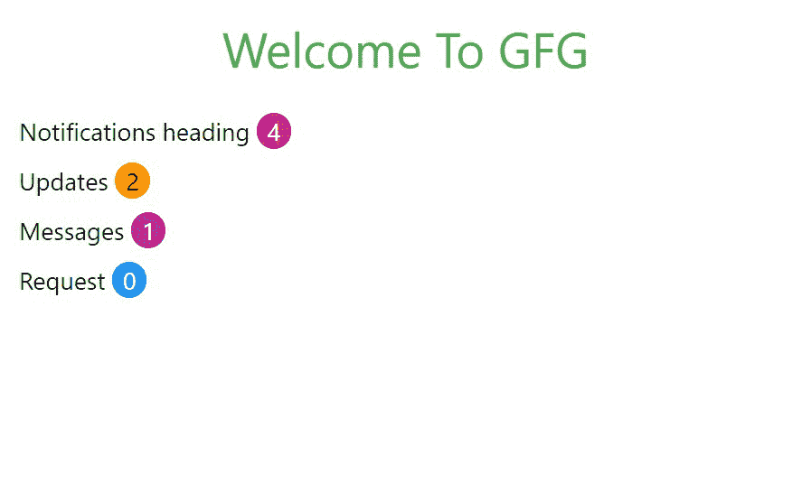
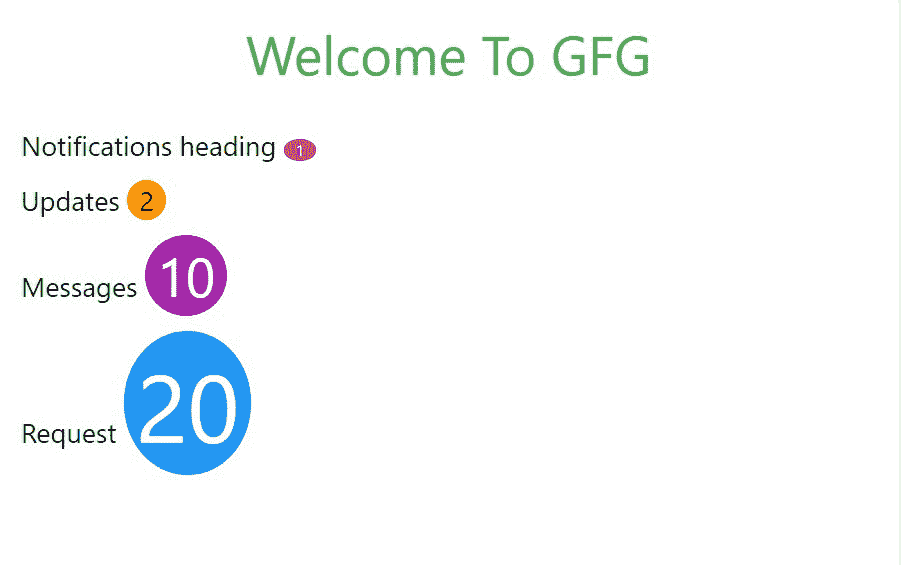
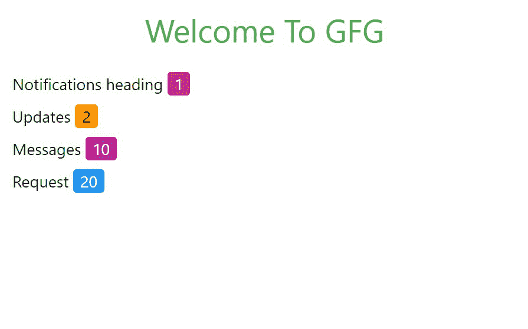

# W3。CSS 徽章

> 原文:[https://www.geeksforgeeks.org/w3-css-badges/](https://www.geeksforgeeks.org/w3-css-badges/)

**.w3-badge** 类用于向内容添加附加信息。例如，一些网站将一些通知与链接相关联。当登录到一个特定的网站时，会看到通知号码，该网站通过单击它来告知要查看的新闻或通知的号码。这个类帮助开发者将圆形徽章添加到他们的网站，默认颜色设置为黑色。

**示例:**在 HTML 页面中添加徽章。

## 超文本标记语言

```html
<!DOCTYPE html>
<html>

<head>

    <!-- Adding W3.CSS file through external link -->
    <link rel="stylesheet" href=
        "https://www.w3schools.com/w3css/4/w3.css">
</head>

<body>

    <!-- w3-container is used to add 
          16px padding to any HTML element  -->
    <!-- w3-center is used to set the 
         content of the element to the center -->
    <div class="w3-container w3-center">

        <!-- w3-text-green sets the text 
             color to green. -->
        <!-- w3-xxlarge sets font size to 32px. -->
        <h2 class="w3-text-green w3-xxlarge">
           Welcome To GFG
        </h2>
    </div>

    <!-- Badges in W3.CSS -->
    <div class="w3-container"> 
        <h5>Notifications heading  
            <!-- Adding Badge with value 4 -->
            <span class="w3-badge">4</span> 
        </h5> 

        <h5>Updates  
            <!-- Adding Badge with value 2 -->
            <span class="w3-badge">2</span> 
        </h5> 

        <h5>Messages  
            <!-- Adding Badge with value 1 -->
            <span class="w3-badge">1</span> 
        </h5> 
        <h5>Request
            <!-- Adding Badge with value 0 -->
            <span class="w3-badge">0</span> 
        </h5> 
    </div> 
</body>
</html>
```

**输出:**



徽章可以在网页的任何地方使用。它们可以用于按钮、表格、段落、列表等。它们非常有用，因为它们可以在页面上的任何地方使用。我们甚至可以使用 W3 给它们上色或改变它们的大小。其他类的 CSS。

**示例:**在 HTML 页面上添加彩色徽章。

## 超文本标记语言

```html
<!DOCTYPE html>
<html>

<head>

    <!-- Adding W3.CSS file through external link -->
    <link rel="stylesheet" href=
        "https://www.w3schools.com/w3css/4/w3.css">
</head>

<body>

    <!-- w3-container is used to add 
          16px padding to any HTML element.  -->
    <!-- w3-center is used to set the 
          content of the element to the center. -->
    <div class="w3-container w3-center">

        <!-- w3-text-green sets the text 
             color to green. -->
        <!-- w3-xxlarge sets font size to 32px. -->
        <h2 class="w3-text-green w3-xxlarge">
           Welcome To GFG
        </h2>
    </div>

    <!-- Colored Badges in W3.CSS -->
    <div class="w3-container"> 
        <h5>Notifications heading  
            <!-- Adding Badge with value 4 -->
            <span class="w3-badge w3-pink">4</span> 
        </h5> 

        <h5>Updates  
            <!-- Adding Badge with value 2 -->
            <span class="w3-badge w3-orange">2</span> 
        </h5> 

        <h5>Messages  
            <!-- Adding Badge with value 1 -->
            <span class="w3-badge w3-purple">1</span> 
        </h5> 
        <h5>Request
            <!-- Adding Badge with value 0 -->
            <span class="w3-badge w3-blue">0</span> 
        </h5>
    </div> 
</body>

</html>
```

**输出:**



**示例:**添加各种尺寸的徽章。

## 超文本标记语言

```html
<!DOCTYPE html>
<html>

<head>

    <!-- Adding W3.CSS file through external link -->
    <link rel="stylesheet" href=
        "https://www.w3schools.com/w3css/4/w3.css">
</head>

<body>

    <!-- w3-container is used to add
         16px padding to any HTML element.  -->
    <!-- w3-center is used to set the 
         content of the element to the center. -->
    <div class="w3-container w3-center">

        <!-- w3-text-green sets the text 
             color to green. -->
        <!-- w3-xxlarge sets font size to 32px. -->
        <h2 class="w3-text-green w3-xxlarge">
           Welcome To GFG
        </h2>
    </div>

    <!-- Badges with different sizes using W3.CSS -->
    <div class="w3-container"> 
        <h5>Notifications heading  
            <!-- Adding Badge with value 4 -->
            <span class="w3-badge w3-pink w3-tiny">1</span> 
        </h5> 

        <h5>Updates  
            <!-- Adding Badge with value 2 -->
            <span class="w3-badge w3-orange w3-large">2</span> 
        </h5> 

        <h5>Messages  
            <!-- Adding Badge with value 1 -->
            <span class="w3-badge w3-purple w3-xxlarge">10</span> 
        </h5> 
        <h5>Request
            <!-- Adding Badge with value 0 -->
            <span class="w3-badge w3-blue w3-jumbo">20</span> 
        </h5>
    </div> 
</body>
</html>
```

**输出:**



虽然默认的是圆形徽章，并且没有方形徽章的类，但是我们也可以通过使用 w3-round 类来减少它的边框半径来制作方形徽章。

**示例:**在 HTML 页面中添加方形徽章。

## 超文本标记语言

```html
<!DOCTYPE html>
<html>

<head>

    <!-- Adding W3.CSS file through external link -->
    <link rel="stylesheet" href=
        "https://www.w3schools.com/w3css/4/w3.css">
</head>

<body>
    <!-- w3-container is used to add 
         16px padding to any HTML element.  -->
    <!-- w3-center is used to set the content 
         of the element to the center. -->
    <div class="w3-container w3-center">

        <!-- w3-text-green sets the text 
             color to green. -->
        <!-- w3-xxlarge sets font size to 32px. -->
        <h2 class="w3-text-green w3-xxlarge">
             Welcome To GFG
         </h2>
    </div>

    <!-- Square Badges in W3.CSS -->
    <div class="w3-container"> 
        <h5>Notifications heading  
            <!-- Adding Badge with value 4 -->
            <span class="w3-badge w3-pink w3-round">1</span> 
        </h5> 

        <h5>Updates  
            <!-- Adding Badge with value 2 -->
            <span class="w3-badge w3-orange w3-round">2</span> 
        </h5> 

        <h5>Messages  
            <!-- Adding Badge with value 1 -->
            <span class="w3-badge w3-purple w3-round">10</span> 
        </h5> 
        <h5>Request
            <!-- Adding Badge with value 0 -->
            <span class="w3-badge w3-blue w3-round">20</span> 
        </h5>
    </div> 
</body>
</html>
```

**输出:**

