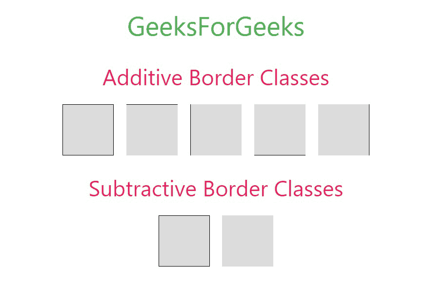
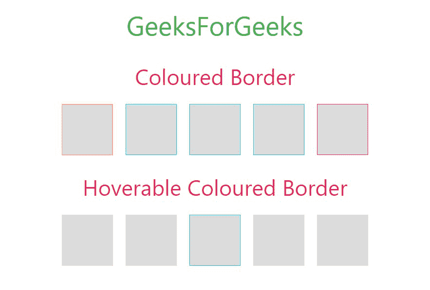
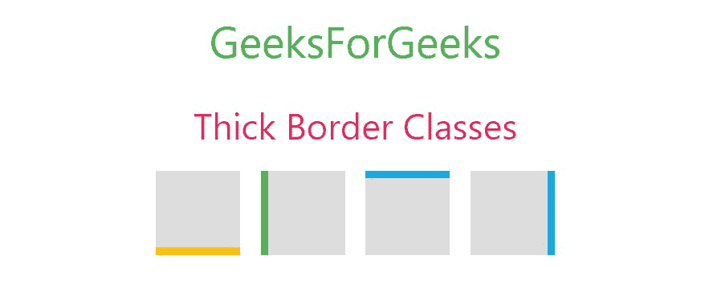

# W3。CSS 边框

> 原文:[https://www.geeksforgeeks.org/w3-css-border/](https://www.geeksforgeeks.org/w3-css-border/)

边框通常用于显示框、表格单元格或任何其他 HTML 元素周围的轮廓。在 W3。CSS 中，有不同的类可以添加或删除边框。用于添加边框的类称为**加法类**，用于移除边框的类称为**减法类**。

**附加边框类:**

<figure class="table">

| Sr number | Class name | explain |
| --- | --- | --- |
| 1。 | w3-border | 它用于在目标元素周围添加边框。

 |
| 2。 | w3-border-top | 用于给目标元素添加上边框。 |
| 3。 | w3-border-bottom | 它用来给目标元素添加一个下边框。 |
| 4。 | w3-边框-右边界

 | 它是用来给目标元素添加右边界的。 |
| 5。 | w3-边框-左侧 | 用于给目标元素添加左边框。 |

</figure>

**减法边框类:**

<figure class="table">

| 

Sr 编号

 | 

类名

 | 

描述

 |
| --- | --- | --- |
| 1。 | w3-border-0 | 移除目标元素的所有边框。 |

</figure>

**示例:**

## 超文本标记语言

```
<!DOCTYPE html>
<html>

<head>
    <!-- Adding W3.CSS file through external link -->
    <link rel="stylesheet" 
          href="https://www.w3schools.com/w3css/4/w3.css">

    <style> 
        /* CSS for Square boxes */ 
        span { 
            display: inline-block; 
            width: 70px; 
            height: 70px; 
            margin: 6px; 
            background-color: #DCDCDC; 
        } 
    </style> 
</head>

<body>
    <!-- w3-container is used to add 
         16px padding to any HTML element.  -->
    <!-- w3-center is used to set the content
         of the element to the center. -->
    <div class="w3-container w3-center">
        <!-- w3-text-green sets the text color to green. -->
        <!-- w3-xxlarge sets font size to 32px. -->
        <h2 class="w3-text-green w3-xxlarge">GeeksForGeeks</h2>
    </div>

    <!-- Additive Border Classes in W3.CSS -->
    <div class="w3-container w3-center">
        <h2 class="w3-text-pink">Additive Border Classes</h2> 
            <span class="w3-border w3-border-black"></span> 
            <span class="w3-border-top w3-border-black"></span> 
            <span class="w3-border-left w3-border-black"></span> 
            <span class="w3-border-bottom w3-border-black"></span> 
            <span class="w3-border-right w3-border-black"></span>
    </div>

    <!-- Subtractive Border Class in W3.CSS -->
    <div class="w3-container w3-center">
        <h2 class="w3-text-pink">Subtractive Border Classes</h2> 
        <span class="w3-border w3-border-black"></span> 
        <span class="w3-border-0"></span>
    </div>
</body>
</html>
```

**输出:**



**边框颜色:**可以使用 W3.CSS 中提供的以下**边框颜色类**将任何颜色添加到边框中。如果您想要任何其他自定义颜色，可以使用 CSS 属性手动设置。

**示例:**

## 超文本标记语言

```
<!DOCTYPE html>
<html>

<head>

    <!-- Adding W3.CSS file through external link -->
    <link rel="stylesheet" 
          href="https://www.w3schools.com/w3css/4/w3.css">
    <style> 
        /* CSS for Square boxes */ 
        span { 
            display: inline-block; 
            width: 70px; 
            height: 70px; 
            margin: 6px; 
            background-color: #DCDCDC; 
        } 
    </style> 
</head>

<body>
    <!-- w3-container is used to add 
          16px padding to any HTML element.  -->
    <!-- w3-center is used to set the 
            content of the element to the center. -->
    <div class="w3-container w3-center">
        <!-- w3-text-green sets the text color to green. -->
        <!-- w3-xxlarge sets font size to 32px. -->
        <h2 class="w3-text-green w3-xxlarge">GeeksForGeeks</h2>
    </div>

    <!-- Border Color Classes in W3.CSS -->
    <div class="w3-container w3-center">
        <h2 class="w3-text-pink">Coloured Border</h2> 
        <span class="w3-border w3-border-amber"></span> 
        <span class="w3-border w3-border-aqua"></span>
        <span class="w3-border w3-border-blue"></span>
        <span class="w3-border w3-border-cyan"></span>
        <span class="w3-border w3-border-pink"></span>
    </div>

    <!-- Hoverable Border Colour Classes in W3.CSS -->
    <div class="w3-container w3-center">
        <h2 class="w3-text-pink">Hoverable Coloured Border</h2> 
        <span class="w3-border w3-hover-border-amber"></span> 
        <span class="w3-border w3-hover-border-aqua"></span>
        <span class="w3-border w3-hover-border-blue"></span>
        <span class="w3-border w3-hover-border-cyan"></span>
        <span class="w3-border w3-hover-border-pink"></span>
    </div>
</body>
</html>
```

**输出:**



#### 粗边框:

您可以使用 W3 向目标元素的任何一侧添加一个粗边框。CSS 边框类。

<figure class="table">

| Sr number | taxon | explain |
| --- | --- | --- |
| 1。 | w3-巴特勒 | Used to add a thick border to the bottom of the target element. |
| 2。 | W3C-leftbar | Used to add a thick border to the left of the target element. |
| 3。 | w3-right bar(W3C-右列) | Used to add a thick border to the right of the target element. |
| 4。 | w3-顶栏 | Used to add a thick border to the top of the target element. |

</figure>

**示例:**

## 超文本标记语言

```
<!DOCTYPE html>
<html>

<head>

    <!-- Adding W3.CSS file through external link -->
    <link rel="stylesheet" 
          href="https://www.w3schools.com/w3css/4/w3.css">

    <style> 
        /* CSS for Square boxes */ 
        span { 
            display: inline-block; 
            width: 70px; 
            height: 70px; 
            margin: 6px; 
            background-color: #DCDCDC; 
        } 
    </style> 
</head>

<body>
    <!-- w3-container is used to add 
         16px padding to any HTML element.  -->
    <!-- w3-center is used to set the content 
         of the element to the center. -->
    <div class="w3-container w3-center">
        <!-- w3-text-green sets the text colour to green. -->
        <!-- w3-xxlarge sets font size to 32px. -->
        <h2 class="w3-text-green w3-xxlarge">GeeksForGeeks</h2>
    </div>

    <!-- Thick Border Classes in W3.CSS -->
    <div class="w3-container w3-center">
        <h2 class="w3-text-pink">Thick Border Classes</h2> 
        <span class="w3-bottombar w3-border-amber"></span> 
        <span class="w3-leftbar w3-border-green"></span>
        <span class="w3-topbar w3-border-blue"></span>
        <span class="w3-rightbar w3-border-cyan"></span>
    </div>
</body>

</html>
```

**输出:**

