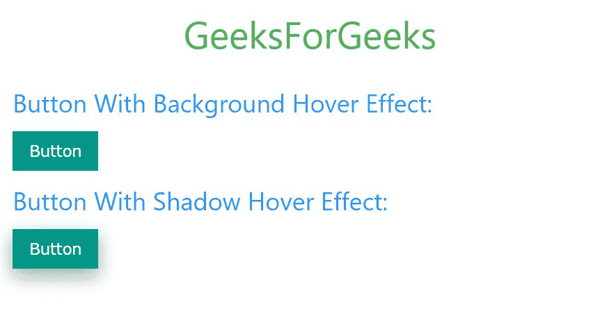

# W3。CSS 按钮

> 原文:[https://www.geeksforgeeks.org/w3-css-button/](https://www.geeksforgeeks.org/w3-css-button/)

W3。CSS 提供了不同的类，可以使用不同的标签，如<button>、</button> 

具有悬停效果的按钮的实现如下:

## 超文本标记语言

```css
<!DOCTYPE html>
<html>

<head>

    <!-- Adding W3.CSS file through external link -->
    <link rel="stylesheet" href=
        "https://www.w3schools.com/w3css/4/w3.css">

</head>

<body>
    <!-- w3-container is used to add
         16px padding to any HTML element.  -->
    <!-- w3-center is used to set the content 
          of the element to the center. -->
    <div class="w3-container w3-center">
        <!-- w3-text-green sets the text 

            colour to green. -->
        <!-- w3-xxlarge sets font size to 32px. -->
        <h2 class="w3-text-green w3-xxlarge">
            GeeksForGeeks
        </h2>
    </div>

    <!-- Button With Hover Effect in W3.CSS -->
    <div class="w3-container">

        <!-- Button with background hover effect -->
        <h3 class="w3-text-blue">
            Button With Background Hover Effect:
        </h3>
        <input class="w3-button w3-teal" 
            type="button" value="Button">

        <!-- Button with shadow hover effect -->
        <h3 class="w3-text-blue">
            Button With Shadow Hover Effect:
        </h3>
        <input class="w3-btn w3-teal" 
            type="button" value="Button">
    </div>
</body>

</html>
```

**输出:**



**注意:**<a>、<按钮>和<输入>元素用于保存按钮类别。

**彩色按钮:**也可以使用 W3.CSS 的颜色类给文本添加字体和背景颜色，也可以给按钮添加悬停颜色。

**示例:**

## 超文本标记语言

```css
<!DOCTYPE html>
<html>

<head>
    <!-- Title of the page -->
    <title>GeeksForGeeks</title>

    <!-- Adding W3.CSS file through external link -->
    <link rel="stylesheet" href=
        "https://www.w3schools.com/w3css/4/w3.css">

    <style>
        .w3-button {
            width: 130px;
        }
    </style>
</head>

<body>
    <!-- w3-container is used to add 
         16px padding to any HTML element.  -->
    <!-- w3-center is used to set the 
         content of the element to the center. -->
    <div class="w3-container w3-center">

        <!-- w3-text-green sets the text 
            colour to green. -->
        <!-- w3-xxlarge sets font size to 32px. -->
        <h2 class="w3-text-green w3-xxlarge">
            GeeksForGeeks
        </h2>
    </div>

    <!-- Button With Different Colours in W3.CSS -->
    <div class="w3-container">

        <!-- Button with various background colours -->
        <p class="w3-bar">
            <button class="w3-button w3-red">
                Red
            </button>
            <button class="w3-button w3-light-blue">
                Light Blue
            </button>
            <button class="w3-button w3-lime">
                Lime
            </button>
            <button class="w3-button w3-deep-orange">
                D.Orange
            </button>
        </p>

        <p class="w3-bar">
            <button class="w3-button w3-pink">
                Pink
            </button>
            <button class="w3-button w3-cyan">
                Cyan
            </button>
            <button class="w3-button w3-sand">
                Sand
            </button>
            <button class="w3-button w3-brown">
                Brown
            </button>
        </p>

        <p class="w3-bar">
            <button class="w3-button w3-purple">
                Purple
            </button>
            <button class="w3-button w3-aqua">
                Aqua
            </button>
            <button class="w3-button w3-khaki">
                Khaki
            </button>
            <button class="w3-button w3-blue-grey">
                Blue Grey
            </button>
        </p>

        <p class="w3-bar">
            <button class="w3-button w3-deep-purple">
                D.Purple
            </button>
            <button class="w3-button w3-teal">
                Teal
            </button>
            <button class="w3-button w3-yellow">
                Yellow
            </button>
            <button class="w3-button w3-light-grey">
                Light Grey
            </button>
        </p>

        <p class="w3-bar">
            <button class="w3-button w3-indigo">
                Indigo
            </button>
            <button class="w3-button w3-green">
                Green
            </button>
            <button class="w3-button w3-amber">
                Amber
            </button>
            <button class="w3-button w3-grey">
                Grey
            </button>
        </p>

        <p class="w3-bar">
            <button class="w3-button w3-blue">
                Blue
            </button>
            <button class="w3-button w3-light-green">
                Light Green
            </button>
            <button class="w3-button w3-orange">
                Orange
            </button>
            <button class="w3-button w3-dark-grey">
                Dark Grey
            </button>
        </p>
    </div>
</body>

</html>
```

**输出:**


**圆形按钮:**W3 的 W3-圆形类。CSS 可以用来在网页上循环按钮。

**示例:**

## 超文本标记语言

```css
<!DOCTYPE html>
<html>

<head>

    <!-- Adding W3.CSS file through external link -->
    <link rel="stylesheet" href=
        "https://www.w3schools.com/w3css/4/w3.css">

</head>

<body>
    <!-- w3-container is used to add 16px 
        padding to any HTML element.  -->
    <!-- w3-center is used to set the content
         of the element to the center. -->
    <div class="w3-container w3-center">

        <!-- w3-text-green sets the text 
            colour to green. -->
        <!-- w3-xxlarge sets font size to 32px. -->
        <h2 class="w3-text-green w3-xxlarge">
            GeeksForGeeks
        </h2>
    </div>

    <!-- Circular Button With Different 
        Colours in W3.CSS -->
    <div class="w3-container">

        <!-- Circular Button with various 
            background colours -->
        <h3>Circular Buttons:</h3>
        <button class="w3-button w3-large 
            w3-circle w3-purple">G
        </button>
        <button class="w3-button w3-large 
            w3-circle w3-deep-orange">F
        </button>
        <button class="w3-button w3-large 
            w3-circle w3-blue">G
        </button>
    </div>
</body>

</html>
```

**输出:**


**涟漪效果:**可以使用 W3.CSS 的 w3-ripple 类为按钮添加涟漪效果，涟漪效果是现代设计潮流的一部分。你已经在很多网站上看到了，特别是谷歌的材料设计语言。它会产生按键效果。

**示例:**

## 超文本标记语言

```css
<!DOCTYPE html>
<html>
<head>
    <!-- Title of the page -->
    <title>GeeksForGeeks</title>

    <!-- Adding W3.CSS file through external link -->
    <link rel="stylesheet"
          href="https://www.w3schools.com/w3css/4/w3.css">

</head>
<body>
    <!-- w3-container is used to add 
        16px padding to any HTML element.  -->
    <!-- w3-center is used to set the content
        of the element to the center. -->
    <div class="w3-container w3-center">
        <!-- w3-text-green sets the text colour to green. -->
        <!-- w3-xxlarge sets font size to 32px. -->
        <h2 class="w3-text-green w3-xxlarge">GeeksForGeeks</h2>
    </div>

    <!-- Button with ripple effect in W3.CSS -->
    <div class="w3-container">

        <!-- Button with ripple effect -->
        <h3 class="w3-text-blue">Button With Ripple Effect:</h3>
        <div class="w3-center">
            <button class="w3-button w3-ripple w3-large w3-purple">
                Enter GFG
            </button>
        </div>
    </div>
</body>
</html>
```

**输出:**


**圆形按钮:**可以使用 W3。CSS 圆形类为网页创建圆边按钮。

**示例:**

## 超文本标记语言

```css
<!DOCTYPE html>
<html>

<head>

    <!-- Adding W3.CSS file through external link -->
    <link rel="stylesheet" href=
        "https://www.w3schools.com/w3css/4/w3.css">

</head>

<body>

    <!-- w3-container is used to add 16px
         padding to any HTML element.  -->
    <!-- w3-center is used to set the content 
         of the element to the center. -->
    <div class="w3-container w3-center">

        <!-- w3-text-green sets the text 
            colour to green. -->
        <!-- w3-xxlarge sets font size to 32px. -->
        <h2 class="w3-text-green w3-xxlarge">
            GeeksForGeeks
        </h2>
    </div>

    <!-- Button with Round Borders in W3.CSS -->
    <div class="w3-container">

        <!-- Button with round borders -->
        <h3 class="w3-text-blue">
            Button With Round Borders:
        </h3>

        <button class="w3-button w3-ripple 
            w3-large w3-purple">
            Normal Button
        </button><br><br>

        <button class="w3-round w3-button 
            w3-ripple w3-large w3-purple">
            w3-round Button
        </button><br><br>

        <button class="w3-round-large w3-button 
            w3-ripple w3-large w3-purple">
            w3-round-large Button
        </button><br><br>

        <button class="w3-round-xlarge w3-button 
            w3-ripple w3-large w3-purple">
            w3-round-xlarge Button
        </button><br><br>

        <button class="w3-round-xxlarge w3-button 
            w3-ripple w3-large w3-purple">
            w3-round-xxlarge Button
        </button>
    </div>
</body>

</html>
```

**输出:**


**按钮尺寸:** W3。CSS 提供了不同的类，允许改变按钮的大小。. w3-small 和. w3-jumbo 类用于大小按钮。

**示例:**

## 超文本标记语言

```css
<!DOCTYPE html>
<html>

<head>
    <!-- Title of the page -->
    <title>GeeksForGeeks</title>

    <!-- Adding W3.CSS file through external link -->
    <link rel="stylesheet" href=
        "https://www.w3schools.com/w3css/4/w3.css">

</head>

<body>
    <!-- w3-container is used to add 
        16px padding to any HTML element.  -->
    <!-- w3-center is used to set the 
        content of the element to the center. -->
    <div class="w3-container w3-center">

        <!-- w3-text-green sets the text 
            colour to green. -->
        <!-- w3-xxlarge sets font size to 32px. -->
        <h2 class="w3-text-green w3-xxlarge">
            GeeksForGeeks
        </h2>
    </div>

    <!-- Button with various sizes in W3.CSS -->
    <div class="w3-container">

        <!-- Button with various sizes -->
        <h3 class="w3-text-blue">
            Button With Various Sizes:
        </h3>

        <button class="w3-small w3-button w3-purple">
            w3-small Button
        </button><br><br>

        <button class="w3-large w3-button w3-purple">
            w3-large Button
        </button><br><br>

        <button class="w3-xxlarge w3-button w3-purple">
            w3-xxlarge Button
        </button><br><br>

        <button class="w3-jumbo w3-button w3-purple">
            w3-jumbo Button
        </button>
    </div>
</body>

</html>
```

**输出:**


**禁用状态按钮:**禁用属性与<按钮>元素一起使用来设置按钮的禁用状态。

**示例:**

## 超文本标记语言

```css
<!DOCTYPE html>
<html>

<head>

    <!-- Adding W3.CSS file through external link -->
    <link rel="stylesheet" href=
        "https://www.w3schools.com/w3css/4/w3.css">

</head>

<body>

    <!-- w3-container is used to add 16px 
        padding to any HTML element.  -->
    <!-- w3-center is used to set the content
        of the element to the center. -->
    <div class="w3-container w3-center">

        <!-- w3-text-green sets the text 
            colour to green. -->
        <!-- w3-xxlarge sets font size to 32px. -->
        <h2 class="w3-text-green w3-xxlarge">
            GeeksForGeeks
        </h2>
    </div>

    <!-- Button with disabled state in W3.CSS -->
    <div class="w3-container">

        <!-- Button with disabled state -->
        <h3 class="w3-text-blue">
            Button With Disabled State:
        </h3>

        <button class="w3-button w3-green w3-round">
           Active Button
        </button>

        <button class="w3-button w3-blue w3-round" 
            disabled>
            Disabled Button
        </button>
    </div>
</body>

</html>
```

**输出:**


**块级按钮:**w3 的. W3 块类。CSS 用于创建一个块级按钮，它占据了父元素的所有宽度。

**示例:**

## 超文本标记语言

```css
<!DOCTYPE html>
<html>

<head>

    <!-- Adding W3.CSS file through external link -->
    <link rel="stylesheet" href=
        "https://www.w3schools.com/w3css/4/w3.css">
</head>

<body>
    <!-- w3-container is used to add 16px 
         padding to any HTML element.  -->
    <!-- w3-center is used to set the content
         of the element to the center. -->
    <div class="w3-container w3-center">

        <!-- w3-text-green sets the text 
            colour to green. -->
        <!-- w3-xxlarge sets font size to 32px. -->
        <h2 class="w3-text-green w3-xxlarge">
            GeeksForGeeks
        </h2>
    </div>

    <!-- Block Button in W3.CSS -->
    <div class="w3-container">

        <!-- Block Button -->
        <h3 class="w3-text-blue">
            Block Level Button:
        </h3>

        <button class="w3-button w3-block 
            w3-green w3-round">
           Block Button
        </button>
    </div>
</body>

</html>
```

**输出:**

