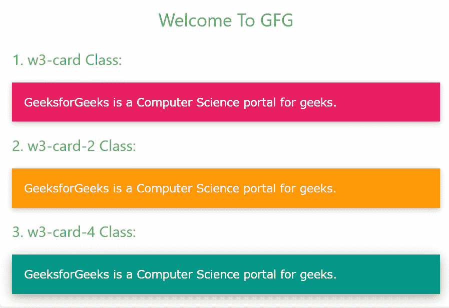
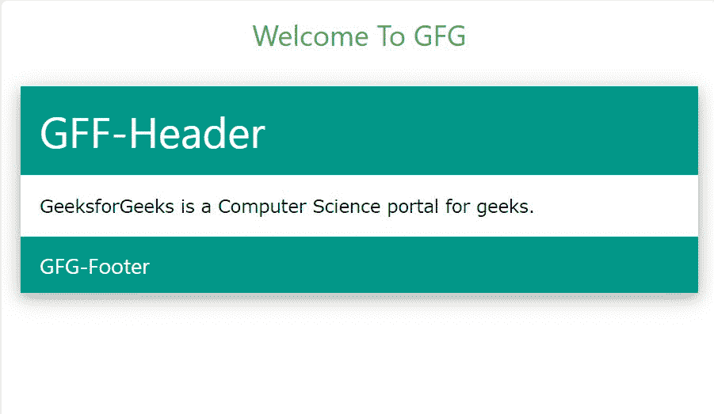

# W3。CSS 卡

> 原文:[https://www.geeksforgeeks.org/w3-css-cards/](https://www.geeksforgeeks.org/w3-css-cards/)

卡片是一种灵活且可扩展的内容容器。它可以包括页眉、页脚和各种各样的内容。W3。CSS 帮助开发人员给元素添加类似纸张的效果。它包含三类类:

<figure class="table">

| 

Sr 号

 | 

类名

 | 

描述

 |
| --- | --- | --- |
| 1。

 | w3-card | 它用来给元素添加一个 2px 的方块阴影。 |
| 2。 | w3-card-2 | 它与 w3-card 类相同。 |
| 3。 | w3-card-4 | 它用来给元素添加一个 4px 的方块阴影。

 |

</figure>

**示例:**在 HTML 页面中使用不同的卡片类。

```html
<!DOCTYPE html>
<html>

<head>

    <!-- Adding W3.CSS file through external link -->
    <link rel="stylesheet" href=
        "https://www.w3schools.com/w3css/4/w3.css">
</head>

<body>
    <!-- w3-container is used to add
         16px padding to any HTML element.  -->
    <!-- w3-center is used to set the
         content of the element to the center. -->
    <div class="w3-container w3-center">

        <!-- w3-text-green sets the text 
            color to green. -->
        <!-- w3-xlarge sets font size to 16px. -->
        <h2 class="w3-text-green w3-xlarge">
            Welcome To GFG
        </h2>
    </div>

    <h4 class="w3-container w3-text-green">
        1\. w3-card Class:
    </h4>

    <!-- w3-pink sets the background color pink -->
    <div class="w3-container w3-card 
        w3-pink w3-margin">

        <!-- w3-text-white sets the text 
            color to white. -->
        <p class="w3-text-white">
            GeeksforGeeks is a Computer 
            Science portal for geeks.
        </p>
    </div>

    <h4 class="w3-container w3-text-green">
        2\. w3-card-2 Class:
    </h4>

    <!-- w3-pink sets the background 
        color orange -->
    <div class="w3-container w3-card-2 
        w3-orange w3-margin">

        <!-- w3-text-white sets the text 
            colour to white. -->
        <p class="w3-text-white">
            GeeksforGeeks is a Computer 
            Science portal for geeks.
        </p>
    </div>

    <h4 class="w3-container w3-text-green">
        3\. w3-card-4 Class:
    </h4>

    <!-- w3-pink sets the background 
        colour teal -->
    <div class="w3-container w3-card-4 
        w3-teal w3-margin">

        <!-- w3-text-white sets the text 
            colour to white. -->
        <p class="w3-text-white">
            GeeksforGeeks is a Computer 
            Science portal for geeks.
        </p>
    </div>
</body>

</html>
```

**输出:**



**示例:**增加一张有表头和表尾的卡片。

```html
<!DOCTYPE html>
<html>

<head>

    <!-- Adding W3.CSS file through external link -->
    <link rel="stylesheet" href=
        "https://www.w3schools.com/w3css/4/w3.css">

</head>

<body>
    <!-- w3-container is used to add
         16px padding to any HTML element.  -->
    <!-- w3-center is used to set the content 
         of the element to the center. -->
    <div class="w3-container w3-center">

        <!-- w3-text-green sets the text 
            color to green. -->
        <!-- w3-xlarge sets font size to 16px. -->
        <h2 class="w3-text-green w3-xlarge">
            Welcome To GFG
        </h2>
    </div>

    <!-- Creating Card with some Margin -->
    <div class="w3-card-4 w3-margin">

        <!-- Adding header -->
        <header class="w3-container w3-teal">
            <h1>GFF-Header</h1>
        </header>

        <!-- Adding Content -->
        <div class="w3-container">
            <p>
                GeeksforGeeks is a Computer 
                Science portal for geeks.
            </p>
        </div>

        <!-- Adding Footer -->
        <footer class="w3-container w3-teal">
            <h5>GFG-Footer</h5>
        </footer>
    </div>
</body>

</html>
```

**输出:**



**注意:**同样，如果需要，可以使用 img 标签在卡片中插入图像。