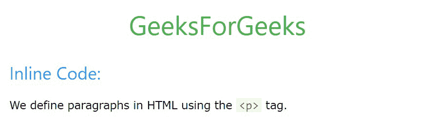
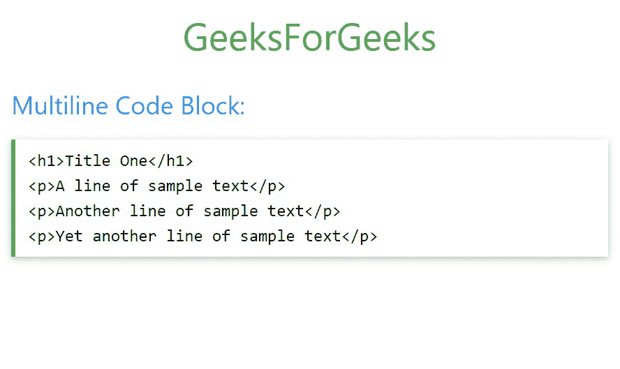

# W3。CSS 代码〔t1〕

> 原文:[https://www.geeksforgeeks.org/w3-css-code/](https://www.geeksforgeeks.org/w3-css-code/)

W3。CSS 提供了几个用于显示内联和多行代码块的类。

**显示内联代码:**内联代码应该用 **w3-codespan** 作为类的 **<代码>** 标签包装。生成的文本将以固定宽度的字体显示，并给出浅灰色背景的红色字体。

**注意:****<****>**标签应替换为**&lt；**和**&gt；**分别为。

**示例:**

## 超文本标记语言

```css
<!DOCTYPE html>
<html>

<head>

    <!-- Adding W3.CSS file through external link -->
    <link rel="stylesheet" href=
        "https://www.w3schools.com/w3css/4/w3.css">

</head>

<body>
    <!-- w3-container is used to add 16px 
          padding to any HTML element.  -->
    <!-- w3-center is used to set the content
         of the element to the center. -->
    <div class="w3-container w3-center">

        <!-- w3-text-green sets the text 
            colour to green. -->
        <!-- w3-xxlarge sets font size to 32px. -->
        <h2 class="w3-text-green w3-xxlarge">
            GeeksForGeeks
        </h2>
    </div>

    <!-- Inline Code in W3.CSS -->
    <div class="w3-container">
        <h3 class="w3-text-blue">Inline Code:</h3>

        <p>
            We define paragraphs in HTML using the
            <code class="w3-codespan"><p></code> tag.
        </p>
    </div>
</body>

</html>
```

**输出:**



**显示多行代码块:**多行代码应该用类 **w3-code** 包装在< div >标签中。生成的文本将以可读的单间距字体显示，并保留空格和换行符。

**注意:****<**和 **>** 标签应替换为**&lt；**和**&gt；**分别为。

**示例:**

## 超文本标记语言

```css
<!DOCTYPE html>
<html>

<head>

    <!-- Adding W3.CSS file through external link -->
    <link rel="stylesheet" href=
        "https://www.w3schools.com/w3css/4/w3.css">

</head>

<body>
    <!-- w3-container is used to add 16px 
         padding to any HTML element.  -->
    <!-- w3-center is used to set the content
         of the element to the center. -->
    <div class="w3-container w3-center">

        <!-- w3-text-green sets the text 
            colour to green. -->
        <!-- w3-xxlarge sets font size to 32px. -->
        <h2 class="w3-text-green w3-xxlarge">
            GeeksForGeeks
        </h2>
    </div>

    <!-- Multiline Code Block in W3.CSS -->
    <div class="w3-container">
        <h3 class="w3-text-blue">
            Multiline Code Block:
        </h3>

        <div class="w3-code notranslate w3-card">
            <!-- Lines of code starts -->
            <h1>Title One</h1> <br> 
            <p>A line of sample text</p> 
            <br> <p>Another line of sample 
            text</p> <br> <p>Yet another 
            line of sample text</p>
            <!-- Lines of code ends -->
        </div>
    </div>
</body>

</html>
```

**输出:**

