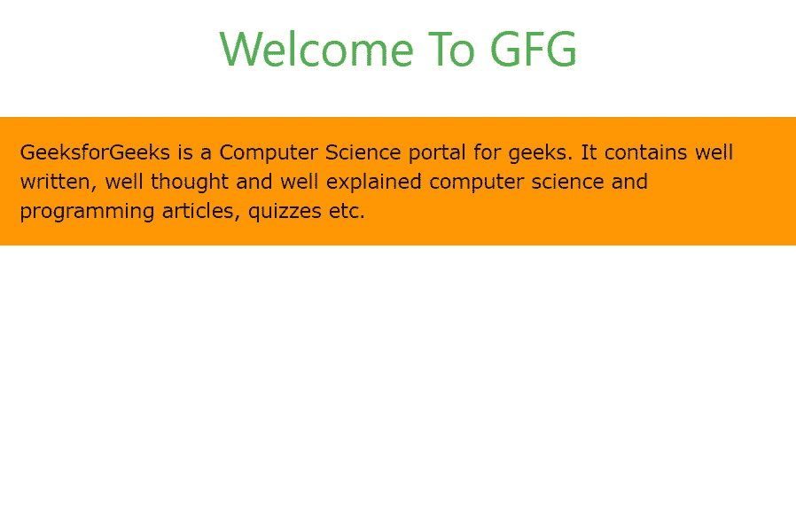
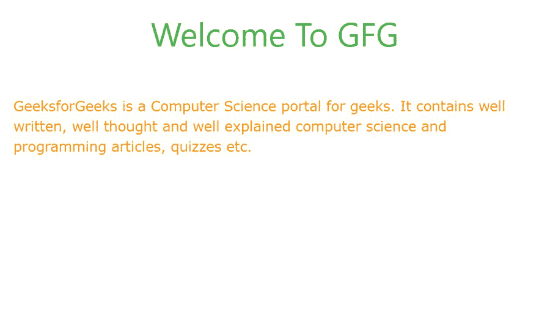
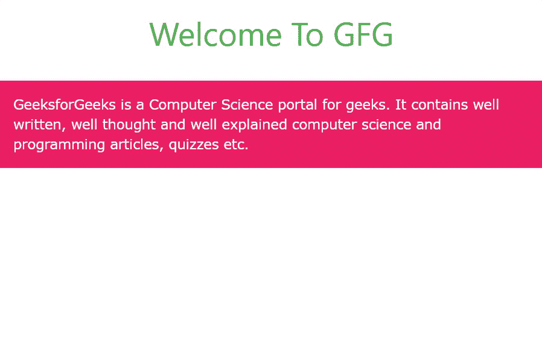
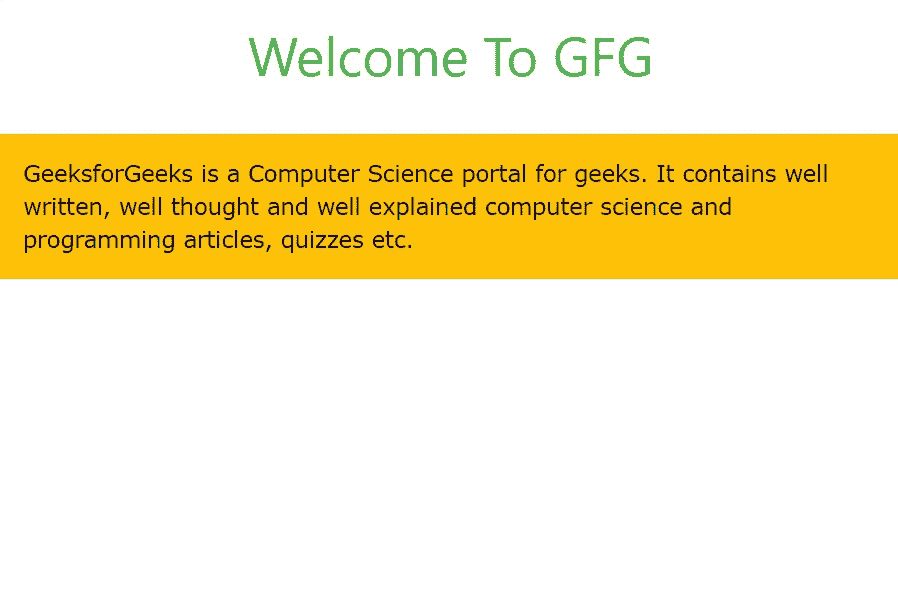
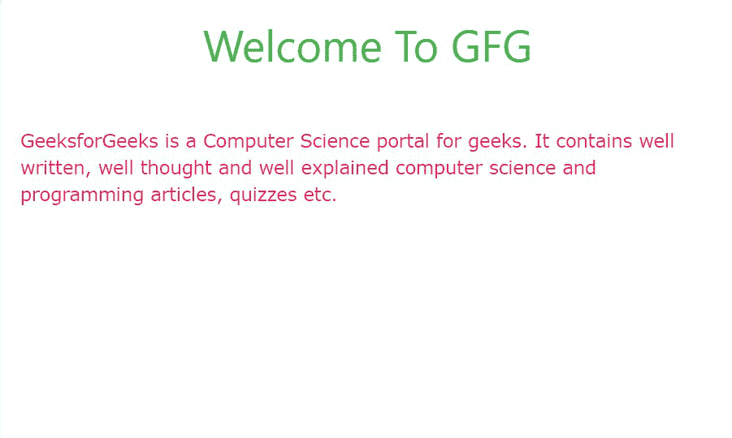
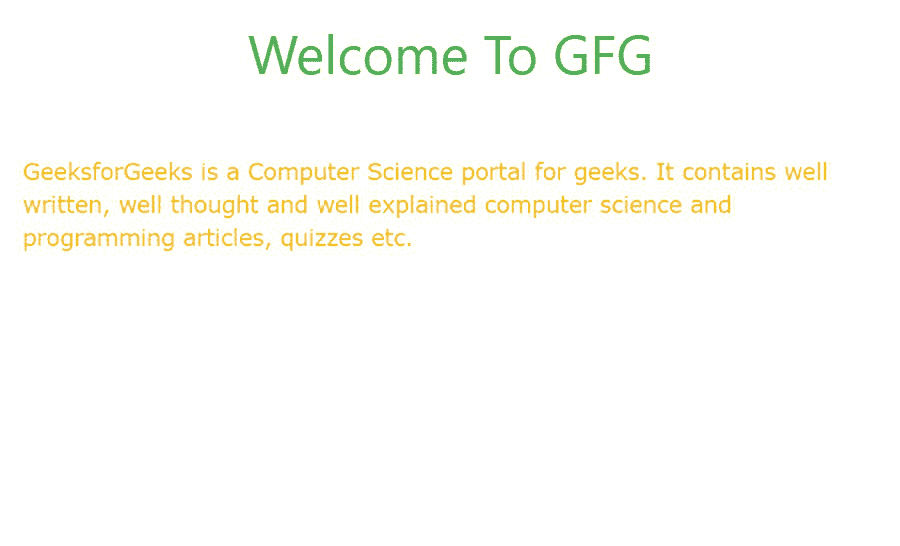

# W3。CSS 颜色

> 原文:[https://www.geeksforgeeks.org/w3-css-colors/](https://www.geeksforgeeks.org/w3-css-colors/)

W3。CSS 为我们提供了设置字体和容器颜色的类。不仅如此，还有一些类可以在悬停分割或部分时更改或设置字体或容器的颜色。所有的着色元素可以大致分为以下几个部分:

*   背景颜色
*   文本颜色
*   悬停背景颜色
*   悬停文本颜色

**背景色:**背景色类如下:

<figure class="table">

【背景色名称】

【T1125】8。【T1128】【T1129】【青色】【T1130】【T1132】【T3 133】【T3-青色】

9。

【T1152】

10。

【T3-light-green】

13。

| 【红色】 |  |
| --- | --- |
| 2。 | 【粉色】 |  |
| --- | --- | --- |
| 3。 | 【紫色】 | 【T3-紫色】 |
| --- | --- | --- |
| 4。 |  | 【T3-深色紫色】 |
| --- | --- | --- |
| 5。 |  |
| --- | --- |
| 6。 | 【蓝色】 |  |
| --- | --- | --- |
|  | 【淡蓝色】 |  | [T3- light blue] |
| --- | --- | --- | --- |
| 【aqua】 |  | 【T3-aqua】 | 【T1157】【缇尔】【T1158】 |  | 11。 | 【绿色】 | [t green] | 12。 | 【light green】 |
| --- | --- | --- | --- | --- | --- | --- | --- | --- | --- |
| 【lime】

 |  |
| --- | --- |
|  | 【沙】 | 【w3219】 |  |
| --- | --- | --- | --- |
| 15。 |  | 【w3-khaki】18。【T3-深灰色】【T1110】【w3-pale-yellow】【T1112】【T1114】【T1117】【T1119】

&#124; 16。 &#124; 黄公子 &#124; 【T3-黄公子 &#124;
&#124; 17。 &#124; 【琥珀】 &#124; 【T3 261】【T3-amber】 &#124;
&#124; 绿筠 &#124; 【w3-orange】 &#124;
&#124; 19。 &#124; 王曰 &#124; 【T3 289】【w3-王曰【291】 &#124;
&#124;  &#124; 【法语】绿筠 &#124;
&#124; 阿苏阿苏阿苏阿苏阿苏阿苏阿苏阿苏阿苏阿苏阿苏阿苏阿苏阿苏阿苏阿苏阿苏阿苏阿苏阿苏阿苏阿苏阿苏阿苏阿苏阿苏阿苏阿苏 &#124; 【T3-brown】 &#124;
&#124;  &#124; 郑国荣(音似“天启”)先生(音似“天启”)先生(音似“天启”)先生(音似“天启”)先生(音似“天启”)先生(音似“天启”)先生(音似“天启”先生) &#124; 【T3──郑国荣(音似“天启”)先生(音似“天启”)先生(音似“天启”)先生(音似“天启”)先生(音似“天启”)先生(音似“天启”)先生(音似“天启”先生) &#124;  &#124; 绿筠

 &#124; 【T3–绿筠 &#124;
&#124;  &#124;  &#124;
&#124; 鬼灵 &#124; 【T3-鬼灵 &#124;
&#124;  &#124;  &#124; 黄头发 &#124; 【t 黄头发 &#124;

 |
| --- | --- | --- |

</figure>

**示例:**在分割上添加背景色。

## 超文本标记语言

```css
<!DOCTYPE html>
<html>

<head>

    <!-- Adding W3.CSS file through external link -->
    <link rel="stylesheet" href=
        "https://www.w3schools.com/w3css/4/w3.css">

</head>

<body>
    <!-- w3-container is used to add 16px 
        padding to any HTML element.  -->
    <!-- w3-center is used to set the content 
        of the element to the center. -->
    <div class="w3-container w3-center">

        <!-- w3-text-green sets the text 
            color to green. -->
        <!-- w3-xxlarge sets font size to 32px -->
        <h2 class="w3-text-green w3-xxlarge">
            Welcome To GFG
        </h2>
    </div>

    <!-- w3-orange sets the background
         color orange -->
    <!-- w3-panel is used to 16px padding 
        from all the direction -->
    <div class="w3-panel w3-orange">

        <p>
            GeeksforGeeks is a Computer Science 
            portal for geeks. It contains well 
            written, well thought and well 
            explained computer science and 
            programming articles, quizzes etc.
        </p>
    </div>
</body>

</html>
```

**输出:**



**文字颜色:**字体颜色类别如下:

<figure class="table">

【Sr no .

【w3text-light-blue】

| 

【文字颜色名称】

 | 【琥珀】 | 【t33-文本-琥珀色】 |
| --- | --- | --- |
|  | 【aqua】 | 【w3text-aqua】 |
| --- | --- | --- |
| 3。 | 【蓝色】 | 【w3text-blue】 |
| --- | --- | --- |
| 4。 | 【淡蓝色】 |
| --- | --- |
| 5。 | 【布朗】 | 【T3-text-brown】 |
| --- | --- | --- |
| 6。 | 【青色】 | w3text-你好【w3text-blue-grey】13。14。【T3-文字-深度你好【T1119】【注:t120】大哥...【teal】【T3-text-yellow】【w3-text-white】【w3text-light-grey】

&#124; 7。 &#124; 啁啾啾 &#124;
&#124; 8。 &#124; 绿筠【T1128】【T1130】【T3131】【T3-text-green】 &#124; 【T1137】9。 &#124; 何如【T1142】 &#124; 【w3text-light-green】 &#124; 10。 &#124; 【indigo】 &#124; 11。 &#124;  &#124; 【T3-text-khaki】 &#124;
&#124; 12。 &#124; 【lime】 &#124; 【T3-text-lime】 &#124;
&#124; 【注绿筠 &#124; 【T3-text-orange】 &#124;
&#124; 王曰

 &#124; 【w3-text-deep orange】 &#124;
&#124; )什么事 &#124; 【w3text-pink】 &#124;
&#124; 16。 &#124; 你好 &#124; 【T3 245】【w3text 你好 &#124;
&#124; 17。 &#124; 绿筠 &#124;
&#124; 18。 &#124;  &#124;
&#124; 19。 &#124; 【注:T130】诶诶【T1131】 &#124; 【T3-text-sand】 &#124; 黄公子 &#124;
&#124; 鬼灵 &#124;
&#124;  &#124; 黄头发 &#124; 【T3-text-black】 &#124;  &#124; 绿筠 &#124; 【w3-text-grey】 &#124;
&#124;  &#124; 【注郑国荣(音似“天启”)先生(音似“天启”)先生(音似“天启”)先生(音似“天启”)先生(音似“天启”)先生(音似“天启”)先生(音似“天启”先生) &#124;
&#124;  &#124; 【w3text-dark-grey】 &#124;

 |
| --- | --- | --- |

</figure>

**示例:**给分割添加字体颜色。

## 超文本标记语言

```css
<!DOCTYPE html>
<html>

<head>

    <!-- Adding W3.CSS file through external link -->
    <link rel="stylesheet" href=
        "https://www.w3schools.com/w3css/4/w3.css">

</head>

<body>
    <!-- w3-container is used to add 16px 
        padding to any HTML element.  -->
    <!-- w3-center is used to set the content 
        of the element to the center. -->
    <div class="w3-container w3-center">

        <!-- w3-text-green sets the text 
            color to green. -->
        <!-- w3-xxlarge sets font size to 32px -->
        <h2 class="w3-text-green w3-xxlarge">
            Welcome To GFG
        </h2>
    </div>

    <!-- w3-text-orange sets the font 
        color to orange -->
    <!-- w3-panel is used to 16px padding 
        from all the direction -->
    <div class="w3-panel w3-text-orange">
        <p>
            GeeksforGeeks is a Computer Science 
            portal for geeks. It contains well 
            written, well thought and well 
            explained computer science and 
            programming articles, quizzes etc.
        </p>
    </div>
</body>

</html>
```

**输出:**



**悬停背景色:**可悬停的背景色类别如下:

<figure class="table">T134

9。

T330T332

23。

T344T346

24。

| 

Sr 编号

 | 

背景色名称

 | 

背景色类别

 |
| --- | --- | --- |
| 1。 | 琥珀色 | w3-悬停-琥珀色 |
| 2。 | Aqua | w3-hover-Aqua |
| 3。 | 蓝色 | w3-悬停-蓝色 |
| 4。 | 浅蓝色 | w3-悬停-浅蓝色 |
| 5。 | 棕色 | w3-悬停-棕色 |
| 6。 | 青色 | w3-悬停-青色 |
| 7。 | 蓝灰色 | w3-悬停-蓝灰色 |
| 8。 | 绿色 | w3-悬停-绿色 |
| 浅绿色 | w3-悬停-浅绿色 |
| 10。 | 靛蓝 | w3-hover-靛蓝 |
| 11。 | 卡其色 | w3-悬停-卡其色 |
| 12。 | 石灰 | w3-hover-石灰 |
| 13。 | 橙色 | w3-悬停-橙色 |
| 14。 | 深橙色 | w3-悬停-深橙色 |
| 15。 | 粉色 | w3-悬停-粉色 |
| 16。 | 紫色 | w3-悬停-紫色 |
| 17。 | 深紫色 | w3-悬停-深紫色 |
| 18。 | 红色 | w3-悬停-红色 |
| 19。 | 沙

 | w3-hover-沙 |
| 20。 | 缇尔 | w3-hover-缇尔 |
| 21。 | 黄色 | w3-悬停-黄色 |
| 22。 | 白色 | w3-悬停-白色 |
| 黑色 | w3-悬停-黑色 |
| 灰色 | w3-悬停-灰色 |
| 25。 | 浅灰色 | w3-悬停-浅灰色 |
| 26。 | 深灰色 | w3-悬停-深灰色 |
| 27。 | 淡红色 | w3-悬停-淡红色 |
| 28。 | 淡绿色 | w3-悬停-淡绿色 |
| 29。 | 淡黄色 | w3-悬停-淡黄色 |
| 30。 | 淡蓝色 | w3-悬停-淡蓝色 |

</figure>

**示例:**在分区上添加可悬停的背景色。

## 超文本标记语言

```css
<!DOCTYPE html>
<html>

<head>

    <!-- Adding W3.CSS file through external link -->
    <link rel="stylesheet" href=
        "https://www.w3schools.com/w3css/4/w3.css">

</head>

<body>
    <!-- w3-container is used to add 16px 
        padding to any HTML element.  -->
    <!-- w3-center is used to set the content 
        of the element to the center. -->
    <div class="w3-container w3-center">

        <!-- w3-text-green sets the text 
            color to green. -->
        <!-- w3-xxlarge sets font size to 32px -->
        <h2 class="w3-text-green w3-xxlarge">
            Welcome To GFG
        </h2>
    </div>

    <!-- w3-hover-amber sets the background color
         to amber on hover over the division -->
    <!-- w3-panel is used to 16px padding from 
        all the direction -->
    <div class="w3-panel w3-text-white 
        w3-pink w3-hover-amber">
        <p>
            GeeksforGeeks is a Computer Science 
            portal for geeks. It contains well 
            written, well thought and well 
            explained computer science and 
            programming articles, quizzes etc.
        </p>
    </div>
</body>

</html>
```

**输出:**

*   **悬停前:**



*   **悬停时:**



**悬停文字颜色:**可悬停文字颜色类别如下:

<figure class="table">T134T204

| 

Sr 编号

 | 

文字颜色名称

 | 

文字颜色类别

 |
| --- | --- | --- |
| 1。 | 琥珀色 | w3-悬停-文字-琥珀色 |
| 2。 | Aqua | w3-悬停-文字-Aqua |
| 3。 | 蓝色 | w3-hover-text-Blue |
| 4。 | 浅蓝色 | w3-悬停-文字-浅蓝色 |
| 5。 | 棕色 | w3-悬停-文字-棕色 |
| 6。 | 青色 | w3-悬停-文字-青色 |
| 7。 | 蓝灰色 | w3-悬停-文字-蓝灰色 |
| 8。 | 绿色 | w3-悬停-文字-绿色 |
| 9 . | 浅绿色 | w3-悬停-文字-浅绿色 |
| 10。 | 靛蓝 | w3-悬停-文字-靛蓝 |
| 11。 | 卡其色 | w3-悬停-文字-卡其色 |
| 12。 | 石灰 | w3-悬停-文字-石灰 |
| 13。 | 橙色 | w3-悬停-文字-橙色 |
| 14 . | 深橙色 | w3-hover-text-深橙色 |
| 15。 | 粉色 | w3-悬停-文字-粉色 |
| 16。 | 紫色 | w3-悬停-文字-紫色 |
| 17。 | 深紫色 | w3-hover-text-深紫色 |
| 18。 | 红色 | w3-悬停-文字-红色 |
| 19。 | 沙 | w3-hover-text-沙 |
| 20。 | 缇尔 | w3-hover-text-缇尔 |
| 21。 | 黄色 | w3-悬停-文字-黄色 |
| 22。 | 白色 | w3-悬停-文字-白色 |
| 23。 | 黑色 | w3-悬停-文字-黑色 |
| 24。 | 灰色 | w3-悬停-文字-灰色 |
| 25。 | 浅灰色 | w3-悬停-文字-浅灰色 |
| 26。 | 深灰色 | w3-悬停-文本-深灰色 |

</figure>

**示例:**在分区上添加可悬停的文本颜色。

## 超文本标记语言

```css
<!DOCTYPE html>
<html>

<head>

    <!-- Adding W3.CSS file through external link -->
    <link rel="stylesheet" href=
        "https://www.w3schools.com/w3css/4/w3.css">
</head>

<body>
    <!-- w3-container is used to add 16px 
        padding to any HTML element.  -->
    <!-- w3-center is used to set the 
        content of the element to the center. -->
    <div class="w3-container w3-center">

        <!-- w3-text-green sets the text 
            color to green. -->
        <!-- w3-xxlarge sets font size to 32px -->
        <h2 class="w3-text-green w3-xxlarge">
            Welcome To GFG
        </h2>
    </div>

    <!-- w3-hover-text-amber sets the font color
         to amber on hover over the division -->
    <!-- w3-panel is used to 16px padding from 
        all the direction -->
    <div class="w3-panel w3-text-pink
        w3-hover-text-amber">
        <p>
            GeeksforGeeks is a Computer Science 
            portal for geeks. It contains well 
            written, well thought and well 
            explained computer science and 
            programming articles, quizzes etc.
        </p>
    </div>
</body>

</html>
```

**输出:**

*   **悬停前:**



*   **悬停时:**

