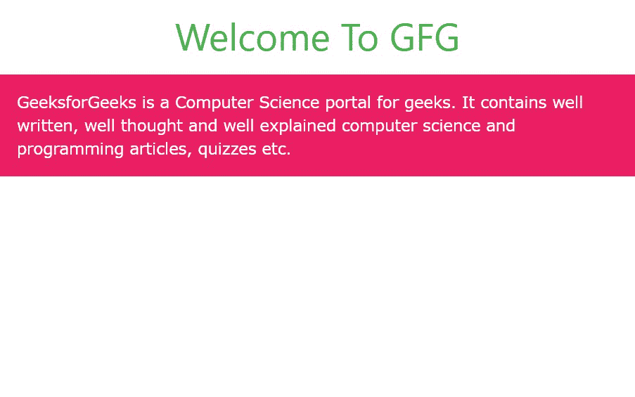
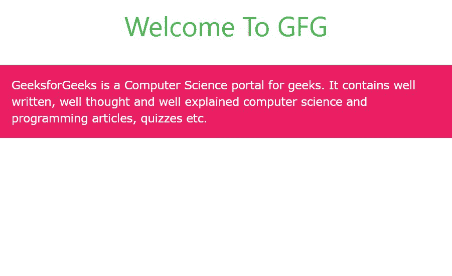

# W3。CSS 容器和面板

> 原文:[https://www.geeksforgeeks.org/w3-css-containers-and-panels/](https://www.geeksforgeeks.org/w3-css-containers-and-panels/)

W3。CSS 为 web 开发人员提供了两个最有用的类，即容器和面板。它们用于将内容与相同的字体颜色、背景颜色、字体大小、字体系列等放在一起。

**w3-container:** 这个类用于在元素的左侧和右侧添加 16px 的填充。它可以与所有 HTML5 容器元素一起使用，即 div、文章、节、页眉、页脚等。这个类中的所有元素共享相同的字体大小、字体颜色、填充、对齐等。

**示例:**在 HTML 页面中使用 w3-container 类。

## 超文本标记语言

```
<!DOCTYPE html>
<html>

<head>

    <!-- Adding W3.CSS file through external link -->
    <link rel="stylesheet" href=
        "https://www.w3schools.com/w3css/4/w3.css">

</head>

<body>
    <!-- w3-container is used to add 16px 
        padding to any HTML element  -->
    <!-- w3-center is used to set the content 
        of the element to the center. -->
    <div class="w3-container w3-center">

        <!-- w3-text-green sets the text 
            color to green. -->
        <!-- w3-xxlarge sets font size to 32px. -->
        <h2 class="w3-text-green w3-xxlarge">
            Welcome To GFG
        </h2>
    </div>

    <!-- w3-pink sets the background color pink -->
    <div class="w3-container w3-pink">

        <!-- w3-text-white sets the text 
            color to white -->
        <p class="w3-text-white ">
            GeeksforGeeks is a Computer Science 
            portal for geeks. It contains well 
            written, well thought and well 
            explained computer science and 
            programming articles, quizzes etc.
        </p>
    </div>
</body>

</html>
```

**输出:**



**w3-panel:** 这个类在所有边上，即上、右、下、左增加 16px 填充。它也可以用于所有的 HTML5 容器元素，即 div、文章、节、页眉、页脚等。这个类中的所有元素共享相同的字体大小、字体颜色、填充、对齐等。

**示例:**在 HTML 页面中使用 w3-panel 类。

## 超文本标记语言

```
<!DOCTYPE html>
<html>

<head>

    <!-- Adding W3.CSS file through external link -->
    <link rel="stylesheet" href=
        "https://www.w3schools.com/w3css/4/w3.css">

</head>

<body>
    <!-- w3-container is used to add 16px 
        padding to any HTML element.  -->
    <!-- w3-center is used to set the content 
        of the element to the center. -->
    <div class="w3-container w3-center">

        <!-- w3-text-green sets the text 
            color to green. -->
        <!-- w3-xxlarge sets font size to 32px. -->
        <h2 class="w3-text-green w3-xxlarge">
            Welcome To GFG
        </h2>
    </div>

    <!-- w3-pink sets the background color pink -->
    <!-- w3-panel is used to 16px padding 
        from all the direction -->
    <div class="w3-panel w3-pink">

        <!-- w3-text-white sets the text 
            colur to white. -->
        <p class="w3-text-white">
            GeeksforGeeks is a Computer Science 
            portal for geeks. It contains well 
            written, well thought and well 
            explained computer science and 
            programming articles, quizzes etc.
        </p>
    </div>
</body>

</html>
```

**输出:**



你可以看到标题和段落之间的差距增加了，因为我们有 w3-panel 类。

**注:**

*   如果您使用段落标记，则自动在内容和分隔线之间添加填充。
*   您可以使用面板和容器来制作诸如笔记、报价、提醒、卡片等样式。