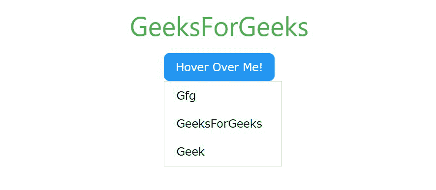
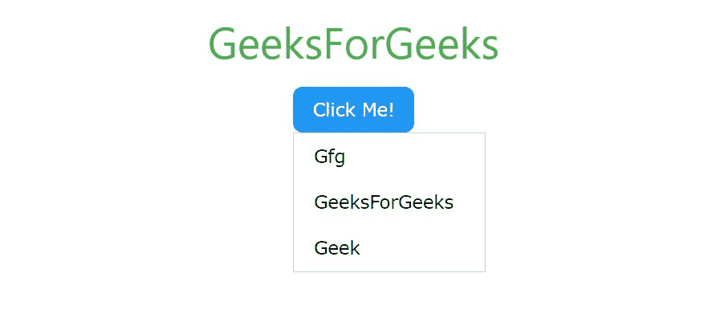

# W3.CSS 下拉式清单

> 原文:[https://www.geeksforgeeks.org/w3-css-dropdown/](https://www.geeksforgeeks.org/w3-css-dropdown/)

下拉菜单是交互式网站最重要的部分之一。下拉菜单是菜单项的集合，允许用户从列表中选择一个值。W3。CSS 还提供了一些类来制作一个流畅且有响应的下拉菜单。下拉菜单有两种类型，即可悬停和可点击。可下拉的类如下:

<figure class="table">

| 

Sr 编号

 | 

类名

 | 

描述

 |
| --- | --- | --- |
| 1。

 | w3-drop down-content | 它是用来制作下拉菜单的内容。 |
| 2。 | w3-drop down-hover | 它用来制作一个可悬停的下拉元素。 |
| 3。 | w3-下拉-点击 | 用于制作可点击的下拉菜单。

 |

</figure>

**示例:**创建可悬停的下拉菜单。

## 超文本标记语言

```css
<!DOCTYPE html>
<html>

<head>

    <!-- Adding W3.CSS file through external link -->
    <link rel="stylesheet" 
          href="https://www.w3schools.com/w3css/4/w3.css">
</head>

<body>

    <!-- w3-container is used to add 16px
          padding to any HTML element.  -->
    <!-- w3-center is used to set the content 
           of the element to the center. -->
    <div class="w3-container w3-center">
        <!-- w3-text-green sets the text colour to green. -->
        <!-- w3-xxlarge sets font size to 32px. -->
        <h2 class="w3-text-green w3-xxlarge">GeeksForGeeks</h2>
    </div>

    <!-- Hoverable Dropdown Menu in W3.CSS -->
    <div class="w3-container w3-center">
        <!-- Hoverable Dropdown Menu -->
        <div class="w3-dropdown-hover w3-round-large">
            <button class=
          "w3-button w3-hover-blue w3-pink w3-round-large">
                Hover Over Me!
            </button>
            <div class="w3-dropdown-content w3-bar-block w3-border">
                <a href="#" class="w3-bar-item w3-button">
                    Gfg
                </a>
                <a href="#" class="w3-bar-item w3-button">
                    GeeksForGeeks
                </a>
                <a href="#" class="w3-bar-item w3-button">
                  Geek
              </a>
            </div>
        </div>
    </div>
</body>

</html>
```

**输出:**

*   **悬停前:**


*   **悬停后:**



**示例:**创建可点击的下拉菜单。

## 超文本标记语言

```css
<!DOCTYPE html>
<html>

<head>

    <!-- Adding W3.CSS file through external link -->
    <link rel="stylesheet" 
          href="https://www.w3schools.com/w3css/4/w3.css">

    <!-- Function to show and hide dropdown menu -->
    <script>
        function show() {
          var x = document.getElementById("gfg");
          if (x.className.indexOf("w3-show") == -1) { 
            x.className += " w3-show";
          } else {
            x.className = x.className.replace(" w3-show", "");
          }
        }
    </script>
</head>

<body>
    <!-- w3-container is used to add 16px
          padding to any HTML element.  -->
    <!-- w3-center is used to set the content 
          of the element to the center. -->
    <div class="w3-container w3-center">
        <!-- w3-text-green sets the text color to green. -->
        <!-- w3-xxlarge sets font size to 32px. -->
        <h2 class="w3-text-green w3-xxlarge">
          GeeksForGeeks
      </h2>
    </div>

    <!-- Hoverable Dropdown Menu in W3.CSS -->
    <div class="w3-container w3-center">
        <!-- Hoverable Dropdown Menu -->
        <div class="w3-dropdown-click w3-round-large">
            <button onclick = "show()" 
                    class="w3-button w3-blue w3-round-large">
                Click Me!
            </button>

            <div id="gfg" 
                 class="w3-dropdown-content w3-bar-block w3-border">
                <a href="#" class="w3-bar-item w3-button">Gfg</a>
                <a href="#" class="w3-bar-item w3-button">
                    GeeksForGeeks
                </a>
                <a href="#" class="w3-bar-item w3-button">Geek</a>
            </div>
        </div>
    </div>
</body>

</html>
```

**输出:**

*   **点击前:**


*   **点击后:**

