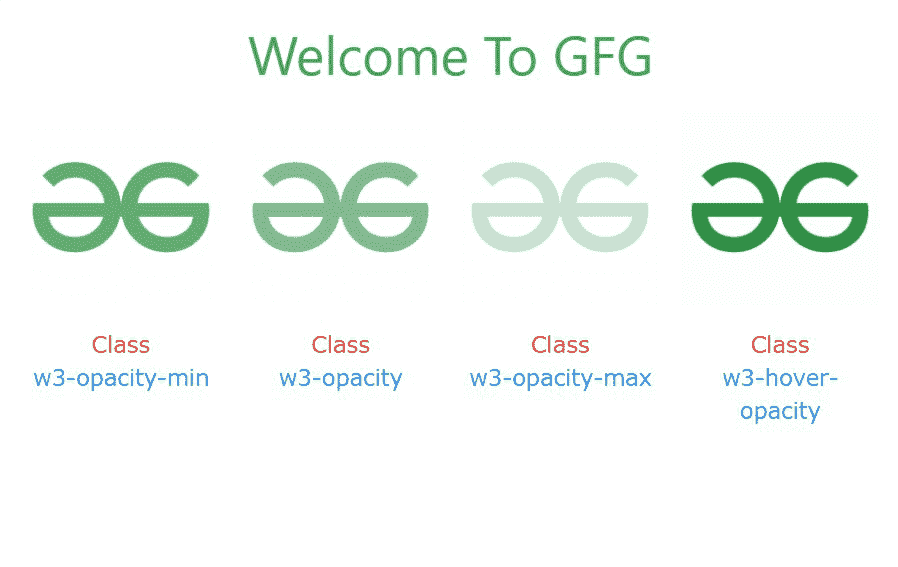
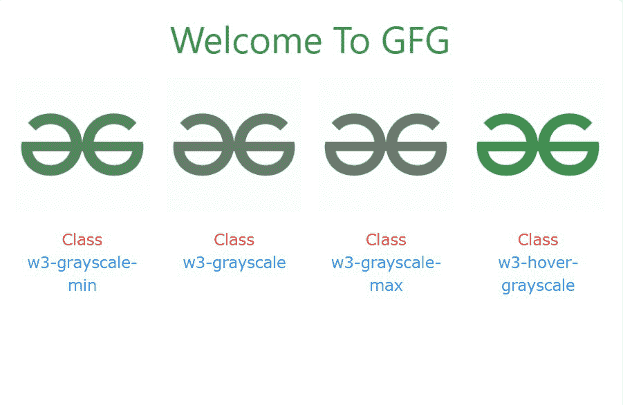
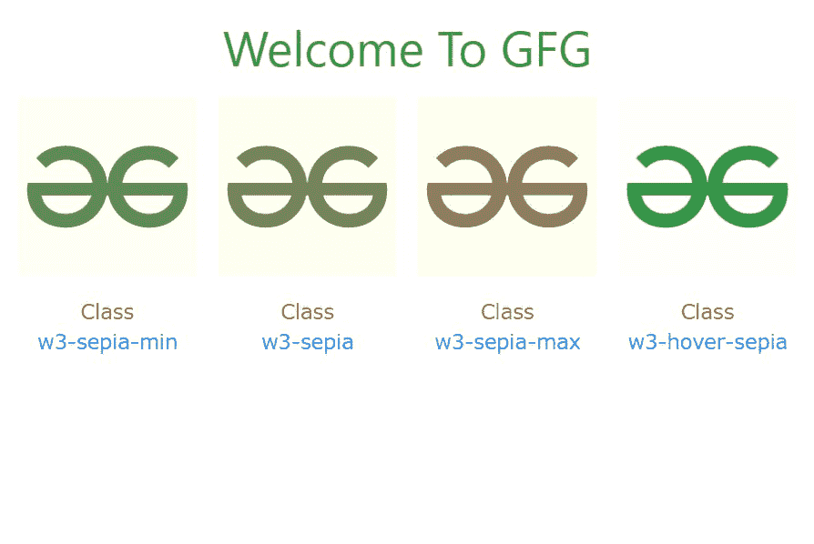

# W3。CSS 效果

> 原文:[https://www.geeksforgeeks.org/w3-css-effects/](https://www.geeksforgeeks.org/w3-css-effects/)

W3。CSS 为 web 开发人员提供了各种效果。它们可以大致分为三类。它们是:

*   不透明
*   灰度等级
*   乌贼的墨

#### 不透明度效果:

有四个不透明度效果类:

<figure class="table">

| 

Sr 号

 | 

类名

 | 

描述

 |
| --- | --- | --- |
| 1。 | w3-不透明度-min | 目标元素的不透明度设置为 **0.75** 。 |
| 2。 | w3-不透明度 | 目标元素的不透明度设置为 **0.6** 。 |
| 3。 | w3-不透明度-max

 | 目标元素的不透明度设置为 **0.25** 。 |
| 4。 | w3-悬停-不透明度 | 悬停时目标元素的不透明度设置为 **0.6** 。 |

</figure>

**示例:**

## 超文本标记语言

```html
<!DOCTYPE html>
<html>

<head>

    <!-- Adding W3.CSS file through external link -->
    <link rel="stylesheet" href=
        "https://www.w3schools.com/w3css/4/w3.css">
</head>

<body>
    <!-- w3-container is used to add 
         16px padding to any HTML element.  -->
    <!-- w3-center is used to set the 
         content of the element to the center. -->
    <div class="w3-container w3-center">

        <!-- w3-text-green sets the text
            colour to green. -->
        <!-- w3-xxlarge sets font size to 32px. -->
        <h2 class="w3-text-green w3-xxlarge">
            Welcome To GFG
        </h2>
    </div>

    <!-- Images with Opacity Effects -->
    <div class="w3-row w3-row-padding w3-center">

        <!-- Minimum Opacity -->
        <div class="w3-col m3 l3">
            

            <p>
                <span class="w3-text-red">
                    Class
                </span>
                <br>
                <span class="w3-text-blue">
                    w3-opacity-min
                </span>
            </p>

        </div>
        <!-- Normal Opacity -->
        <div class="w3-col m3 l3">
            

            <p>
                <span class="w3-text-red">
                    Class
                </span>
                <br>
                <span class="w3-text-blue">
                    w3-opacity
                </span>
            </p>

        </div>
        <!-- Maximum Opacity -->
        <div class="w3-col m3 l3">
            

            <p>
                <span class="w3-text-red">
                    Class
                </span>
                <br>
                <span class="w3-text-blue">
                    w3-opacity-max
                </span>
            </p>

        </div>
        <!-- On Hover Opacity -->
        <div class="w3-col m3 l3">
            
            <p>
                <span class="w3-text-red">
                    Class
                </span>
                <br>
                <span class="w3-text-blue">
                    w3-hover-opacity
                </span>
            </p>

        </div>
    </div>
</body>

</html>
```

**输出:**



**灰度效果:**共有 4 个灰度效果类:

<figure class="table">

| 

Sr 编号

 | 

类名称

 | 

说明

 |
| --- | --- | --- |
| 1。 | w3-灰度-min | 目标元素的灰度设置为 **50%** 。 |
| 2。 | w3-灰度 | 目标元素的灰度设置为 **75%** 。 |
| 3。 | w3-灰度-max | 目标元素的灰度设置为 **100%** 。 |
| 4。 | w3-悬停-灰度 | 悬停时目标元素的灰度设置为 **100%** 。 |

</figure>

**示例:**

## 超文本标记语言

```html
<!DOCTYPE html>
<html>

<head>

    <!-- Adding W3.CSS file through external link -->
    <link rel="stylesheet" href=
        "https://www.w3schools.com/w3css/4/w3.css">

</head>

<body>
    <!-- w3-container is used to add 
         16px padding to any HTML element.  -->
    <!-- w3-center is used to set the 
         content of the element to the center. -->
    <div class="w3-container w3-center">

        <!-- w3-text-green sets the text 
            colour to green. -->
        <!-- w3-xxlarge sets font size to 32px. -->
        <h2 class="w3-text-green w3-xxlarge">
            Welcome To GFG
        </h2>
    </div>

    <!-- Images with Grayscale Effects -->
    <div class="w3-row w3-row-padding w3-center">
        <!-- Minimum Grayscale -->
        <div class="w3-col m3 l3">
            

            <p>
                <span class="w3-text-red">Class</span>
                <br>
                <span class="w3-text-blue">
                    w3-grayscale-min
                </span>
            </p>

        </div>
        <!-- Normal Grayscale -->
        <div class="w3-col m3 l3">
            

            <p>
                <span class="w3-text-red">Class</span>
                <br>
                <span class="w3-text-blue">
                    w3-grayscale
                </span>
            </p>

        </div>
        <!-- Maximum Grayscale -->
        <div class="w3-col m3 l3">
            

            <p>
                <span class="w3-text-red">Class</span>
                <br>
                <span class="w3-text-blue">
                    w3-grayscale-max
                </span>
            </p>

        </div>
        <!-- On Hover Grayscale -->
        <div class="w3-col m3 l3">
            

            <p>
                <span class="w3-text-red">Class</span>
                <br>
                <span class="w3-text-blue">
                    w3-hover-grayscale
                </span>
            </p>
        </div>
    </div>
</body>

</html>
```

**输出:**



**乌贼效果:**有四个乌贼类:

<figure class="table">

| 

Sr 号

 | 

类名

 | 

描述

 |
| --- | --- | --- |
| 1。 | w3-棕褐色-min | 目标元素的棕褐色效果设为 **50%** 。 |
| 2。 | w3-棕褐色 | 目标元素的棕褐色效果设置为 **75%** 。 |
| 3。 | w3-棕褐色-max | 目标元素的棕褐色效果设置为 **100%** 。 |
| 4。 | w3-悬停-乌贼 | 悬停时目标元素的乌贼效果设置为 **100%** 。 |

</figure>

**示例:**

## 超文本标记语言

```html
<!DOCTYPE html>
<html>

<head>

    <!-- Adding W3.CSS file through external link -->
    <link rel="stylesheet" href=
        "https://www.w3schools.com/w3css/4/w3.css">
</head>

<body>
    <!-- w3-container is used to add 16px 
        padding to any HTML element.  -->
    <!-- w3-center is used to set the content 
        of the element to the center. -->
    <div class="w3-container w3-center">

        <!-- w3-text-green sets the text 
            colour to green. -->
        <!-- w3-xxlarge sets font size to 32px. -->
        <h2 class="w3-text-green w3-xxlarge">
            Welcome To GFG
        </h2>
    </div>

    <!-- Images with Sepia Effects -->
    <div class="w3-row w3-row-padding w3-center">
        <!-- Minimum Sepia -->
        <div class="w3-col m3 l3">
            

            <p>
                <span class="w3-text-red">Class</span>
                <br>
                <span class="w3-text-blue">
                    w3-sepia-min
                </span>
            </p>

        </div>
        <!-- Normal Sepia -->
        <div class="w3-col m3 l3">
            

            <p>
                <span class="w3-text-red">Class</span>
                <br>
                <span class="w3-text-blue">
                    w3-sepia
                </span>
            </p>

        </div>
        <!-- Maximum Sepia -->
        <div class="w3-col m3 l3">
            

            <p>
                <span class="w3-text-red">Class</span>
                <br>
                <span class="w3-text-blue">
                    w3-sepia-max
                </span>
            </p>

        </div>
        <!-- On Hover Sepia -->
        <div class="w3-col m3 l3">
            

            <p>
                <span class="w3-text-red">Class</span>
                <br>
                <span class="w3-text-blue">
                    w3-hover-sepia
                </span>
            </p>
        </div>
    </div>
</body>

</html>
```

**输出:**

