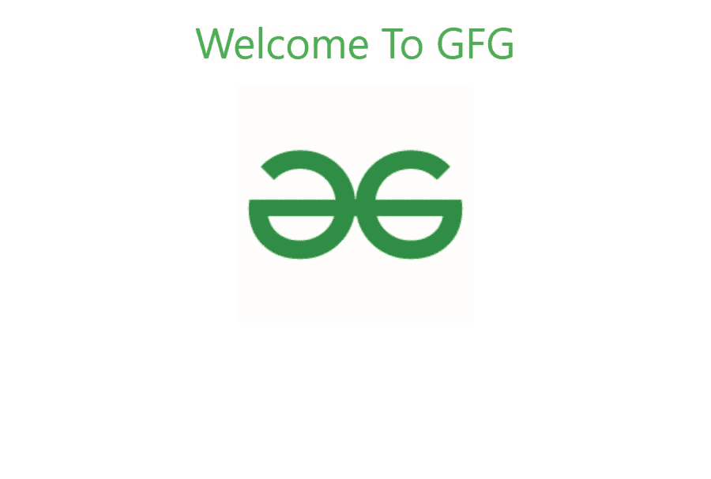
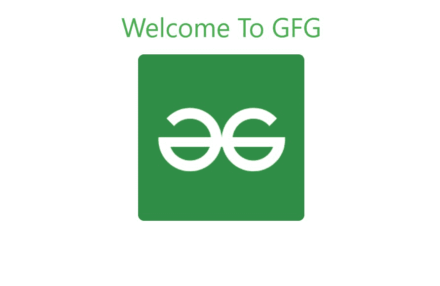

# W3。CSS 图像〔t1〕

> 原文:[https://www.geeksforgeeks.org/w3-css-images/](https://www.geeksforgeeks.org/w3-css-images/)

W3。CSS 提供了一个单一的类来管理图像并使它们具有响应性。使图像具有响应性意味着它应该根据其父元素进行缩放。也就是说，图像的大小不应该溢出其父图像，并且将根据其父图像大小的变化而增长和缩小，而不会失去其纵横比，w3-image 也是如此。

**示例:**向 HTML 页面添加响应图像。

## 超文本标记语言

```
<!DOCTYPE html>
<html>

<head>

    <!-- Adding W3.CSS file through external link -->
    <link rel="stylesheet" 
          href="https://www.w3schools.com/w3css/4/w3.css">
</head>

<body>
    <!-- w3-container is used to add 16px
         padding to any HTML element.  -->
    <!-- w3-center is used to set the content
         of the element to the center. -->
    <div class="w3-container w3-center">

        <!-- w3-text-green sets the text color
             to green. -->
        <!-- w3-xxlarge sets font size to 32px. -->
        <h2 class="w3-text-green w3-xxlarge">
            Welcome To GFG
        </h2>
    </div>

    <!-- Adding a responsive image at the 
         center of the page -->
    <div class="w3-container w3-center">
      
    </div>
</body>

</html>
```

**输出:**



虽然它只有一个类，但它可以与其他类结合，制作各种效果，如圆边图像、带边框图像、卡片图像等。要添加圆边图像，可以使用 w3-round 或任何其他类似的类。

**示例:**在 HTML 页面上添加圆边图像。

## 超文本标记语言

```
<!DOCTYPE html>
<html>
<head>

    <!-- Adding W3.CSS file through external link -->
    <link rel="stylesheet" 
          href="https://www.w3schools.com/w3css/4/w3.css">
</head>

<body>
    <!-- w3-container is used to add 16px
         padding to any HTML element.  -->
    <!-- w3-center is used to set the content
         of the element to the center. -->
    <div class="w3-container w3-center">

        <!-- w3-text-green sets the text color to green. -->
        <!-- w3-xxlarge sets font size to 32px. -->
        <h2 class="w3-text-green w3-xxlarge">
          Welcome To GFG
      </h2>
    </div>

    <!-- Adding a round-edged responsive image at 
         the center of the page -->
    <div class="w3-container w3-center">
        
    </div>
</body>
</html>
```

**输出:**



您也可以使用 w3-circle 类向图像添加圆形图像。

**示例:**

## 超文本标记语言

```
<!DOCTYPE html>
<html>

<head>

    <!-- Adding W3.CSS file through external link -->
    <link rel="stylesheet" 
          href="https://www.w3schools.com/w3css/4/w3.css">
</head>

<body>
    <!-- w3-container is used to add 16px 
         padding to any HTML element.  -->
    <!-- w3-center is used to set the content
         of the element to the center. -->
    <div class="w3-container w3-center">

        <!-- w3-text-green sets the text color to green -->
        <!-- w3-xxlarge sets font size to 32px. -->
        <h2 class="w3-text-green w3-xxlarge">
          Welcome To GFG
      </h2>
    </div>

    <!-- Adding a circular responsive image at 
         the center of the page -->
    <div class="w3-container w3-center">
        
    </div>
</body>

</html>
```