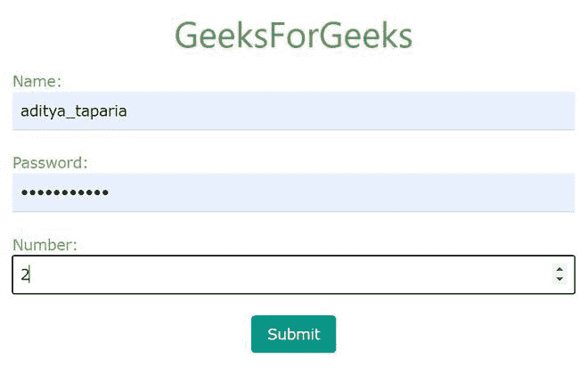
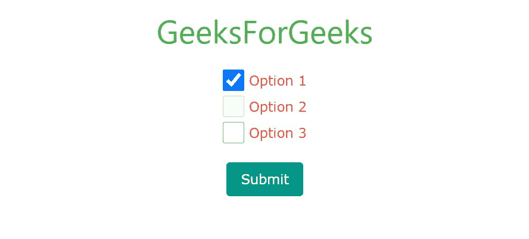
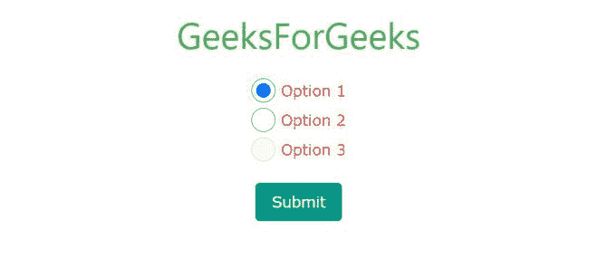
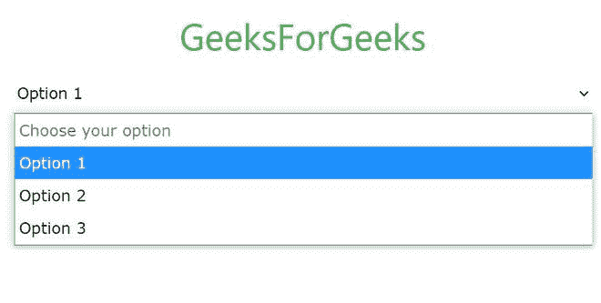
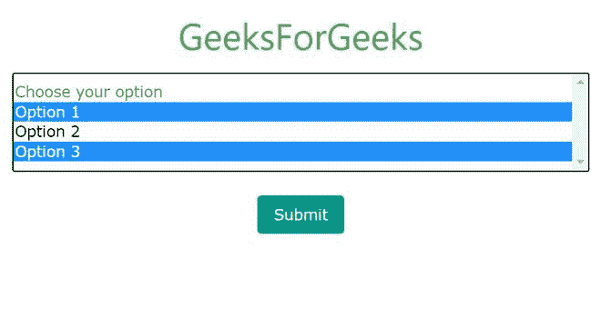
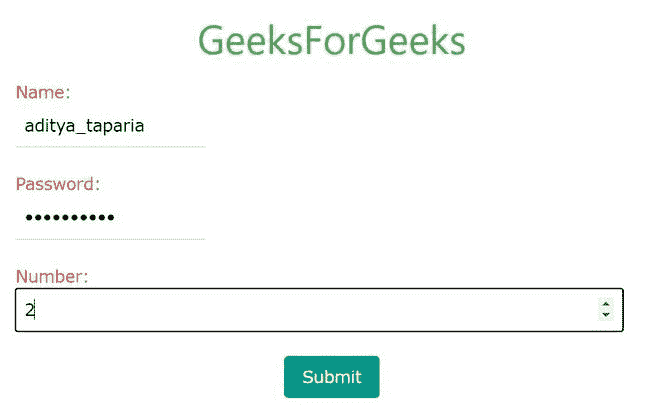

# W3。CSS 输入

> 原文:[https://www.geeksforgeeks.org/w3-css-input/](https://www.geeksforgeeks.org/w3-css-input/)

W3 中的表单控件类列表。CSS 如下:

*   w3-输入
*   w3-检查
*   w3-无线电
*   w3-选择
*   w3-动画-输入

**w3-输入类:**这个类可以用于文本、密码、数字、DateTime、DateTime-local、日期、月份、时间、星期、电子邮件、url、搜索、电话和颜色，这意味着它支持所有的 HTML5 输入类型。它用于将输入元素的宽度设置为 100%。

**示例:**

## 超文本标记语言

```html
<!DOCTYPE html>
<html>

<head>

    <!-- Adding W3.CSS file through external link -->
    <link rel="stylesheet" 
          href="https://www.w3schools.com/w3css/4/w3.css">

</head>

<body>
    <!-- w3-container is used to add 
         16px padding to any HTML element.  -->
    <!-- w3-center is used to set the 
         content of the element to the center. -->
    <div class="w3-container w3-center">
        <!-- w3-text-green sets the text 
            color to green. -->
        <!-- w3-xxlarge sets font size to 32px. -->
        <h2 class="w3-text-green w3-xxlarge">
            GeeksForGeeks
        </h2>
    </div>

    <!-- Form in W3.CSS -->
    <div class="w3-container w3-text-red">
      <form>
         <!-- Text Field -->
         <label for="usr">Name:</label> 
         <input type="text" 
                class="w3-input" 
                id="usr" 
                name="username"> 
         <br>

         <!-- Password Field -->
         <label for="pwd">Password:</label> 
         <input type="password"
                class="w3-input" 
                id="pwd"
                name="password"> 
         <br> 

         <!-- Number Field -->
         <label for="number">Number:</label> 
         <input type="number" 
                class="w3-input" 
                id="number"> 
         <br>
         <div class="w3-center">
             <button type="submit" 
                 class="w3-teal w3-hover-green 
                 w3-round w3-button">
                     Submit
             </button> 
         </div>
      </form>
    </div>
</body>
</html>
```

**输出:**



**w3-检查类别:**复选框用于从提供的列表中选择任何特定项目。此类仅在复选框中使用。

**示例:**

## 超文本标记语言

```html
<!DOCTYPE html>
<html>
<head>

    <!-- Adding W3.CSS file through external link -->
    <link rel="stylesheet" 
          href="https://www.w3schools.com/w3css/4/w3.css">

</head>
<body>
    <!-- w3-container is used to add 16px
         padding to any HTML element.  -->
    <!-- w3-center is used to set the content
         of the element to the center. -->
    <div class="w3-container w3-center">
        <!-- w3-text-green sets the text colour to green. -->
        <!-- w3-xxlarge sets font size to 32px. -->
        <h2 class="w3-text-green w3-xxlarge">
          GeeksForGeeks
      </h2>
    </div>

    <!-- Form in W3.CSS -->
    <div class="w3-container w3-text-red w3-center">
      <form>
         <!-- Checked Checkbox -->
          <label for="check1"> 
          <input type="checkbox" 
                 class="w3-check" 
                 id="check1" 
                 name="option1" 
                 value="something" 
                 checked> 
             Option 1 
          </label>
         <br>

         <!-- Disabled Checkbox -->
         <label for="check2"> 
         <input type="checkbox" 
                class="w3-check"
                id="check2" 
                disabled> 
             Option 2
         </label>
         <br>

         <!-- Normal Checkbox -->
         <label> 
         <input type="checkbox" 
                class="w3-check"
                name="option2"
                value="something">
            Option 3 
         </label>
         <br><br>

         <!-- button -->
         <button type="submit" 
             class="w3-teal w3-hover-green 
             w3-round w3-button">
             Submit
         </button>
      </form>
    </div>
</body>
</html>
```

**输出:**



上面的表单包含三个复选框。默认情况下，第一个选项处于选中状态，第二个选项处于禁用状态。要使用内联复选框，只需移除它们之间的 **< br >** 标记。

**w3-单选类别:**单选按钮用于用户从多个选项中选择唯一的选项。它类似于复选框，只是从输入类型中删除“复选框”并放置“单选”。此类仅用于单选按钮。

**示例:**

## 超文本标记语言

```html
<!DOCTYPE html>
<html>
<head>

    <!-- Adding W3.CSS file through external link -->
    <link rel="stylesheet" 
          href="https://www.w3schools.com/w3css/4/w3.css">

</head>
<body>
    <!-- w3-container is used to add 16px 
         padding to any HTML element.  -->
    <!-- w3-center is used to set the content
         of the element to the center. -->
    <div class="w3-container w3-center">
        <!-- w3-text-green sets the text color to green. -->
        <!-- w3-xxlarge sets font size to 32px. -->
        <h2 class="w3-text-green w3-xxlarge">GeeksForGeeks</h2>
    </div>

    <!-- Form in W3.CSS -->
    <div class="w3-container w3-text-red w3-center">
      <form>
         <!-- Checked Radio Button -->
         <label for="radio1"> 
         <input type="radio" class="w3-radio" id="radio1"
                name="optradio" value="option1" checked>
            Option 1 
         </label>
         <br>
         <!-- Normal Radio Button -->
         <label for="radio2"> 
         <input type="radio" class="w3-radio" id="radio2"
                name="optradio" value="option2">
            Option 2 
         </label>
         <br>
         <!-- Disabled Radio Button -->
         <label> 
         <input type="radio" 
                class="w3-radio" 
                disabled> 
            Option 3 
        </label>
         <br><br>

         <!-- Button -->
         <button type="submit" 
             class="w3-teal w3-hover-green 
             w3-round w3-button">
             Submit
         </button>
      </form>
    </div>
</body>
</html>
```

**输出:**



上面的表单包含三个单选按钮。默认情况下，选中第一个选项，禁用最后一个选项。要使用直列单选按钮，只需移除它们之间的 **< br >** 标签。

**w3-select Class:** 这里有两种类型的选择列表从列表中选择单个元素和从列表中选择两个或多个元素来选择多个元素，只需按住 shift 键并逐个选择您的项目。

**示例:**只有一个选择可能的选择列表。

## 超文本标记语言

```html
<!DOCTYPE html>
<html>
<head>

    <!-- Adding W3.CSS file through external link -->
    <link rel="stylesheet" 
          href="https://www.w3schools.com/w3css/4/w3.css">

</head>
<body>
    <!-- w3-container is used to add 16px 
         padding to any HTML element.  -->
    <!-- w3-center is used to set the content 
         of the element to the center. -->
    <div class="w3-container w3-center">
        <!-- w3-text-green sets the text colour to green. -->
        <!-- w3-xxlarge sets font size to 32px. -->
        <h2 class="w3-text-green w3-xxlarge">GeeksForGeeks</h2>
    </div>

    <!-- Form in W3.CSS -->
    <div class="w3-container w3-text-red w3-center">
      <form>
         <!-- Single Selection list -->
         <select class="w3-select" name="option">
            <option value="" disabled selected>
              Choose your option
           </option>
            <option value="1">Option 1</option>
            <option value="2">Option 2</option>
            <option value="3">Option 3</option>
          </select>
         <br><br>

         <!-- Button -->
         <button type="submit" 
             class="w3-teal w3-hover-green 
             w3-round w3-button">
             Submit
         </button>
      </form>
    </div>
</body>
</html>
```

**输出:**



**示例:**可多选的选择列表。

## 超文本标记语言

```html
<!DOCTYPE html>
<html>
<head>

    <!-- Adding W3.CSS file through external link -->
    <link rel="stylesheet" 
          href="https://www.w3schools.com/w3css/4/w3.css">

</head>
<body>
    <!-- w3-container is used to add 16px
          padding to any HTML element.  -->
    <!-- w3-center is used to set the content 
         of the element to the center. -->
    <div class="w3-container w3-center">
        <!-- w3-text-green sets the text colour to green. -->
        <!-- w3-xxlarge sets font size to 32px. -->
        <h2 class="w3-text-green w3-xxlarge">GeeksForGeeks</h2>
    </div>

    <!-- Form in W3.CSS -->
    <div class="w3-container w3-text-red w3-center">
      <form>
         <!-- Multiple Selection list -->
         <select multiple class="w3-select" name="option">
            <option value="" disabled selected>
              Choose your option
           </option>
            <option value="1">Option 1</option>
            <option value="2">Option 2</option>
            <option value="3">Option 3</option>
          </select>
         <br><br>

         <!-- Button -->
         <button type="submit" class="w3-teal 
             w3-hover-green w3-round w3-button">
               Submit
         </button>
      </form>
    </div>
</body>
</html>
```

**输出:**



**w3-animate-input 类:**这个类类似于 w3-input 类，因此可以用于所有 HTML5 表单元素。这个类将目标元素的宽度转换为 100%。

**示例:**

## 超文本标记语言

```html
<!DOCTYPE html>
<html>
<head>

    <!-- Adding W3.CSS file through external link -->
    <link rel="stylesheet" 
          href="https://www.w3schools.com/w3css/4/w3.css">
</head>

<body>
    <!-- w3-container is used to add 16px 
           padding to any HTML element.  -->
    <!-- w3-center is used to set the content 
            of the element to the center. -->
    <div class="w3-container w3-center">

        <!-- w3-text-green sets the text color to green. -->
        <!-- w3-xxlarge sets font size to 32px. -->
        <h2 class="w3-text-green w3-xxlarge">GeeksForGeeks</h2>
    </div>

    <!-- Form in W3.CSS -->
    <div class="w3-container w3-text-red">
      <form>
         <!-- Text Field -->
         <label for="usr">Name:</label>
         <input type="text" 
                class="w3-input w3-animate-input" 
                id="usr" 
                name="username" 
                style="width: 30%;"> 
         <br>

         <!-- Password Field -->
         <label for="pwd">Password:</label> 
         <input type="password" 
                class="w3-input w3-animate-input"
                id="pwd" 
                name="password" 
                style="width: 30%;"> 
         <br> 

         <!-- Number Field -->
         <label for="number">Number:</label> 
         <input type="number"
                class="w3-input w3-animate-input"
                id="number" 
                style="width: 30%;"> 
         <br>
         <div class="w3-center">
             <button type="submit" class="w3-teal 
                 w3-hover-green w3-round w3-button">
                    Submit
             </button> 
         </div>
      </form>
    </div>
</body>
</html>
```

**输出:**



您可以看到所选元素的宽度为 100%，而其他元素的宽度为 30%。