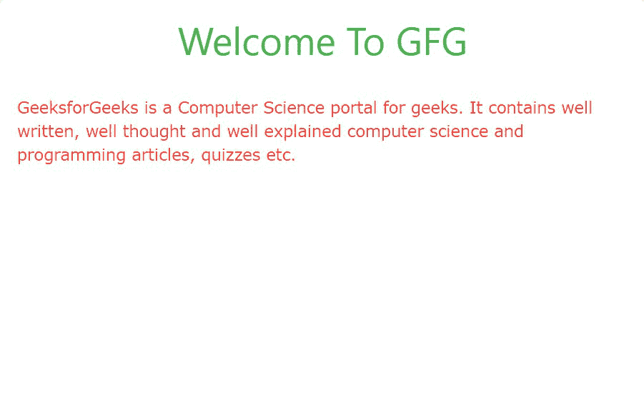

# W3。CSS 简介

> 原文:[https://www.geeksforgeeks.org/w3-css-introduction/](https://www.geeksforgeeks.org/w3-css-introduction/)

#### 什么是 W3。CSS？

*   W3。与其他 CSS 框架相比，CSS 是一个内置响应性的现代框架，易于学习和使用。
*   它旨在加快和简化网络开发，并支持现代响应设备，如移动设备、笔记本电脑、平板电脑和台式机。
*   W3。CSS 旨在成为 Bootstrap 的高质量替代品。

#### 如何使用 W3？网页上的 CSS？

W3。CSS 是免费给大家使用的。任何人都可以通过简单地链接网页中的样式来使用它。包含 W3 有两种方式。网站上的 CSS:

*   包括 W3。CSS 从这个[链接](https://www.w3schools.com/w3css/4/w3.css)如下所述:

## 超文本标记语言

```html
<link rel="stylesheet" 
  href="https://www.w3schools.com/w3css/4/w3.css">
```

*   下载 W3。CSS 从[这里](https://www.w3schools.com/w3css/4/w3.css)开始使用。

**示例:**

## 超文本标记语言

```html
<!DOCTYPE html>
<html>

<head>

    <!-- Adding W3.CSS file through external link -->
    <link rel="stylesheet" href=
        "https://www.w3schools.com/w3css/4/w3.css">

</head>

<body>

    <!-- w3-container is used to add 16px 
        padding to any HTML element.  -->
    <!-- w3-center is used to set the content 
        of the element to the center. -->
    <div class="w3-container w3-center">
        <!-- w3-text-green sets the text color 
            to green. -->
        <!-- w3-xxlarge sets font size to 32px -->
        <h2 class="w3-text-green w3-xxlarge">
            Welcome To GFG
        </h2>
    </div>

    <div class="w3-container">

        <!-- w3-text-red sets the text 
            color to red. -->
        <p class="w3-text-red">
            GeeksforGeeks is a Computer Science 
            portal for geeks. It contains well 
            written, well thought and well 
            explained computer science and 
            programming articles, quizzes etc.
        </p>
    </div>
</body>

</html>
```

**输出:**

