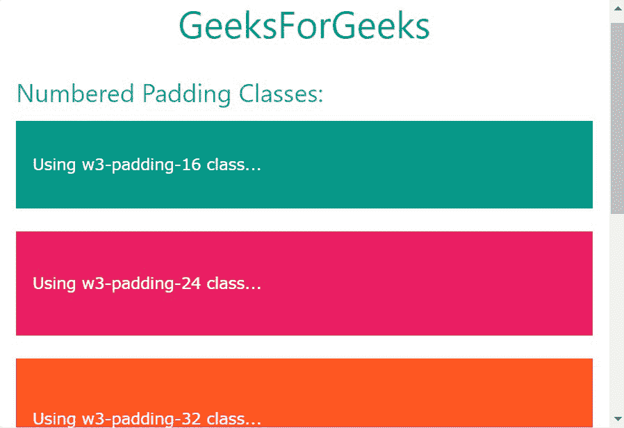
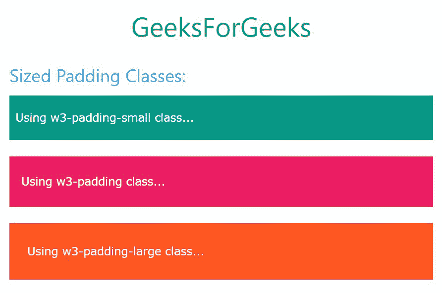

# 【T3】w3 . CSS 填充

> 原文:[https://www.geeksforgeeks.org/w3-css-padding/](https://www.geeksforgeeks.org/w3-css-padding/)

W3。CSS 有许多类的工具来轻松地为 HTML 中的元素设置样式。它包括各种用于修改元素外观的响应填充类。有两种类型的填充类:

*   编号填充类
*   大小填充类

**编号填充类:**这些类根据分配给它们的编号向目标元素添加顶部和底部填充。属于这一类的班级名单如下:

<figure class="table">

| 

Sr 编号

 | 

班级名称

 | 

描述

 |
| --- | --- | --- |
| 1。 | w3-padding-16 | 这个类给目标元素增加了 16px 的上下填充。 |
| 2。 | w3-padding-24 | 这个类给目标元素添加了 24px 的上下填充。 |
| 3。 | w3-padding-32

 | 这个类给目标元素添加了 32px 的上下填充。 |
| 4。 | w3-padding-48 | 这个类给目标元素添加了 48px 的上下填充。 |
| 5。 | w3-padding-64 | 这个类给目标元素添加了 64px 的上下填充。 |

</figure>

**示例:**

## 超文本标记语言

```
<!DOCTYPE html>
<html>

<head>

    <!-- Adding W3.CSS file through external link -->
    <link rel="stylesheet" href=
        "https://www.w3schools.com/w3css/4/w3.css">
</head>

<body>
    <!-- w3-container is used to add 
         16px padding to any HTML element.  -->
    <!-- w3-center is used to set the 
         content of the element to the center. -->
    <div class="w3-container w3-center">
        <!-- w3-text-green sets the text 
            color to green. -->
        <!-- w3-xxlarge sets font size to 32px. -->
        <h2 class="w3-text-green w3-xxlarge">
            GeeksForGeeks
        </h2>
    </div>

    <!-- Numbered Padding Classes in W3.CSS -->
    <div class="w3-container">

        <!-- Numbered Padding Classes -->
        <h3 class="w3-text-blue">
            Numbered Padding Classes:
        </h3>

        <!-- w3-padding-16 class -->
        <div class="w3-container w3-padding-16 w3-teal">
            <p>Using w3-padding-16 class...</p>
        </div>
        <br>

        <!-- w3-padding-24 class -->
        <div class="w3-container w3-padding-24 w3-pink">
            <p>Using w3-padding-24 class...</p>
        </div>
        <br>

        <!-- w3-padding-32 class -->
        <div class="w3-container w3-padding-32 w3-deep-orange">
            <p>Using w3-padding-32 class...</p>
        </div>
        <br>

        <!-- w3-padding-48 class -->
        <div class="w3-container w3-padding-48 w3-purple">
            <p>Using w3-padding-48 class...</p>
        </div>
        <br>

        <!-- w3-padding-64 class -->
        <div class="w3-container w3-padding-64 w3-blue">
            <p>Using w3-padding-64 class...</p>
        </div>
    </div>
</body>

</html>
```

**输出:**



**大小填充类:**这些类根据其大小向目标元素添加顶部、底部、左侧和右侧填充。属于这一类别的班级名单如下:

<figure class="table">

| 

Sr 编号

 | 

班级名称

 | 

描述

 |
| --- | --- | --- |
| 1。 | w3-padding-small | 这个类给元素添加了 4px 的顶部、底部和 8px 的左、右填充。 |
| 2。 | w3-填充 | 这个类给元素添加了 8px 的顶部、底部和 16px 的左、右填充。 |
| 3。 | w3-填充-大号 | 这个类给元素添加了 12px 的顶部、底部和 24px 的左、右填充。 |

</figure>

**示例:**

## 超文本标记语言

```
<!DOCTYPE html>
<html>

<head>

    <!-- Adding W3.CSS file through external link -->
    <link rel="stylesheet" href=
        "https://www.w3schools.com/w3css/4/w3.css">
</head>

<body>
    <!-- w3-container is used to add 
         16px padding to any HTML element.  -->
    <!-- w3-center is used to set the content 
         of the element to the center. -->
    <div class="w3-container w3-center">

        <!-- w3-text-green sets the text 
            colour to green. -->
        <!-- w3-xxlarge sets font size to 32px. -->
        <h2 class="w3-text-green w3-xxlarge">
            GeeksForGeeks
        </h2>
    </div>

    <!-- Sized Padding Classes in W3.CSS -->
    <div class="w3-container">

        <!-- Sized Padding Classes -->
        <h3 class="w3-text-blue">
            Sized Padding Classes:
        </h3>

        <!-- w3-padding-small class -->
        <div class="w3-container 
            w3-padding-small w3-teal">
            <p>Using w3-padding-small class...</p>
        </div>
        <br>

        <!-- w3-padding class -->
        <div class="w3-container w3-padding w3-pink">
            <p>Using w3-padding class...</p>
        </div>
        <br>

        <!-- w3-padding-large class -->
        <div class="w3-container w3-padding-large 
            w3-deep-orange">
            <p>Using w3-padding-large class...</p>
        </div>
    </div>
</body>

</html>
```

**输出:**

