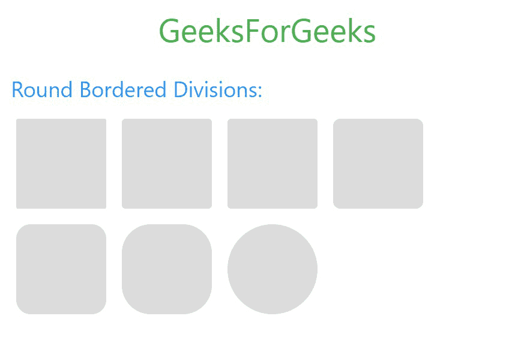

# W3。CSS 回合

> 原文:[https://www.geeksforgeeks.org/w3-css-round/](https://www.geeksforgeeks.org/w3-css-round/)

边框半径用于使边框的拐角弯曲。半径越大，它就会越弯越圆。这些类可以应用于任何分割、图像、按钮、容器等。

<figure class="table">

| 

Sr 编号

 | 

类

 | 

说明

 |
| --- | --- | --- |
| 1。

 | w3-round-small | 它将元素的边框半径设置为 2px。 |
| 2。 | w3-round | 它将元素的边框半径设置为 4px。 |
| 3。 | w3-round-medium | 其工作原理与 w3-round 相同，将元素的边框半径设置为 4px。

 |
| 4。 | w3-round-large | 它将元素的边框半径设置为 8px。 |
| 5。 | w3-round-xlarge | 它将元素的边框半径设置为 16px。 |
| 6。 | w3-round-xxlarge | 它将元素的边框半径设置为 32px。 |
| 7。 | w3-circle | 它将边框半径设置为 50%。 |

</figure>

在 W3。在 CSS 中，代码中使用的下列类用于在划分的所有角落实现边界半径。

**示例:**

## 超文本标记语言

```
<!DOCTYPE html>
<html>

<head>
    <!-- Title of the page -->
    <title>GeeksForGeeks</title>

    <!-- Adding W3.CSS file through external link -->
    <link rel="stylesheet" href=
        "https://www.w3schools.com/w3css/4/w3.css">

    <style>

        /* CSS Style for Boxes */
        span {
            display: inline-block;
            width: 100px;
            height: 100px;
            margin: 6px;
            background-color: #DCDCDC;
        }
    </style>
</head>

<body>
    <!-- w3-container is used to add 
        16px padding to any HTML element.  -->
    <!-- w3-center is used to set the 
        content of the element to the center. -->
    <div class="w3-container w3-center">

        <!-- w3-text-green sets the text 
            colour to green. -->
        <!-- w3-xxlarge sets font size to 32px. -->
        <h2 class="w3-text-green w3-xxlarge">
            GeeksForGeeks
        </h2>
    </div>

    <!-- Round Bordered Divisions in W3.CSS -->
    <div class="w3-container">

        <!-- Round Bordered Divisions -->
        <h3 class="w3-text-blue">
            Round Bordered Divisions:
        </h3>

        <!-- Below classes are used to add radius  
                 to the borders -->
        <span class="w3-round-small"></span>
        <span class="w3-round"></span>
        <span class="w3-round-medium"></span>
        <span class="w3-round-large"></span>
        <span class="w3-round-xlarge"></span>
        <span class="w3-round-xxlarge"></span>
        <span class="w3-circle"></span>
    </div>
</body>

</html>
```

**输出:**

