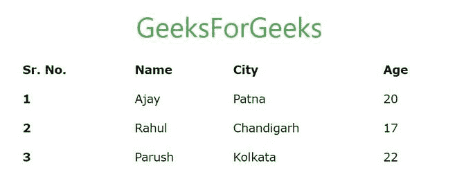
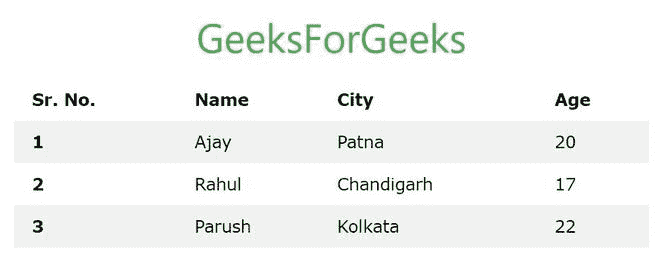
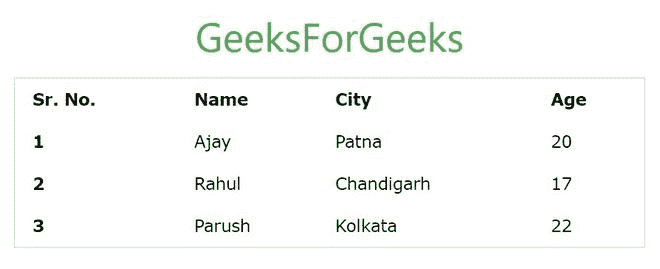
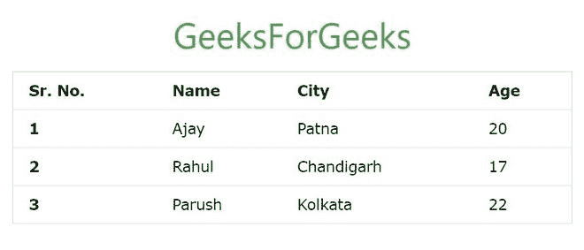
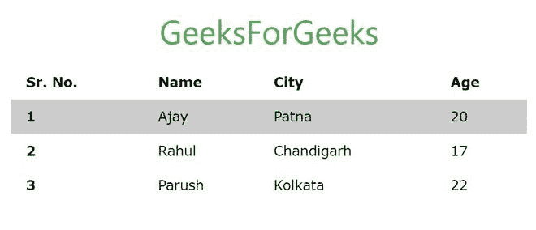
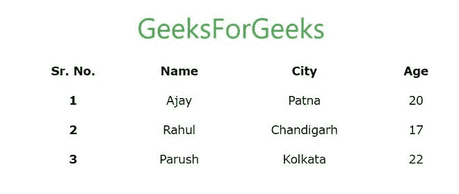
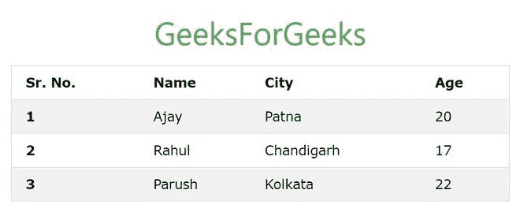

# W3。CSS 表〔t1〕

> 原文:[https://www.geeksforgeeks.org/w3-css-tables/](https://www.geeksforgeeks.org/w3-css-tables/)

W3。CSS 提供了一系列的类，可以用来对表格应用各种样式，比如改变标题外观，使行被剥离，添加或删除边框，使行可悬停等。W3。CSS 还提供了使表格具有响应性的类。

**简单表:**使用. w3-table 类创建一个简单的 w3。CSS 表格。这个类名与<表>标签一起使用来创建一个表。

**语法:**

```css
<table class="w3-table"> Table Contents... <table>
```

**示例:**

## 超文本标记语言

```css
<!DOCTYPE html>
<html>
<head>

    <!-- Adding W3.CSS file through external link -->
    <link rel="stylesheet"
          href="https://www.w3schools.com/w3css/4/w3.css">

</head>
<body>
    <!-- w3-container is used to add 16px
         padding to any HTML element.  -->
    <!-- w3-center is used to set the content
         of the element to the center. -->
    <div class="w3-container w3-center">

        <!-- w3-text-green sets the text
            color to green. -->
        <!-- w3-xxlarge sets font size to 32px. -->
        <h2 class="w3-text-green w3-xxlarge">
           GeeksForGeeks
        </h2>
    </div>

    <!-- Adding a table at the center of the page -->
    <div class="w3-container w3-center">
        <table class="w3-table"> 
            <!-- Table Heading -->
            <thead> 
                <tr> 
                    <th>Sr. No.</th> 
                    <th>Name</th> 
                    <th>City</th> 
                    <th>Age</th> 
                </tr> 
            </thead> 

            <!-- Table Body or Content -->
            <tbody> 
                <tr> 
                    <th>1</th> 
                    <td>Ajay</td> 
                    <td>Patna</td> 
                    <td>20</td> 
                </tr> 
                <tr> 
                    <th>2</th> 
                    <td>Rahul</td> 
                    <td>Chandigarh</td> 
                    <td>17</td> 
                </tr> 
                <tr> 
                    <th>3</th> 
                    <td>Parush</td> 
                    <td>Kolkata</td> 
                    <td>22</td> 
                </tr> 
            </tbody> 
        </table>
    </div>
</body>
</html>
```

**输出:**



**剥离行:**使用. w3 剥离类来创建交替的暗行和亮行。使用<表>标签中的 table、w3-table 和 w3-stripped 类的组合来创建一个剥离表。

**语法:**

```css
<table class="w3-table w3-stripped"> Table Contents... <table>
```

**示例:**

## 超文本标记语言

```css
<!DOCTYPE html>
<html>
<head>
    <!-- Title of the page -->
    <title>GeeksForGeeks</title>

    <!-- Adding W3.CSS file through external link -->
    <link rel="stylesheet"
          href="https://www.w3schools.com/w3css/4/w3.css">

</head>
<body>
    <!-- w3-container is used to add
         16px padding to any HTML element.  -->
    <!-- w3-center is used to set the
         content of the element to the center. -->
    <div class="w3-container w3-center">

        <!-- w3-text-green sets the text color to green. -->
        <!-- w3-xxlarge sets font size to 32px. -->
        <h2 class="w3-text-green w3-xxlarge">
            GeeksForGeeks
        </h2>
    </div>

    <!-- Adding a table at the center of the page -->
    <div class="w3-container w3-center">
        <table class="w3-table w3-stripped"> 
            <!-- Table Headings -->
            <tr> 
                <th>Sr. No.</th> 
                <th>Name</th> 
                <th>City</th> 
                <th>Age</th> 
            </tr> 

            <!-- Table Content -->
            <tr> 
                <th>1</th> 
                <td>Ajay</td> 
                <td>Patna</td> 
                <td>20</td> 
            </tr> 
            <tr> 
                <th>2</th> 
                <td>Rahul</td> 
                <td>Chandigarh</td> 
                <td>17</td> 
            </tr> 
            <tr> 
                <th>3</th> 
                <td>Parush</td> 
                <td>Kolkata</td> 
                <td>22</td> 
            </tr> 
        </table>
    </div>
</body>
</html>
```

**输出:**



**加边框表格:**使用. w3 边框在表格中添加边框。边框只出现在表格周围，而不出现在表格中。在 table 标记中使用. w3-border 和. w3-table 可以看到这种效果。

**语法:**

```css
<table class="w3-table w3-border"> Table Contents... <table>
```

**示例:**

## 超文本标记语言

```css
<!DOCTYPE html>
<html>
<head>
    <!-- Title of the page -->
    <title>GeeksForGeeks</title>

    <!-- Adding W3.CSS file through external link -->
    <link rel="stylesheet"
          href="https://www.w3schools.com/w3css/4/w3.css">

</head>
<body>
    <!-- w3-container is used to add 16px
         padding to any HTML element.  -->
    <!-- w3-center is used to set the
         content of the element to the center. -->
    <div class="w3-container w3-center">

        <!-- w3-text-green sets the text color to green. -->
        <!-- w3-xxlarge sets font size to 32px. -->
        <h2 class="w3-text-green w3-xxlarge">GeeksForGeeks</h2>
    </div>

    <!-- Adding a table at the center of the page -->
    <div class="w3-container w3-center">
        <table class="w3-table w3-border"> 
            <!-- Table Headings -->
            <tr> 
                <th>Sr. No.</th> 
                <th>Name</th> 
                <th>City</th> 
                <th>Age</th> 
            </tr> 

            <!-- Table Content -->
            <tr> 
                <th>1</th> 
                <td>Ajay</td> 
                <td>Patna</td> 
                <td>20</td> 
            </tr> 
            <tr> 
                <th>2</th> 
                <td>Rahul</td> 
                <td>Chandigarh</td> 
                <td>17</td> 
            </tr> 
            <tr> 
                <th>3</th> 
                <td>Parush</td> 
                <td>Kolkata</td> 
                <td>22</td> 
            </tr> 
        </table>
    </div>
</body>
</html>
```

**输出:**



如果我们想要一个完全有边框的表，我们必须在表标签中使用. w3 边框类以及. w3 边框和 w3 表。

**示例:**

## 超文本标记语言

```css
<!DOCTYPE html>
<html>
<head>

    <!-- Adding W3.CSS file through external link -->
    <link rel="stylesheet"
          href="https://www.w3schools.com/w3css/4/w3.css">

</head>

<body>
    <!-- w3-container is used to add
         16px padding to any HTML element.  -->
    <!-- w3-center is used to set the
         content of the element to the center. -->
    <div class="w3-container w3-center">

        <!-- w3-text-green sets the text color to green. -->
        <!-- w3-xxlarge sets font size to 32px. -->
        <h2 class="w3-text-green w3-xxlarge">
            GeeksForGeeks
        </h2>
    </div>

    <!-- Adding a table at the center of the page -->
    <div class="w3-container w3-center">
        <table class="w3-table w3-border w3-bordered"> 
            <!-- Table Headings -->
            <tr> 
                <th>Sr. No.</th> 
                <th>Name</th> 
                <th>City</th> 
                <th>Age</th> 
            </tr> 

            <!-- Table Content -->
            <tr> 
                <th>1</th> 
                <td>Ajay</td> 
                <td>Patna</td> 
                <td>20</td> 
            </tr> 
            <tr> 
                <th>2</th> 
                <td>Rahul</td> 
                <td>Chandigarh</td> 
                <td>17</td> 
            </tr> 
            <tr> 
                <th>3</th> 
                <td>Parush</td> 
                <td>Kolkata</td> 
                <td>22</td> 
            </tr> 
        </table>
    </div>
</body>
</html>
```

**输出:**



**可悬停表格:**使用. w3-可悬停类在表格行上添加悬停效果(鼠标移动时背景颜色变为灰色)。在<表>标签中使用 w3-table 和 w3-可悬停类的组合来创建悬停行表。

**语法:**

```css
<table class="w3-table w3-hoverable"> Table Contents... <table>
```

**例:**

## 超文本标记语言

```css
<!DOCTYPE html>
<html>
<head>
    <!-- Title of the page -->
    <title>GeeksForGeeks</title>

    <!-- Adding W3.CSS file through external link -->
    <link rel="stylesheet"
          href="https://www.w3schools.com/w3css/4/w3.css">
</head>

<body>
    <!-- w3-container is used to add
         16px padding to any HTML element.  -->
    <!-- w3-center is used to set the
         content of the element to the center. -->
    <div class="w3-container w3-center">

        <!-- w3-text-green sets the text color to green. -->
        <!-- w3-xxlarge sets font size to 32px. -->
        <h2 class="w3-text-green w3-xxlarge">GeeksForGeeks</h2>
    </div>

    <!-- Adding a table at the center of the page -->
    <div class="w3-container w3-center">
        <table class="w3-table w3-hoverable"> 
            <!-- Table Headings -->
            <tr> 
                <th>Sr. No.</th> 
                <th>Name</th> 
                <th>City</th> 
                <th>Age</th> 
            </tr> 

            <!-- Table Content -->
            <tr> 
                <th>1</th> 
                <td>Ajay</td> 
                <td>Patna</td> 
                <td>20</td> 
            </tr> 
            <tr> 
                <th>2</th> 
                <td>Rahul</td> 
                <td>Chandigarh</td> 
                <td>17</td> 
            </tr> 
            <tr> 
                <th>3</th> 
                <td>Parush</td> 
                <td>Kolkata</td> 
                <td>22</td> 
            </tr> 
        </table>
    </div>
</body>
</html>
```

**输出:**



**居中内容表:**以. w3 为中心的类用于将表的所有内容放在中心。在<表>标签中使用 w3-table 和以 w3 为中心的类的组合来创建这种效果。

**语法:**

```css
<table class="w3-table w3-centered"> Table Contents... <table>
```

**示例:**

## 超文本标记语言

```css
<!DOCTYPE html>
<html>
<head>

    <!-- Adding W3.CSS file through external link -->
    <link rel="stylesheet"
          href="https://www.w3schools.com/w3css/4/w3.css">
</head>

<body>
    <!-- w3-container is used to add
          16px padding to any HTML element.  -->
    <!-- w3-center is used to set the
         content of the element to the center. -->
    <div class="w3-container w3-center">

        <!-- w3-text-green sets the text color to green. -->
        <!-- w3-xxlarge sets font size to 32px. -->
        <h2 class="w3-text-green w3-xxlarge">GeeksForGeeks</h2>
    </div>

    <!-- Adding a table at the center of the page -->
    <div class="w3-container w3-center">
        <table class="w3-table w3-centered"> 
            <!-- Table Headings -->
            <tr> 
                <th>Sr. No.</th> 
                <th>Name</th> 
                <th>City</th> 
                <th>Age</th> 
            </tr> 

            <!-- Table Content -->
            <tr> 
                <th>1</th> 
                <td>Ajay</td> 
                <td>Patna</td> 
                <td>20</td> 
            </tr> 
            <tr> 
                <th>2</th> 
                <td>Rahul</td> 
                <td>Chandigarh</td> 
                <td>17</td> 
            </tr> 
            <tr> 
                <th>3</th> 
                <td>Parush</td> 
                <td>Kolkata</td> 
                <td>22</td> 
            </tr> 
        </table>
    </div>
</body>
</html>
```

**输出:**



现在，如果你想在一个表上选择以上所有的效果，那么你可以使用 w3-table-all 类。这个类用于选择表格的所有属性，即边框、分条、表格……你必须使用这个带有表格标签的类才能看到效果。

**示例:**

## 超文本标记语言

```css
<!DOCTYPE html>
<html>
<head>

    <!-- Adding W3.CSS file through external link -->
    <link rel="stylesheet"
          href="https://www.w3schools.com/w3css/4/w3.css">
</head>

<body>

    <!-- w3-container is used to add
          16px padding to any HTML element.  -->
    <!-- w3-center is used to set the
           content of the element to the center. -->
    <div class="w3-container w3-center">

        <!-- w3-text-green sets the text color to green. -->
        <!-- w3-xxlarge sets font size to 32px. -->
        <h2 class="w3-text-green w3-xxlarge">GeeksForGeeks</h2>
    </div>

    <!-- Adding a table at the center of the page -->
    <div class="w3-container w3-center">
        <table class="w3-table-all"> 
            <!-- Table Headings -->
            <tr> 
                <th>Sr. No.</th> 
                <th>Name</th> 
                <th>City</th> 
                <th>Age</th> 
            </tr> 

            <!-- Table Content -->
            <tr> 
                <th>1</th> 
                <td>Ajay</td> 
                <td>Patna</td> 
                <td>20</td> 
            </tr> 
            <tr> 
                <th>2</th> 
                <td>Rahul</td> 
                <td>Chandigarh</td> 
                <td>17</td> 
            </tr> 
            <tr> 
                <th>3</th> 
                <td>Parush</td> 
                <td>Kolkata</td> 
                <td>22</td> 
            </tr> 
        </table>
    </div>
</body>
</html>
```

**输出:**

