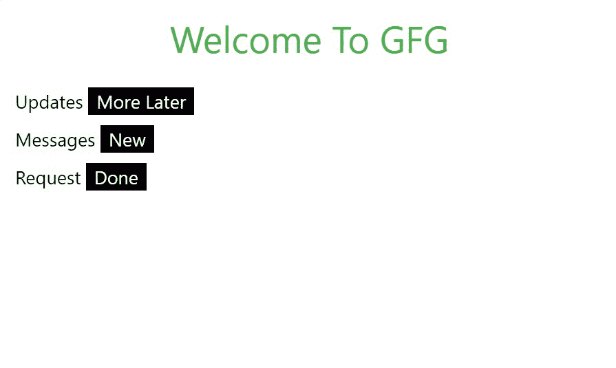
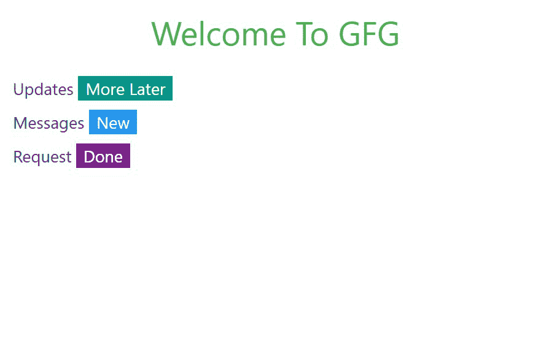
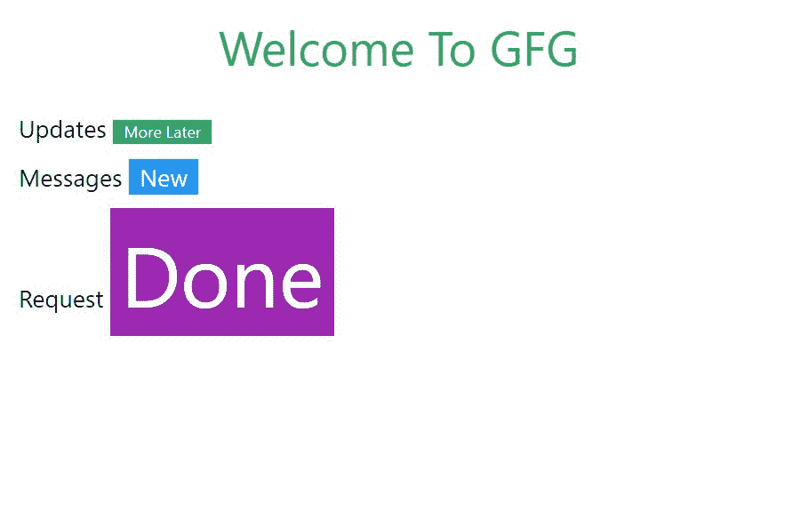
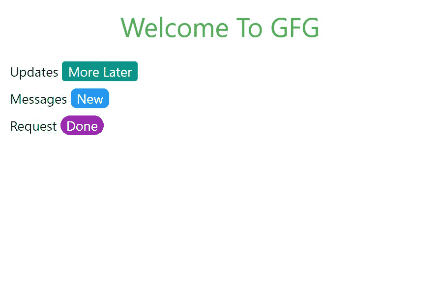

# W3。CSS 标签

> 哎哎哎:# t0]https://www . geeksforgeeks . org/w3-CSS 标签/

. w3-标记用于向内容添加附加信息。例如，一些网站突出显示一些部分是新的，或者当他们更新了一个部分时，他们添加了该部分的更新标签，以便用户可以看到他们已经更新到他们网站上添加的新部分。这个类在使用时会创建一个矩形标签，作为站点上的标签或标志。它的默认颜色是黑色。

**示例:**在 HTML 页面中添加标签。

## 超文本标记语言

```css
<!DOCTYPE html>
<html>

<head>

    <!-- Adding W3.CSS file through external link -->
    <link rel="stylesheet" href=
        "https://www.w3schools.com/w3css/4/w3.css">
</head>

<body>
    <!-- w3-container is used to add 
         16px padding to any HTML element.  -->
    <!-- w3-center is used to set the content
            of the element to the center. -->
    <div class="w3-container w3-center">

        <!-- w3-text-green sets the text 
             color to green. -->
        <!-- w3-xxlarge sets font size to 32px. -->
        <h2 class="w3-text-green w3-xxlarge">
            Welcome To GFG
        </h2>
    </div>

    <!-- Tags in W3.CSS -->
    <div class="w3-container"> 
        <h5>Updates  
            <!-- Adding Tag with value "More later" -->
            <span class="w3-tag">More Later</span> 
        </h5> 

        <h5>Messages  
            <!-- Adding Tag with value "New" -->
            <span class="w3-tag">New</span> 
        </h5> 
        <h5>Request
            <!-- Adding Tag with value "Done" -->
            <span class="w3-tag">Done</span> 
        </h5>
    </div> 
</body>

</html>
```

**输出:**



可以使用 W3.CSS 的颜色类将颜色添加到标签中

**示例:**在 HTML 页面上添加彩色标签。

## 超文本标记语言

```css
<!DOCTYPE html>
<html>

<head>

    <!-- Adding W3.CSS file through external link -->
    <link rel="stylesheet" href=
        "https://www.w3schools.com/w3css/4/w3.css">
</head>

<body>

    <!-- w3-container is used to add 
         16px padding to any HTML element.  -->
    <!-- w3-center is used to set the content
         of the element to the center. -->
    <div class="w3-container w3-center">

        <!-- w3-text-green sets the text color
             to green. -->
        <!-- w3-xxlarge sets font size to 32px. -->
        <h2 class="w3-text-green w3-xxlarge">
            Welcome To GFG
        </h2>
    </div>

    <!-- Tags in W3.CSS -->
    <div class="w3-container"> 
        <h5>Updates  
            <!-- Adding Tag with value "More later" -->
            <span class="w3-tag w3-teal">More Later</span> 
        </h5> 

        <h5>Messages  
            <!-- Adding Tag with value "New" -->
            <span class="w3-tag w3-blue">New</span> 
        </h5> 
        <h5>Request
            <!-- Adding Tag with value "Done" -->
            <span class="w3-tag w3-purple">Done</span> 
        </h5>
    </div> 
</body>
</html>
```

**输出:**



我们可以使用 W3 中提供的字体大小添加各种大小的标签。CSS 类。

**示例:**添加不同大小的标签。

## 超文本标记语言

```css
<!DOCTYPE html>
<html>

<head>

    <!-- Adding W3.CSS file through external link -->
    <link rel="stylesheet" href=
        "https://www.w3schools.com/w3css/4/w3.css">
</head>

<body>

    <!-- w3-container is used to add 
         16px padding to any HTML element.  -->
    <!-- w3-center is used to set the 
         content of the element to the center. -->
    <div class="w3-container w3-center">

        <!-- w3-text-green sets the text color 
             to green. -->
        <!-- w3-xxlarge sets font size to 32px. -->
        <h2 class="w3-text-green w3-xxlarge">
            Welcome To GFG
        </h2>
    </div>

    <!-- Tags in W3.CSS -->
    <div class="w3-container"> 
        <h5>Updates  
            <!-- Adding Tag with value "More later" -->
            <span class="w3-tag w3-teal w3-small">
               More Later</span> 
        </h5> 

        <h5>Messages  
            <!-- Adding Tag with value "New" -->
            <span class="w3-tag w3-blue 
                w3-large">New</span> 
        </h5> 

        <h5>Request
            <!-- Adding Tag with value "Done" -->
            <span class="w3-tag w3-purple 
                w3-jumbo">Done</span> 
        </h5>
    </div> 
</body>

</html>
```

**输出:**



我们还可以在 W3.CSS 中使用边框半径类来添加圆边标签

**示例:**

## 超文本标记语言

```css
<!DOCTYPE html>
<html>

<head>

    <!-- Adding W3.CSS file through external link -->
    <link rel="stylesheet" href=
        "https://www.w3schools.com/w3css/4/w3.css">
</head>

<body>
    <!-- w3-container is used to add
         16px padding to any HTML element.  -->
    <!-- w3-center is used to set the content of 
         the element to the center. -->
    <div class="w3-container w3-center">

        <!-- w3-text-green sets the text color
             to green. -->
        <!-- w3-xxlarge sets font size to 32px. -->
        <h2 class="w3-text-green w3-xxlarge">
            Welcome To GFG
        </h2>
    </div>

    <!-- Tags in W3.CSS -->
    <div class="w3-container"> 
        <h5>Updates  
            <!-- Adding Tag with value "More later" -->
            <span class="w3-tag w3-teal 
                w3-round">More Later</span> 
        </h5> 

        <h5>Messages  
            <!-- Adding Tag with value "New" -->
            <span class="w3-tag w3-blue 
                w3-round-large">New</span> 
        </h5> 
        <h5>Request
            <!-- Adding Tag with value "Done" -->
            <span class="w3-tag w3-purple 
                w3-round-xlarge">Done</span> 
        </h5>
    </div> 
</body>

</html>
```

**输出:**

