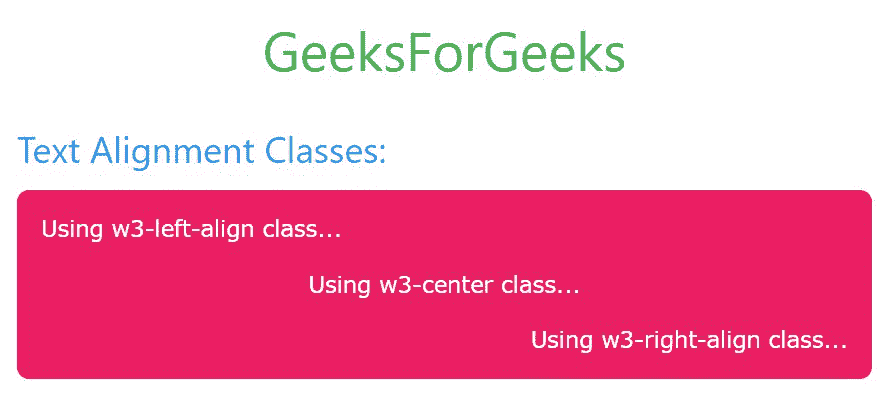
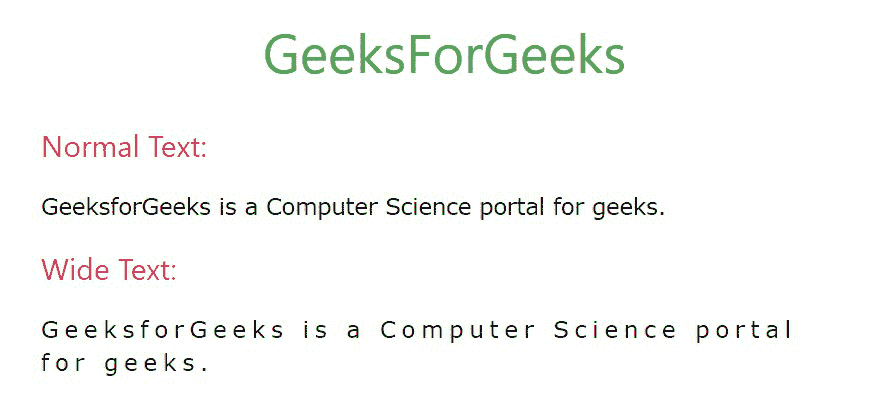
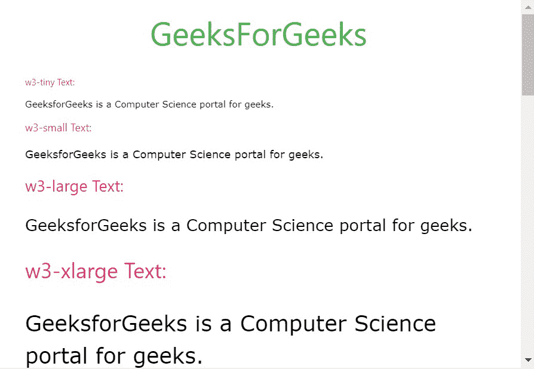
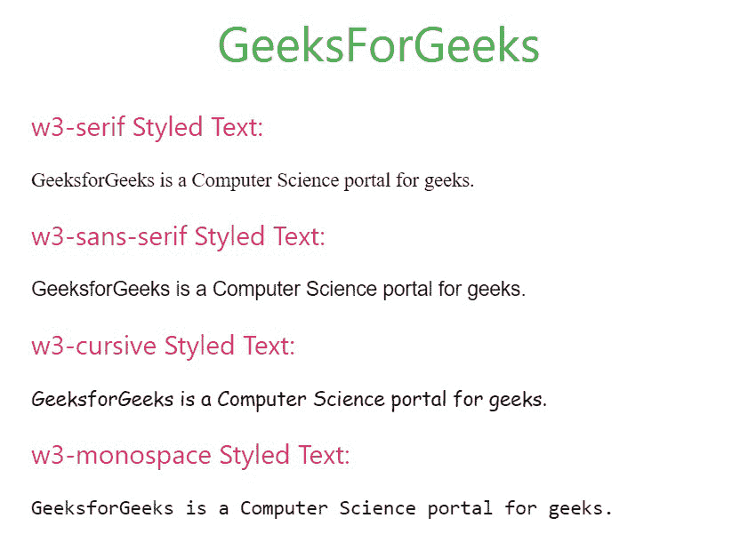

# W3。CSS 文本和字体

> 原文:[https://www.geeksforgeeks.org/w3-css-text-and-fonts/](https://www.geeksforgeeks.org/w3-css-text-and-fonts/)

W3。CSS 是最受欢迎的开源前端框架之一，它帮助我们开发响应迅速、移动优先的网站和网络应用程序。作为其产品的一部分，它为我们提供了一组类，称为**文本实用程序类**，它控制各种文本属性，如文本对齐、文本大小、文本不透明度。

**文本对齐:** W3。CSS 有三个类来将文本居中、左对齐和右对齐。它们的描述如下:

<figure class="table">

| Sr number | taxon | describe |
| --- | --- | --- |
| 1。 | W3- Left alignment | Used to align text to the left. |

</figure>

2.w3-右对齐它用于将文本向右对齐。3.w3 中心It is used to align the text to the center.

**示例:**

## 超文本标记语言

```
<!DOCTYPE html>
<html>

<head>

    <!-- Adding W3.CSS file through external link -->
    <link rel="stylesheet" 
          href=
          "https://www.w3schools.com/w3css/4/w3.css">
</head>

<body>
    <!-- w3-container is used to add 16px 
         padding to any HTML element.  -->
    <!-- w3-center is used to set the content
         of the element to the center. -->
    <div class="w3-container w3-center">
        <!-- w3-text-green sets the text color to green. -->
        <!-- w3-xxlarge sets font size to 32px. -->
        <h2 class="w3-text-green w3-xxlarge">
          GeeksForGeeks
      </h2>
    </div>

    <!-- Text Alignment Classes in W3.CSS -->
    <div class="w3-container">

        <!-- Text Alignment Classes -->
        <h3 class="w3-text-blue">Text Alignment Classes:</h3> 

        <div class="w3-container w3-pink w3-round-large">

            <!-- w3-left-align class -->
            <p class="w3-left-align">
                Using w3-left-align class...
            </p>

            <!-- w3-center class -->
            <p class="w3-center">
                Using w3-center class...
            </p>

            <!-- w3-right-align class -->
            <p class="w3-right-align">
              Using w3-right-align class...
          </p>
        </div>
    </div>
</body>

</html>
```

**输出:**



**宽文本:**为了使文本看起来更宽，我们使用了 W3.CSS 的一个 **w3 宽的**类

**示例:**

## 超文本标记语言

```
<!DOCTYPE html>
<html>

<head>

    <!-- Adding W3.CSS file through external link -->
    <link rel="stylesheet" 
          href="https://www.w3schools.com/w3css/4/w3.css">
</head>

<body>
    <!-- w3-container is used to add 16px 
         padding to any HTML element.  -->
    <!-- w3-center is used to set the content
         of the element to the center. -->
    <div class="w3-container w3-center">
        <!-- w3-text-green sets the text color to green. -->
        <!-- w3-xxlarge sets font size to 32px. -->
        <h2 class="w3-text-green w3-xxlarge">GeeksForGeeks</h2>
    </div>

    <!-- Wide Text Class in W3.CSS -->
    <div class="w3-container">
        <div class="w3-container">

            <!-- Normal text -->
            <h4 class="w3-text-pink">Normal Text:</h4>

            <p>
                GeeksforGeeks is a Computer 
                Science portal for geeks.
            </p>

            <!-- Wide text -->
            <h4 class="w3-text-pink">Wide Text:</h4>
            <p class="w3-wide">
                GeeksforGeeks is a Computer 
                Science portal for geeks.
            </p>
        </div>
    </div>
</body>

</html>
```

**输出:**



#### 字体大小:

您可以使用 W3.CSS 的大小类来设置文本的字体。该类别下的类如下:

<figure class="table">

| Sr number | taxon | describe |
| --- | --- | --- |
| 1。 | w3-tiny | This class sets the font size of the target element to 10px. |
| 2。 | w3-小型 | This class sets the font size of the target element to 12px. |
| 3。 | W3- Large | This class sets the font size of the target element to 18px. |
| 4。 | w3-xlarge | This class sets the font size of the target element to 24px. |
| 5。 | w3-xx 大公司 | This class sets the font size of the target element to 32px. |
| 6。 | w3-xxxlarge 大口径机枪 | This class sets the font size of the target element to 48px. |
| 7。 | w3-珍宝 | This class sets the font size of the target element to 64px. |

</figure>

**示例:**

## 超文本标记语言

```
<!DOCTYPE html>
<html>

<head>

    <!-- Adding W3.CSS file through external link -->
    <link rel="stylesheet" href=
        "https://www.w3schools.com/w3css/4/w3.css">
</head>

<body>
    <!-- w3-container is used to add 16px
         padding to any HTML element.  -->
    <!-- w3-center is used to set the content 
         of the element to the center. -->
    <div class="w3-container w3-center">

        <!-- w3-text-green sets the text 
            color to green. -->
        <!-- w3-xxlarge sets font size to 32px. -->
        <h2 class="w3-text-green w3-xxlarge">
            GeeksForGeeks
        </h2>
    </div>

    <!-- Different Text Sizes in W3.CSS -->
    <div class="w3-container">
        <div class="w3-container">

            <!-- w3-tiny text -->
            <h4 class="w3-text-pink w3-tiny">
                w3-tiny Text:
            </h4>
            <p class="w3-tiny">
                GeeksforGeeks is a Computer 
                Science portal for geeks.
            </p>

            <!-- w3-small text -->
            <h4 class="w3-text-pink w3-small">
                w3-small Text:
            </h4>
            <p class="w3-small">
                GeeksforGeeks is a Computer 
                Science portal for geeks.
            </p>

            <!-- w3-large text -->
            <h4 class="w3-text-pink w3-large">
                w3-large Text:
            </h4>
            <p class="w3-large">
                GeeksforGeeks is a Computer 
                Science portal for geeks.
            </p>

            <!-- w3-xlarge text -->
            <h4 class="w3-text-pink w3-xlarge">
                w3-xlarge Text:
            </h4>
            <p class="w3-xlarge">
                GeeksforGeeks is a Computer 
                Science portal for geeks.
            </p>

            <!-- w3-xxlarge text -->
            <h4 class="w3-text-pink w3-xxlarge">
                w3-xxlarge Text:
            </h4>
            <p class="w3-xxlarge">
                GeeksforGeeks is a Computer 
                Science portal for geeks.
            </p>

            <!-- w3-xxxlarge text -->
            <h4 class="w3-text-pink w3-xxxlarge">
                w3-xxxlarge Text:
            </h4>
            <p class="w3-xxxlarge">
                GeeksforGeeks is a Computer 
                Science portal for geeks.
            </p>

            <!-- w3-jumbo text -->
            <h4 class="w3-text-pink w3-jumbo">
                w3-jumbo Text:
            </h4>
            <p class="w3-jumbo">
                GeeksforGeeks is a Computer 
                Science portal for geeks.
            </p>
        </div>
    </div>
</body>

</html>
```

**输出:**



**字体样式:** W3。CSS 也有一些内置的字体样式，可以广泛用于装饰网页。字体样式的类别列表如下:

<figure class="table">

| 

-你好。不，不。

 | 

类别名

 | 

描述

 |
| --- | --- | --- |
| 1. | w3-serif | 字体样式更改为衬线。 |
| 2. | w3 无衬线字体 | 字体样式更改为无衬线。 |
| 3. | w3-草书 | 字体样式更改为草书。 |
| 4. | w3-单空间 | 字体样式更改为等宽。 |

</figure>

**示例:**

## 超文本标记语言

```
<!DOCTYPE html>
<html>

<head>

    <!-- Adding W3.CSS file through external link -->
    <link rel="stylesheet" href=
        "https://www.w3schools.com/w3css/4/w3.css">
</head>

<body>
    <!-- w3-container is used to add 16px
         padding to any HTML element.  -->
    <!-- w3-center is used to set the content
         of the element to the center. -->
    <div class="w3-container w3-center">

        <!-- w3-text-green sets the text 
            colour to green. -->
        <!-- w3-xxlarge sets font size to 32px. -->
        <h2 class="w3-text-green w3-xxlarge">
            GeeksForGeeks
        </h2>
    </div>

    <!-- Different Font Styles in W3.CSS -->
    <div class="w3-container">
        <div class="w3-container">

            <!-- w3-serif Styled Text -->
            <h4 class="w3-text-pink">
                w3-serif Styled Text:
            </h4>
            <p class="w3-serif">
                GeeksforGeeks is a Computer 
                Science portal for geeks.
            </p>

            <!-- w3-sans-serif Styled Text -->
            <h4 class="w3-text-pink">
                w3-sans-serif Styled Text:
            </h4>
            <p class="w3-sans-serif">
                GeeksforGeeks is a Computer 
                Science portal for geeks.
            </p>

            <!-- w3-cursive Styled Text -->
            <h4 class="w3-text-pink">
                w3-cursive Styled Text:
            </h4>
            <p class="w3-cursive">
                GeeksforGeeks is a Computer
                Science portal for geeks.
            </p>

            <!-- w3-monospace Styled Text -->
            <h4 class="w3-text-pink">
                w3-monospace Styled Text:
            </h4>
            <p class="w3-monospace">
                GeeksforGeeks is a Computer 
                Science portal for geeks.
            </p>
        </div>
    </div>
</body>

</html>
```

**输出:**

