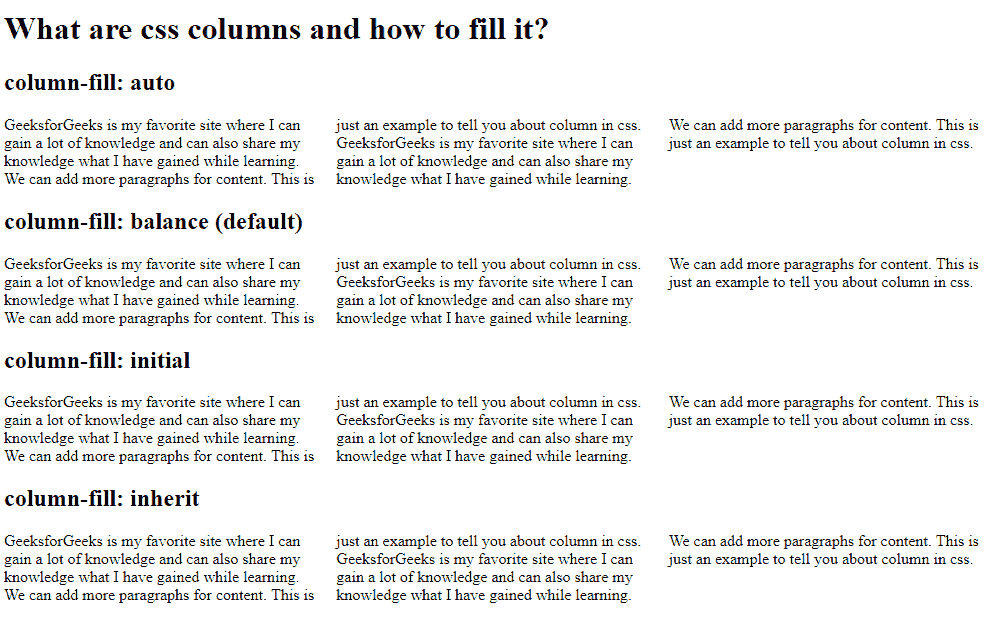

# 什么是 CSS 列，如何填充？

> 原文:[https://www . geesforgeks . org/什么是 CSS-columns-以及如何填充它/](https://www.geeksforgeeks.org/what-are-css-columns-and-how-to-fill-it/)

**CSS 列:**我们可以将一个元素的内容拆分成列，称为 CSS 列。我们可以使用[列填充](https://www.geeksforgeeks.org/css-column-fill-property/)属性来填充它。column-fill 属性控制元素的内容如何拆分成列。它接受值 auto、balance、inherit 和 initial。

**语法:**

```
column-fill: balance|auto|initial|inherit;
```

这个例子展示了如何将一个元素分解为多个列:

**示例:**

## 超文本标记语言

```
<!DOCTYPE html>
<html>

<head>
    <style>
        div {
            column-count: 3;
        }

        .gfg1 {
            column-fill: auto;
        }

        .gfg2 {
            column-fill: balance;
        }

        .gfg3 {
            column-fill: initial;
        }

        .gfg4 {
            column-fill: inherit;
        }
    </style>
</head>

<body>
    <h1>What are css columns and how to fill it?</h1>

    <h2>column-fill: auto</h2>
    <div class="gfg1">
        GeeksforGeeks is my favorite site 
        where I can gain a lot of knowledge 
        and can also share my knowledge what 
        I have gained while learning. We can 
        add more paragraphs for content. 
        This is just an example to tell you 
        about column in css.
        GeeksforGeeks is my favorite site 
        where I can gain a lot of knowledge 
        and can also share my knowledge what 
        I have gained while learning. We can 
        add more paragraphs for content. 
        This is just an example to tell you 
        about column in css.
    </div>

    <h2>column-fill: balance (default)</h2>
    <div class="gfg2">
        GeeksforGeeks is my favorite site 
        where I can gain a lot of knowledge 
        and can also share my knowledge what 
        I have gained while learning. We can 
        add more paragraphs for content. 
        This is just an example to tell you 
        about column in css.
        GeeksforGeeks is my favorite site 
        where I can gain a lot of knowledge 
        and can also share my knowledge what 
        I have gained while learning. We can 
        add more paragraphs for content. 
        This is just an example to tell you 
        about column in css.
    </div>

    <h2>column-fill: initial</h2>
    <div class="gfg13">
        GeeksforGeeks is my favorite site 
        where I can gain a lot of knowledge 
        and can also share my knowledge what 
        I have gained while learning. We can 
        add more paragraphs for content. 
        This is just an example to tell you 
        about column in css.
        GeeksforGeeks is my favorite site 
        where I can gain a lot of knowledge 
        and can also share my knowledge what 
        I have gained while learning. We can 
        add more paragraphs for content. 
        This is just an example to tell you 
        about column in css.
    </div>

    <h2>column-fill: inherit</h2>
    <div class="gfg4">
        GeeksforGeeks is my favorite site 
        where I can gain a lot of knowledge 
        and can also share my knowledge what 
        I have gained while learning. We can 
        add more paragraphs for content. 
        This is just an example to tell you 
        about column in css.
        GeeksforGeeks is my favorite site 
        where I can gain a lot of knowledge 
        and can also share my knowledge what 
        I have gained while learning. We can 
        add more paragraphs for content. 
        This is just an example to tell you 
        about column in css.
    </div>
</body>

</html>
```

**输出:**

