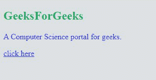
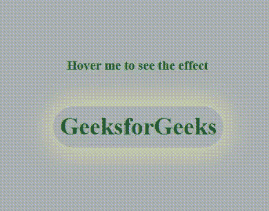
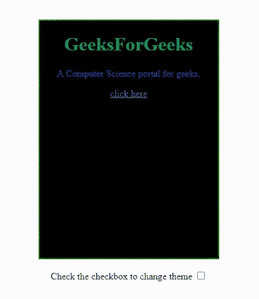

# 什么是 CSS 自定义属性？

> 原文:[https://www . geesforgeks . org/what-is-CSS-custom-properties/](https://www.geeksforgeeks.org/what-are-css-custom-properties/)

在本文中，我们将了解 CSS 自定义属性及其实现。CSS 自定义属性也称为 CSS 变量或级联变量。这些实体包含将在整个文档中重用的特定值&可以使用 var()函数访问(例如，color:(–原色)；).前缀为–的属性名描述了自定义属性&它们的值将在使用 var()函数的其他声明中使用。

通常，当我们设计一个可能包含大量 CSS 属性的大型网站时&很可能我们已经多次使用了类似的值。管理大尺寸造型属性真的很难。为了处理这个，自定义属性允许我们在一个地方声明一个变量，可以引用多个其他地方。这将减少管理代码的工作量，因为我们可以通过在一个地方进行更改来轻松更新值。

**语法:**

*   **对于变量:**

```css
var( --custom-name, value )
```

**参数:**var()函数接受下面列出的两个参数:

*   **–自定义名称:**接受自定义属性名称的必选参数。
*   **值:**为可选参数。它接受当自定义属性无效时使用的回退值。

**语法:**

*   **自定义属性:**

```css
--custom-name: values;
```

分配给自定义属性的值将与一个或多个标记的任何序列相匹配，直到序列中断&不再包含任何有效标记。

我们将创建一些 CSS 变量&定义这些 CSS 变量的值，用它们来设计 HTML 组件的样式。

**示例 1:** 在本例中，我们将为背景颜色、主要字体颜色和标题属性创建 CSS 变量。

## 超文本标记语言

```css
<!DOCTYPE html>
<html>

<head>
    <style>

        /* Declare CSS custom properties 
        or CSS variables */
        :root {
            --background-color: #dee1e3;
            --primary-font-color: #302AE6;
            --heading-color: #14ac60;
            --link-color: #093aeb;
        }

        body {
            background-color: var(--background-color);
        }

        h2 {
            color: var(--heading-color);
        }

        p {
            color: var(--primary-font-color);
        }

        a {
            color: var(--link-color);
        }
    </style>
</head>

<body>
    <h2>GeeksForGeeks</h2>
    <p>A Computer Science portal for geeks.</p>

    <a href="http://geeksforgeeks.org">click here</a>
</body>

</html>
```

**输出:**



**示例 2:** 在本例中，我们将使用 box-shadow-color 属性在悬停时创建阴影效果。

## 超文本标记语言

```css
<!DOCTYPE html>
<html>

<head>
    <style>
        body {
            background-color: #abb0b3;
            color: #0f5e1b;
        }

        #click {
            border-radius: 50px;
            display: inline-block;
            font-size: 35px;
            padding: 10px;
            transition: box-shadow 1.2s;
        }

        #click {
            box-shadow: 0 0 40px var(--box-shadow-color);
            --box-shadow-color: palegoldenrod;
        }

        #click:hover {
            --box-shadow-color: #57ab57;
        }
    </style>
</head>

<body>
    <h4>Hover me to see the effect</h4>
    <h2 id="click">GeeksforGeeks</h2>
</body>

</html>
```

**输出:**



**示例 3:** 为了理解 CSS 自定义属性的重要性，我们将创建一个网页，在这个网页中，我们只需使用 CSS 自定义属性和一些普通的 JavaScript 就可以更改容器的主题。

首先，我们将为深色主题和浅色主题定义一些样式属性。默认情况下，我们将容器的主题设置为深色。我们还将使用主题 CSS 自定义属性来设置我们的 HTML 网页元素的样式。

## 超文本标记语言

```css
<!DOCTYPE html>
<html>

<head>
    <style>
        :root {
            --background-color: #000;
            --primary-font-color: #302AE6;
            --heading-color: #14ac60;
            --link-color: #ae2ab3;
        }

        /* Light theme */
        [theme="light"] {
            --background-color: #eee;
            --primary-font-color: #000;
            --heading-color: #303030;
            --link-color: #302AE6;
        }

        .container {
            background-color: var(--background-color);
            height: 400px;
            width: 300px;
            border: 2px solid green;
        }

        h1 {
            color: var(--heading-color);
        }

        p {
            color: var(--primary-font-color);
        }

        a {
            color: var(--link-color);
        }
    </style>
</head>

<body>
    <center>
        <div class="container">
            <h1>GeeksForGeeks</h1>

            <p>A Computer Science portal for geeks.</p>

            <a href="http://geeksforgeeks.org">click here</a>
        </div><br>
        <label class="checkbox-theme" for="checkbox">
            Check the checkbox to change theme
            <input type="checkbox" id="checkbox" />
        </label>
    </center>

    <script>
        const Switch = document.querySelector(
            '.checkbox-theme input[type="checkbox"]');

        /* Function to change theme*/
        function changeTheme(e) {
            if (e.target.checked) {
                document.documentElement
                    .setAttribute('theme', 'light');
            }
            else {
                document.documentElement
                    .setAttribute('theme', 'dark');
            }
        }
        Switch.addEventListener(
            'change', changeTheme, false);
    </script>
</body>

</html>
```

**输出:**



**支持的浏览器:**

*   谷歌 Chrome 49.0
*   微软边缘 15.0
*   Firefox 31.0
*   Safari 9.1
*   opera 36.0