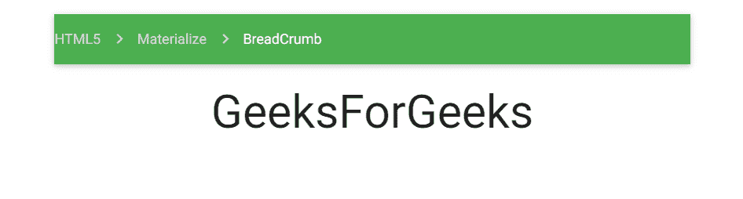

# 物化 CSS 中面包屑有哪些类？

> 原文:[https://www . geeksforgeeks . org/什么是物化面包屑类-css/](https://www.geeksforgeeks.org/what-are-the-classes-of-breadcrumb-in-materialize-css/)

[物化](https://www.geeksforgeeks.org/materialize-introduction-and-installation/)是一个基于谷歌 Material Design 的现代响应式 CSS 框架。它的目标是开发一个设计系统，允许在任何平台上的所有服务中集成用户体验。物化是一种将成功设计的经典原则与创新和技术相结合的设计语言。物化带来了各种有用的组件，帮助开发人员创建响应网站。[面包屑](https://www.geeksforgeeks.org/materialize-css-breadcrumbs/)是物化 CSS 的内置组件之一。物化 CSS 中的面包屑基本上是在你有多层内容来显示用户在网站或 web App 上的当前工作位置时使用的。

物化 CSS 提供了各种 CSS 类，以一种简单的方式创建一个漂亮的面包屑。下表显示了可用的类及其用法。

*   **nav-wrapper:** 它基本上将 nav 组件设置为面包屑或者一个 navbar 包装器。
*   **面包屑:**用于将锚点元素设置为面包屑。最后一个锚点元素处于活动状态，而其余元素显示为灰色。

我们可以使用以下语法创建面包屑。

**语法:**

```css
<nav>
  <div class="nav-wrapper green">
    <a href="#html5" class="breadcrumb">HTML5</a>
    <a href="#materialize" class="breadcrumb">Materialize</a>
    <a href="#breadcrumb" class="breadcrumb">BreadCrumb</a>
  </div>
</nav>
```

**示例 1:** 在本例中，我们用当前位置面包屑创建了一个简单的面包屑，这意味着您在面包屑页面上，它在物化类别下，HTML5 指向 HTML5 页面。

## 超文本标记语言

```css
<html>
   <head>
      <title>BreadCrumb</title>
      <link
         rel="stylesheet"
         href=
"https://fonts.googleapis.com/icon?family=Material+Icons"/>
      <link
         rel="stylesheet"
         href=
"https://cdnjs.cloudflare.com/ajax/libs/materialize/0.97.3/css/materialize.min.css"/>
      <script
         type="text/javascript"
         src=
"https://code.jquery.com/jquery-2.1.1.min.js">
      </script>
      <script src=
"https://cdnjs.cloudflare.com/ajax/libs/materialize/0.97.3/js/materialize.min.js">
      </script>
      <style>
         .container {
           height: 64px;
           display: flex;
           align-items: center;
         }
         h1 {
           justify-content: center;
           text-align: center;
         }
         div {
           display: flex;
           align-items: center;
           color: white;
           background-color: green;
         }
         span {
           font-family: Roboto;
           font-weight: 300;
           font-size: 20px;
           color: white;
         }
         i {
           margin: 0 8px;
         }
      </style>
   </head>
   <body>
      <div class="container">
         <div>
            <span>HTML5</span>
            <i class="material-icons">double_arrow</i>
         </div>
         <div>
            <span>Materialize</span>
            <i class="material-icons">double_arrow</i>
         </div>
         <div>
            <span>BreadCrumb</span>
            <i class="material-icons">double_arrow</i>
         </div>
      </div>
      <h1>GeeksForGeeks</h1>
   </body>
</html>
```

**输出:**


**示例 2:** 在本例中，我们将使用活动的当前位置面包屑创建一个简单的面包屑。

## 超文本标记语言

```css
<html>
  <head>
    <title>BreadCrumb</title>
    <link
      rel="stylesheet"
      href=
"https://fonts.googleapis.com/icon?family=Material+Icons"/>
    <link
      rel="stylesheet"
      href=
"https://cdnjs.cloudflare.com/ajax/libs/materialize/0.97.3/css/materialize.min.css"/>
    <style>
      h1 {
        justify-content: center;
        text-align: center;
      }
    </style>
    <script
      type="text/javascript"
      src=
"https://code.jquery.com/jquery-2.1.1.min.js">
    </script>
    <script src=
"https://cdnjs.cloudflare.com/ajax/libs/materialize/0.97.3/js/materialize.min.js">
    </script>
  </head>

  <body class="container">
    <nav>
      <div class="nav-wrapper green">
        <a href="#html5" class="breadcrumb">HTML5</a>
        <a href="#materialize" class="breadcrumb">Materialize</a>
        <a href="#breadcrumb" class="breadcrumb">BreadCrumb</a>
      </div>
    </nav>
    <h1>GeeksForGeeks</h1>
  </body>
</html>
```

**输出:**

