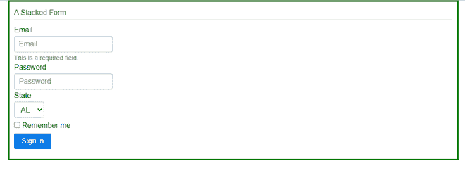
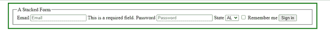

# Pure 有哪些重要特点。CSS？

> 原文:[https://www . geesforgeks . org/pure-CSS 的重要特性是什么/](https://www.geeksforgeeks.org/what-are-the-important-features-of-pure-css/)

**Pure.css** 只是 css 的另一个框架，区别它的是它的微小尺寸。它只有 3.7kb，因此是与 [Bootstrap](https://www.geeksforgeeks.org/bootstrap-tutorials/) 竞争的好竞争者。

**特征:**

*   首先，这是**免费的**。
*   它有几个重要的预先构建的公共元素，如下所示
    *   **基地:**元素如[<p>](https://www.geeksforgeeks.org/html-paragraph/)[<h1…h6>](https://www.geeksforgeeks.org/how-to-define-an-html-heading-in-html5/)地形等。
    *   **网格:**响应网格。
    *   **表单:**多列、堆叠表单、对齐表单、分组输入等。
    *   **表格:**带边框、剥离等的基表。
    *   **按钮**:聚焦、悬停、活动等按钮效果。
    *   **菜单:**下拉菜单、可滚动菜单、垂直菜单、响应菜单等。
*   如上所述，它小得可笑。模块时钟低于 4kb！
*   非常适合初学者。简单直观。只需从他们的网站 purecss.io 复制样式表链接，并将其添加到您的 HTML 文档中。
*   pure.css 在设计时考虑了响应设计。因此，我们获得了在所有平台上保持不变的预构建响应风格。
*   不依赖于 JavaScript 及其库。
*   它还支持阴影和颜色。
*   Bootstrap 的绝佳替代方案。
*   从本质上来说，它只是一个不同的 CSS 模块的集合，这些模块响应迅速、体积小且易于使用。

**纯的实现。CSS:** 这个框架主要有两种使用方式。你可以从 purecss.io 下载，也可以使用 CDN。让我们通过使用堆叠形式来理解这两者。

**堆叠形态**:将类“**纯形态堆叠**添加到任意 [<形态>](https://www.geeksforgeeks.org/html-forms/) 元素中，创建堆叠形态。

**注意:**通过在<表单>类中添加“**纯表单**来创建默认表单，然后您可以创建任何特定类型的表单，如堆叠、对齐等。

**手动添加链接:**现在已经在机器上下载了 pure.css zip 文件。提取它，并把它放在你的网站目录。您可以使用 [<链接>](https://www.geeksforgeeks.org/html-link-tag/) 标签将其附加到您的主 HTML 文档中。

**语法:**

```
<link rel = "stylesheet" href: "downloaded_pure_css_file"/> 
```

**例 1:**

## 超文本标记语言

```
<!DOCTYPE html>
<html>

<head>
    <meta name="viewport" content=
        "width=device-width, initial-scale=1" />

    <!-- Linking the Pure.CSS file that 
        we've downloaded-->
    <link rel="stylesheet" href="pure-min.css" />

    <style>
        form {
            margin: auto;
            width: 50%;
            border: 3px solid green;
            padding: 10px;
        }
    </style>
</head>

<body>
    <form class="pure-form pure-form-stacked">

        <!-- To create an stacked form, add 
            the pure-form-stacked classname
            to a form element alongside 
            pure-form -->
        <fieldset>
            <legend>A Stacked Form</legend>
            <label for="stacked-email">Email</label>
            <input type="email" id="stacked-email" 
                placeholder="Email" />

            <span class="pure-form-message"> 
                This is a required field.
            </span>
            <label for="stacked-password">Password</label>
            <input type="password" id="stacked-password" 
                placeholder="Password" />
            <label for="stacked-state">State</label>
            <select id="stacked-state">
                <option>AL</option>
                <option>CA</option>
                <option>IL</option>
            </select>
            <label for="stacked-remember" class="pure-checkbox">
                <input type="checkbox" id="stacked-remember" />
                Remember me
            </label>
            <button type="submit" class=
                "pure-button pure-button-primary">
                Sign in
            </button>
        </fieldset>
    </form>
</body>

</html>
```

**输出:**



使用纯堆叠形式。css(链接下载的 CSS 文件)

如果我们删除 *pure.css* 文件，即如果我们删除<链接>标签，我们会得到以下输出。



没有纯粹。半铸钢ˌ钢性铸铁(Cast Semi-Steel)

**使用 CDN(内容交付网络):**即使这两个步骤都做同样的事情，仍然大多数人更喜欢 CDN 而不是手动链接 *pure.css* 文件，因为当你使用 CDN 时，你总是会得到最新的文件。所以你不用担心每次更新你的 *pure.css* 文件。

**语法:**

> <link rel="“stylesheet”" href:="">
> /*复制 pure.css 网站的 url 表单获取最新版本*/

**示例:**

## 超文本标记语言

```
<!DOCTYPE html>
<html>

<head>
    <meta name="viewport" content=
        "width=device-width, initial-scale=1" />

    <!-- The only difference is that you have 
        to copy the link from pure.css website 
        instead of linking the downloaded 
        file -->

    <link rel="stylesheet" href=
"https://unpkg.com/purecss@2.0.6/build/pure-min.css" />

    <style>
        form {
            margin: auto;
            width: 50%;
            border: 3px solid green;
            padding: 10px;
        }
    </style>
</head>

<body>
    <form class="pure-form pure-form-stacked">

        <!-- To create an stacked form, add the 
             pure-form-stacked classname to a 
             <form> element alongside pure-form -->
        <fieldset>
            <legend>A Stacked Form</legend>
            <label for="stacked-email">Email</label>
            <input type="email" id="stacked-email" 
                placeholder="Email" />
            <span class="pure-form-message">
                This is a required field.
            </span>
            <label for="stacked-password">Password</label>
            <input type="password" id="stacked-password" 
                placeholder="Password" />
            <label for="stacked-state">State</label>
            <select id="stacked-state">
                <option>AL</option>
                <option>CA</option>
                <option>IL</option>
            </select>
            <label for="stacked-remember" class="pure-checkbox">
                <input type="checkbox" id="stacked-remember" />
                Remember me
            </label>
            <button type="submit" class=
                "pure-button pure-button-primary">
                Sign in
            </button>
        </fieldset>
    </form>
</body>

</html>
```

#### 输出:


使用纯堆叠形式。添加纯 CSS 文件的网址