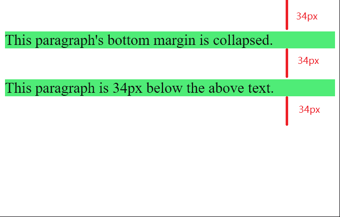
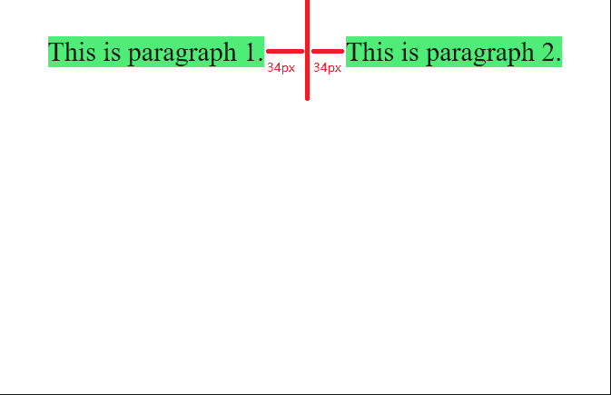
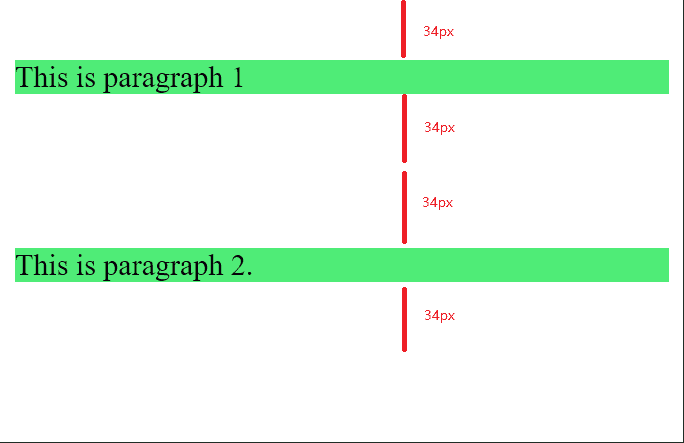
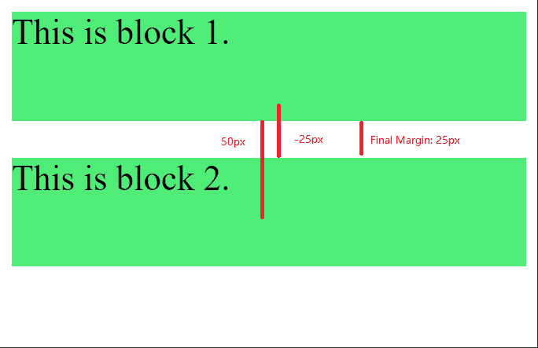

# CSS 中边距塌陷的规则是什么？

> 原文:[https://www . geesforgeks . org/CSS 中的边缘折叠规则是什么/](https://www.geeksforgeeks.org/what-are-the-rules-of-margin-collapse-in-css/)

边距折叠是 CSS 的一种行为，其中块级元素的垂直边距被合并成一个，即合并到具有最大值的元素的边距。有时，当我们给元素分配边距时，它并没有按照我们认为的方式工作，这就造成了混乱。以下规则将帮助您理解边距折叠:

**规则 1:只有块级元素的垂直边距被折叠**

第一个规则是只有元素的垂直边距会折叠，而不是水平边距。控制边距折叠的 CSS 规则指出，水平边距永远不能满足要求的条件。

**例 1:**

## 超文本标记语言

```html
<html>
<head>
  <style>
    p {
      font-size: 24px;
      margin-top: 34px;
      margin-bottom: 34px;
      background-color: rgb(79, 236, 119);
    }
  </style>
</head>
<body>
  <div class="container">
    <p>
      This paragraph's bottom
      margin is collapsed.
    </p>

    <p>
      This paragraph is 34px
      below the above text.
    </p>

  </div>
</body>
</html>
```

**输出:**在本例中，第一个和第二个< p >标签的 34px 边距合并，而不是相隔 68px，占据相同的空间。当第一段的下边距与第二段的上边距合并时。因此，两段之间的空间只有 34px。



**示例 2:** 这个示例演示了当使用水平边距时会发生什么。

## 超文本标记语言

```html
<html>
<head>
  <style>
    p {
      font-size: 24px;
      display: inline-block;
      margin-left: 34px;
      margin-right: 34px;
      background-color: rgb(79, 236, 119);
    }
  </style>
</head>
<body>
  <p>This is paragraph 1.</p>
  <p>This is paragraph 2.</p>
</body>
</html>
```

**输出:**很明显，水平边距不会塌陷。边距折叠只发生在块级元素上。除了块级元素，没有其他元素的边距可以折叠。这里，我们有两个内嵌块的< p >标签，因此它们的边距不会折叠。



**规则 2:元素应该相邻**

仅当块元素彼此直接接触时，才会发生边距折叠。它们不应被任何换行符或其他元素分隔。我们一般在两个元素之间提供
标签，但由于这个原因，页边距不会塌陷。

**示例:**在本例中，我们在两个元素之间提供了一个换行符。

## 超文本标记语言

```html
<html>
<head>
  <style>
    p {
      margin-top: 32px;
      margin-bottom: 32px;
      background-color: rgb(79, 236, 119);
    }
  </style>
</head>
<body>
  <p>This is paragraph 1</p>
  <br>
  <p>This is paragraph 2.</p>

</body>
</html>
```

**输出:**在输出中可以看到，第二个< p >标签的上边距并没有与第一个< p >标签的下边距发生塌陷，这是由于两个元素之间的断线造成的。元素必须相邻才能折叠边距。



**规则 3。将使用较大边距的元素**

这条规则决定了当利润不对称时会发生什么。这意味着如果顶部元素需要下面 62px 的空间，而底部元素只需要上面 24px。在这种情况下，两个元素之间的空间只有 62px。正如上面已经解释的，如果两个相邻的元素之间没有填充、边框或换行符(即它们的边距垂直接触)，那么它们的边距将折叠，两个元素中较大的边距获胜。

**规则 4:溢出属性应设置为可见**

当元素的溢出属性值设置为除可见之外的任何值时，元素的边距不会折叠。它的值必须可见，以便边距可以折叠。因此，溢出:隐藏和溢出:自动不会让保证金崩溃。

**规则 5:负边际加起来**

负边距用于减少两个元素之间的间距。它使元素彼此靠得更近。考虑第一个元素的边距-底部是-65px，第二个元素的边距-顶部是-25px。在这种情况下，两个元素之间的间距将为-65px，因为它比-25px 更重要。但是当一个边距是正的，另一个边距是负的时，这些边距相加得到元素之间的间距。

**示例:**

## 超文本标记语言

```html
<html>
<head>
  <style>
    div {
      font-size: 24px;
      height: 75px;
      background-color: rgb(79, 236, 119);
    }

    #b1 {
      margin-bottom: 50px;
    }

    #b2 {
      margin-top: -25px;
    }
  </style>
</head>
<body>
  <div id="b1">This is block 1.</div>
  <div id="b2">This is block 2.</div>
</body>
</html>
```

**输出:**在本例中，第一个 div 的边距底部为 50px，第二个 div 的边距顶部为-25px。所以它们之间的空间大小将是 25px (-25px+50px)。



**规则 6:父元素和子元素之间的边距不折叠**

边距用于增加同级元素之间的间距。它不能用于增加父元素和子元素之间的空间，因为我们有填充。边距只从子元素转移到父元素，因为边距总是试图增加兄弟元素之间的空间，因此我们认为边距应用于父元素。因此，父元素和子元素之间没有边距折叠，它们之间只有边距转移。

要将边距转移到父元素，必须满足以下条件:

*   父代和子代应该相邻。
*   父元素的高度应该是自动的。
*   父元素不应有任何填充或边框。

**规则 7:折叠仅适用于流程布局**

当元素在 flexbox 或 grid box 中对齐，或者它们不是流入的(例如绝对定位或浮动)时，边距不会折叠。